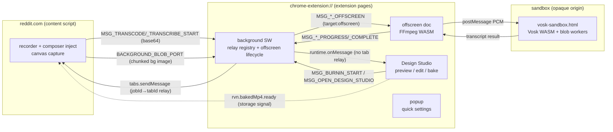
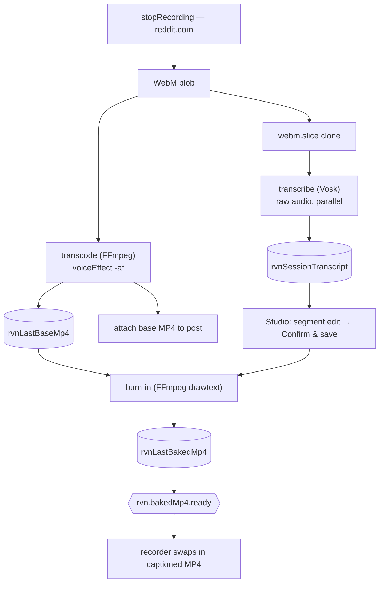
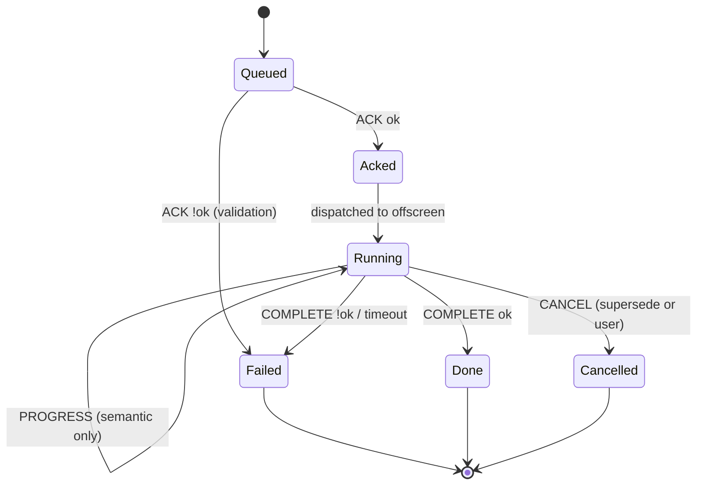

# Diagram cookbook — Mermaid recipes for this repo

Copy a recipe, then correct it against current code before committing. These are
seeded with the *real* contexts, messages, and stores so you start from truth,
not a blank canvas. **Always render-check** — Mermaid syntax errors fail silently
in plain Markdown and a broken diagram is worse than none.

Conventions:
- Use **stable identifiers** (message constants, store names) as labels — they
  survive refactors; line numbers don't.
- One altitude per diagram. If it needs >~15 nodes, split it.
- Keep node text short; put detail in the surrounding prose.

---

## 1. Context map (who talks to whom)



Notes to keep accurate: Design Studio receives burn-in progress on
`runtime.onMessage` and is excluded from the tab relay
(`burnInSkipTabRelayByJobId` in `background.ts`). Vosk runs *inside* the sandbox,
reached through the offscreen/transcribe path — confirm the current hop in
`src/transcription/vosk-sandbox-client.ts`.

---

## 2. Data flow (record → attach)



Invariant to preserve in the picture: **transcribe must not block transcode**
(recorder reaches "stopped" after transcode only — BUG-026), and STT reads the
**clone**, not the voice-modulated export.

---

## 3. State machine (one offscreen job)



Heuristic: only **semantic** progress advances `Running→Running`; heartbeats must
not reset the stall/timeout timer (`engineering-principles.md` § semantic health).
A superseding job cancels the previous one (`registerTranscodeTab` etc.).

Alternative state machine worth maintaining: `rvn.workflow.phase`
(`design → capture → polish`) with the auto-promotion rule (banner jumps to
Phase 3 when `hasSessionRecording()` regardless of stored phase).

---

## 4. Sequence (pipeline + relay hop)

```mermaid
sequenceDiagram
  participant CS as content script
  participant BG as background SW
  participant OFF as offscreen (FFmpeg)
  CS->>BG: MSG_TRANSCODE_START (base64 WebM, jobId)
  BG->>BG: validate + registerTranscodeTab(jobId→tabId)
  BG-->>CS: MSG_TRANSCODE_ACK (ok)
  BG->>OFF: ensureOffscreen + MSG_TRANSCODE_OFFSCREEN
  loop until done
    OFF->>BG: MSG_TRANSCODE_PROGRESS
    BG->>CS: tabs.sendMessage (resolveRelayTabId)
  end
  OFF->>BG: MSG_TRANSCODE_COMPLETE (mp4 base64 | error)
  BG->>CS: relay COMPLETE, then delete jobId→tabId
```

The ordering that matters (BUG-032): on failure, **broadcast COMPLETE before
deleting** the `jobId→tabId` entry — otherwise the content tab never hears the
failure. Show that ordering explicitly when you draw the failure path.

---

## Embedding rules
- Put diagrams **inline** in the living doc (GitHub + most viewers render
  Mermaid). Keep the source readable — it's the editable form.
- Above each diagram, one sentence: what it shows + what to verify it against.
- Below each, the **invariant(s)** it encodes, so the picture and the rules
  travel together.
