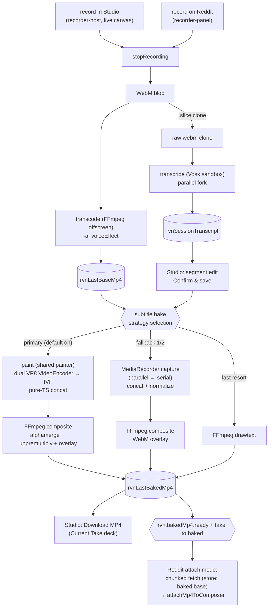
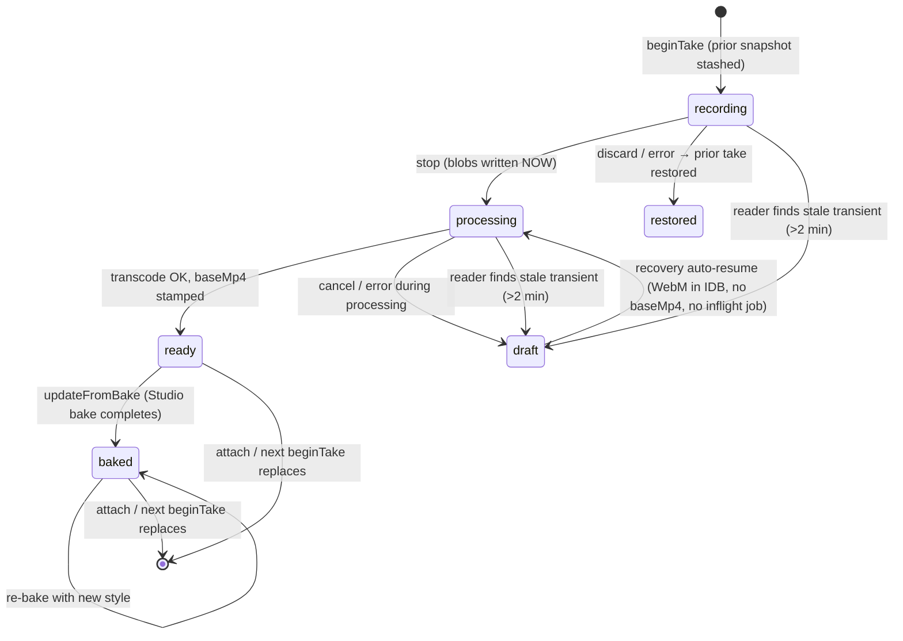
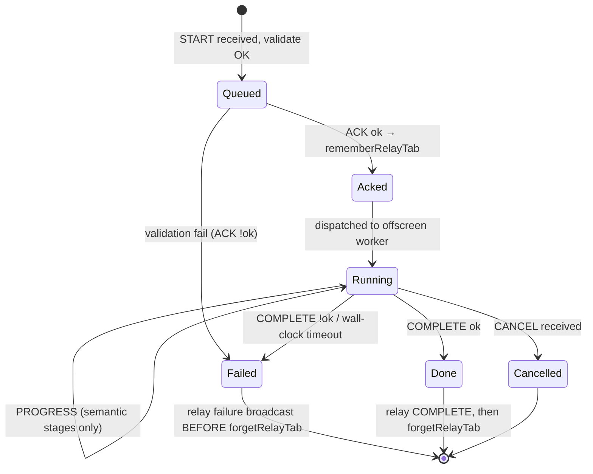

# Architecture Map — Reddit Voice Notes

**Version:** v2.0 · **Reflects branch/tag:** `main` @ package `5.4.0` (tag `v5.4.0` deferred; baseline tag `v5.3.10`) · **Updated:** 2026-07-06
**Status:** Canonical cross-cutting architecture index. Wins for *how subsystems fit together*;
subsystem internals are owned by the canonical docs linked in §8.
**Re-run:** `/architecture-hardening` (full) or a named phase.

### Changelog
- `v2.0` (2026-07-06) — MAJOR: three architectural shifts since v1.1. (1) **Subtitle bake re-architected**: FFmpeg `drawtext` is now the *last* fallback tier; the primary path is Canvas-2D overlay render (v5.3.4) → per-chunk encode (WebCodecs dual-IVF, v5.3.10; MediaRecorder parallel/serial, v5.3.9 fallback) → FFmpeg composite (`alphamerge`/`overlay`). Invariant I3 reworded. (2) **Take lifecycle** — new cross-context state class: `rvn.take.current` snapshot + `TakeArtifactStamp`s, synced by `storage.onChanged` (deliberately no message family — ADR-0002). (3) **Design Studio is now a capture surface** (`recorder-host.ts` headless mount, live WYSIWYG canvas handover, Reddit demoted to optional output target via attach mode). New diagrams 2.3 (take lifecycle) and updated 2.1/2.2; confidence ledger + self-critique fully refreshed.
- `v1.1` (2026-07-04) — additive: v5.3.9 parallel chunked bake (N concurrent MediaRecorder capture loops in the Studio page; workers/offscreen deliberately rejected — pacing-bound). Detail: `docs/transcription-architecture.md` § Parallel chunked bake; `docs/5.3.9-worker-and-chunked-parallelization-design.md` §0.
- `v1.0` (2026-06-24) — initial map; all four phases. Branch: `eloquent` at eloquent-5 hardening.

> Bump MINOR for additive refreshes; MAJOR when a context, pipeline, or storage class is added/removed.

---

## 1. Execution contexts

Verified against `wxt.config.ts` `manifest.content_security_policy` (2026-07-06 — unchanged since v1.0). The single most important architectural fact: **a fix in one context never transfers to another** — different CSP, origin, and API surface.

| Context | Origin / CSP | eval | chrome.* | Responsibility | Entry |
|---------|--------------|------|----------|----------------|-------|
| Content script | reddit.com, isolated world | n/a | limited | recorder panel (capture **or** attach mode), composer inject, canvas capture | `entrypoints/content.ts` |
| Background SW | ext, `wasm-unsafe-eval` | no | yes | relay registry, offscreen lifecycle, artifact stamping, orphan-transcode persistence, chunked blob serving | `entrypoints/background.ts` |
| Offscreen doc | ext, `wasm-unsafe-eval` | no | yes | FFmpeg transcode + subtitle burn-in/composite (WASM) | `entrypoints/offscreen/main.ts` |
| Manifest sandbox | opaque/null, `unsafe-eval` + `worker-src blob:` | **yes** | **no** | Vosk STT (Emscripten + blob workers) | `public/vosk-sandbox.html` |
| Design Studio | ext page | no | yes | **primary product surface**: styling, preview, transcript edit, **native capture (getUserMedia)**, overlay render + WebCodecs encode, bake orchestration, take deck | `entrypoints/design-studio/` |
| Popup | ext page | no | yes | quick settings | `entrypoints/popup/` |

**Sandbox CSP detail (BUG-010/011/013):** `sandbox allow-scripts allow-forms allow-popups allow-modals; script-src 'self' 'unsafe-inline' 'unsafe-eval'; worker-src blob: 'self'; child-src blob: 'self'` — Vosk needs `unsafe-eval` for Emscripten and `worker-src blob:` for blob workers. Full CSP archaeology: `docs/transcription-architecture.md`.

**v5.4.0 note:** no new execution context was added. Studio-native recording runs `VoiceRecorderSession` unmodified on the extension page; the entire downstream (relays, transcribe fork, transcode client) is `runtime.sendMessage`-based and works identically from either surface (`claude-progress.md` v5.4.0 Phase 2). The WebCodecs encode loop also runs in the Studio page (OffscreenCanvas, worker-portable but not yet in a worker — ADR-0001).

---

## 2. Diagrams

### 2.1 Context map (who talks to whom)

Verified against `src/messaging/types.ts`, `src/messaging/baked-mp4-blob.ts`, `src/messaging/background-blob.ts` (message constants) and `src/session/take-manager.ts` (storage sync).


**Invariants encoded:**
- Design Studio receives burn-in messages via `runtime.onMessage` and is registered in `burnInSkipTabRelayByJobId` in `background.ts` — excluded from the `tabs.sendMessage` relay that targets Reddit tabs. A future pipeline whose consumer is an extension page must preserve this split.
- The take lifecycle crosses contexts as a **storage key**, never a message. `storage.onChanged` on `rvn.take.current` is the sync channel (ADR-0002); the Reddit panel's live-sync during Studio capture (`maybePromoteNewerTake` in `recorder-panel.ts`) rides this subscription.

### 2.2 Data flow (record → bake → attach), v5.4.0 shape

Verified against `src/recorder/voice-recorder.ts` (fork at stop), `src/recorder/recorder-host.ts`, `docs/transcription-architecture.md` § WebCodecs overlay encode, IDB store module names.



**Invariants encoded:** Transcribe always consumes the raw clone (STT timing independent of voice effect). Every capture surface funnels into the same stop path — blobs are written **only at stop** (discard/error-while-recording restores the prior take snapshot without touching stores). The bake fallback order is `webcodecs → mediarecorder-parallel → serial → drawtext`; only *constructed* (WebCodecs) streams skip normalize (ADR-0001).

### 2.3 State machine — take lifecycle (NEW, the v5.4.0 spine)

Verified against `src/session/take-manager.ts` (types + `normalizeStaleTake`, `STALE_TRANSIENT_MS`), `src/ui/design-studio/studio-take-recovery.ts`, `claude-progress.md` v5.4.0 Phase 0.



**Invariants encoded:**
- **Stop-time blob-write:** blobs land in IDB only at stop; a discarded recording restores the stashed prior take intact (this is what makes Reddit "Record new here" safe while a Studio take is attachable).
- **Stale-transient demotion is read-side:** `normalizeStaleTake` demotes `recording`/`processing` snapshots older than `STALE_TRANSIENT_MS` (2 min) to `draft` *when read* — no daemon required, correct under MV3 SW death.
- **Recovery is serialized and queue-aware:** `studio-take-recovery.ts` chains recovery ops and asks the background (`MSG_QUERY_TRANSCODE_INFLIGHT`) before resuming, so a still-running offscreen transcode is never doubled.

### 2.4 State machine — offscreen job lifecycle (carried from v1.1)

Applies to all three offscreen pipelines. Verified in v1.0 against `entrypoints/offscreen/main.ts` and `src/messaging/relay-registry.ts`; not re-read line-by-line this session (see §7).



**Invariants encoded:** failure broadcasts before relay-map cleanup (BUG-032); heartbeats never advance `Running→Running` — only semantic progress resets the stall timer (`isMeaningfulProgress()` in `src/ffmpeg/transcoder.ts`, BUG-006).

### 2.5 Pipeline sequence + relay hop (transcode, representative)

Burn-in differs: Design Studio initiates and `runtime.onMessage` replaces `tabs.sendMessage`. Studio-initiated *transcode* (native capture) also skips the tab hop — the client lives on an extension page (see §7 open question on the exact mechanism).

```mermaid
sequenceDiagram
  participant CS as content script
  participant BG as background SW
  participant OFF as offscreen (FFmpeg)
  CS->>BG: MSG_TRANSCODE_START (base64 WebM, jobId)
  BG->>BG: validate + rememberRelayTab(jobId→tabId)
  BG-->>CS: MSG_TRANSCODE_ACK (ok)
  BG->>OFF: ensureOffscreen + MSG_TRANSCODE_OFFSCREEN
  loop until done
    OFF-->>BG: MSG_TRANSCODE_PROGRESS (semantic stages)
    BG-->>CS: tabs.sendMessage relay
  end
  OFF-->>BG: MSG_TRANSCODE_COMPLETE (mp4Base64 | error)
  Note over BG: relay COMPLETE first, then forgetRelayTab (BUG-032)
  BG-->>CS: relay COMPLETE
  BG->>BG: forgetRelayTab(jobId) + stamp take artifact (v5.4.0)
```

**v5.4.0 addition:** after relayed IDB writes succeed, `background.ts` stamps `baseRecording`/`baseMp4` artifacts on the current take (`recordArtifact`) and adopts orphan artifacts into a draft; `persistOrphanStudioTranscodeResult` persists a transcode result whose initiating Studio tab died mid-job.

---

## 3. First-class concerns

### 3.1 Preview ↔ bake boundary

The single canvas in `waveform.ts` (`canvas.captureStream`) is the video-track source for `base.mp4`. Studio's Live preview uses the same draw pipeline (`renderThemePreview()`); **Studio-native recording strengthens this further** — `recorder-host.ts` hands the *actual* `WaveformRenderer` canvas element to the Studio preview surface (`onLiveCanvas`), the same element `captureStream()` feeds MediaRecorder: zero copies, zero preview-vs-output drift. Restyling during capture hot-swaps live via the existing prefs listener.

**Invariant:** *Anything visible in Live preview must be reproducible by the transcode or bake export path.* — `docs/design-studio.md` §3.3; `docs/engineering-principles.md` § Pipeline-native solutions.

**The subtitle preview↔bake story changed shape (v5.3.4 → v5.3.10):**
- Preview and bake now share **one painter**: `createOverlayFramePainter` (`subtitle-overlay-renderer.ts`) paints the overlay's global frame at `(startFrame + i) / fps` for *every* encoder strategy — the paint pixels are identical regardless of encoder; the encode/composite leg is the per-strategy QA surface (ADR-0001, extension-points § Overlay encoding backbone).
- Rich effects (halo, dual border, gradients, Oklch rainbow) are canvas-native in both preview and bake — the old drawtext quantization gaps (0.25 s rainbow slices, static `fontcolor`) now apply **only** on the last-resort drawtext tier.
- Remaining accepted gaps: FontFace (preview) vs FreeType-in-WASM (drawtext tier only) kerning; premultiplied-alpha round-trip precision at very low alpha on the WebCodecs composite (glow tails — QA-passed 2026-07-05, machine-dependent, calibration-gated).

**Animated GIF backgrounds — no gap (canvas-native case):** decoded once, advanced by elapsed time in the RAF, captured straight into `base.mp4`. See `docs/gif-animation-design-implementation.md`.

**Where it could silently drift:** a preview-only canvas effect with no bake path, or an encoder strategy that paints at chunk-local rather than global timestamps (breaks animation-phase invariance).

### 3.2 Effect composition

Compositing order (bottom → top) in the final MP4 — unchanged:

1. **Background** — theme gradient/SVG/bokeh + optional personal image or animated GIF (`rvnImageDb`).
2. **Bars** — waveform + glow/effects (canvas capture; 24 fps).
3. **Subtitles** — composited onto `base.mp4` in a post pass. **Never drawn into the capture canvas stream.** The pass is now: overlay video composite (`alphamerge`+`unpremultiply` for WebCodecs IVF, or WebM `overlay` for MediaRecorder paths) with `drawtext` as final fallback.

**Voice effect** applies to the audio track via `-af`/`-filter_complex` in the transcode pass (graph-native, `resolveVoiceGraph` → `buildStylizedGraph`) — not a visual layer.

**Invariant (reworded in v2.0):** *Subtitles are always a post-`base.mp4` FFmpeg pass on the export; they never enter the live capture stream. The overlay's pixels, however, are canvas-painted — the "no canvas subtitles" rule from v1 applies to the capture RAF, not to the offline overlay render.* — `src/ffmpeg/subtitle-burnin.ts`; `docs/transcription-architecture.md` § canvas overlay.

Adding a fourth visual layer still changes compositing order → explicit ADR required.

### 3.3 Message contracts

**Registry:** `src/messaging/types.ts` — single source of truth for pipeline constants and payloads. Chunked blob relays live beside it: `src/messaging/background-blob.ts` (personal backgrounds, port + message fallback), `src/messaging/baked-mp4-blob.ts` (baked/base MP4 fetch, `store: 'baked' | 'base'` param added in v5.4.0 Phase 3 — default `'baked'`, backward compatible).

**Pipelines** (all share `START→ACK→OFFSCREEN→PROGRESS*→COMPLETE|CANCEL`):

| Pipeline | START message | Worker | Initiator | Notes |
|----------|--------------|--------|-----------|-------|
| Transcode | `MSG_TRANSCODE_START` | FFmpeg (offscreen) | Content script **or Studio** (v5.4.0) | Optional voice graph; `voiceEffectFallback` on fail |
| Transcribe | `MSG_TRANSCRIBE_START` | Vosk (sandbox via offscreen) | Content script or Studio | Raw WebM clone; parallel fork |
| Burn-in | `MSG_BURNIN_START` | FFmpeg (offscreen) | Design Studio | Composite/drawtext; skip tab relay |

**Non-pipeline message kinds (v5.4.0):** `MSG_QUERY_TRANSCODE_INFLIGHT` is a simple query/response (no ACK/PROGRESS lifecycle) used by Studio recovery. This is a *second message shape* — keep queries idempotent and side-effect-free so they stay safe to call from recovery chains (extension-points § Message pipelines v2).

**Deliberate non-message:** the take lifecycle. `MSG_TAKE_*` placeholders were scaffolded and then **removed** — storage IS the sync channel (ADR-0002).

**Relay:** `src/messaging/relay-registry.ts` — `browser.storage.session` survives SW restarts; `clearAllRelayTabs()` on SW boot; connection-failure cleanup in all three relay broadcast functions (backlog v1 H4). Fragile ordering: broadcast COMPLETE/failure before deleting the tab entry (BUG-032).

### 3.4 State ownership

**Rule:** one writer per datum. Blobs and transcript text never in `rvnUserPrefs`. Blobs never in the take snapshot.

Authoritative storage map: `docs/design-studio.md` §3.2 (now includes `rvn.take.current`). Deltas this map adds context for:

| Datum | Where | Single writer / choke point |
|-------|-------|------------------------------|
| `rvn.take.current` | `chrome.storage.local` | **TakeManager** (`src/session/take-manager.ts`) — recorder session owns capture transitions, background merges artifact stamps, Studio bake promotes to `baked`. Same-context writes serialized; `sessionEpoch` guards sub-second races |
| `experimental.webCodecsBake` / `parallelBake` | `rvnUserPrefs` | `enqueuePrefsOp`; **default true since v5.4.0** (`resolveOverlayBakeEncoder`, one-time rollout migration — `user-preferences.ts:191,329`) |
| Encoded segment metadata | in-memory per bake | `src/encoding/encoded-segment.ts` (`EncodedOverlaySegmentMeta`) — telemetry + future editing primitive; not persisted |

**Invariants:** all `rvnUserPrefs` writes via `enqueuePrefsOp` (BUG-023). Content scripts can't read extension IDB — chunked relay only. The take snapshot references blobs through `TakeArtifactStamp` (`savedAt`/`byteLength`/`durationSeconds`) — **note:** the stamp↔store-meta cross-check the contract describes is not yet implemented at consumption sites (hardening backlog v2 **H6**).

---

## 4. Invariants (Phase 2)

| # | Invariant | Concern | Enforced at | Confidence |
|---|-----------|---------|-------------|------------|
| I1 | Anything in Live preview is reproducible by the export path | preview↔bake | `docs/design-studio.md` §3.3; informal | High |
| I2 | Transcription always runs on the raw WebM clone, never the voice-modulated export | preview↔bake | `src/recorder/voice-recorder.ts` (fork at stop) | High |
| I3 | Subtitles are a post-`base.mp4` export pass; never in the live capture stream (overlay pixels are canvas-painted offline — that's the design, not a violation) | composition | `src/ffmpeg/subtitle-burnin.ts`; `subtitle-canvas-bake.ts` | High |
| I4 | Failure broadcasts before the relay-registry entry is deleted | messages | `src/messaging/relay-registry.ts`; BUG-032 | High |
| I5 | Stall timers reset only on semantic progress, never heartbeats | messages | `src/ffmpeg/transcoder.ts` `isMeaningfulProgress()` | High |
| I6 | All `rvnUserPrefs` writes go through `enqueuePrefsOp` | state | `src/settings/user-preferences.ts` | High |
| I7 | Content scripts receive blobs via chunked relay only (no extension-IDB reads) | state | `background-blob.ts`, `baked-mp4-blob.ts` | High |
| I8 | Vosk model loads into MEMFS per session (no IDB cache in sandbox) | state | BUG-011/013 accepted tradeoff | High |
| I9 | The take snapshot never contains blobs; blobs stay in single-slot IDB stores, referenced by artifact stamps | state | `take-manager.ts` header + `parseCurrentTake` | High |
| I10 | Blobs are written only at recording stop; discard/error-while-recording restores the stashed prior take untouched | state, preview↔bake | `voice-recorder.ts` v5.4.0 wiring (`beginTake` prior-snapshot stash) | High |
| I11 | Every overlay encoder strategy paints at global `(startFrame + i) / fps` — animation phase and cue-cache keys are chunk-invariant | preview↔bake | `createOverlayFramePainter` (`subtitle-overlay-renderer.ts`); ADR-0001 | High |
| I12 | Only *constructed* streams (WebCodecs IVF) may skip normalize; *captured* MediaRecorder output must always be normalized | composition | ADR-0001 "not the compositeReady mistake"; `scripts/test-overlay-alphamerge-args.mjs` regression guard | High |
| I13 | The alphamerge composite is gated by a measured luma-range calibration probe — codec metadata is never trusted for alpha range | composition | `src/encoding/webcodecs-support.ts`; ADR-0001 | High |
| I14 | Stale transient takes (`recording`/`processing` > 2 min) are demoted to `draft` on read | state | `normalizeStaleTake` (`take-manager.ts:220`) | High |
| I15 | Artifact stamps let consumers detect a snapshot whose blobs moved on (stamp `savedAt` ≈ store meta `savedAt`) | state | **documented but unimplemented at consumption sites** — `take-manager.ts:46-49` vs `recorder-panel.ts:662` (ordering only) | **Low → backlog H6** |

---

## 5. Money-path traces (Phase 2)

### Trace A — Studio-native take, WebCodecs bake, Reddit attach (the v5.4.0 flagship path)

1. Studio deck Record → `mountRecorder({hostContext:'studio'})` (`recorder-host.ts`) → `VoiceRecorderSession` with `takeSource:'studio'` → `beginTake` stashes prior snapshot, take → `recording`
2. `onLiveCanvas` hands the WaveformRenderer canvas into the hero monitor (`.studio__preview-canvas--live`); theme RAF paused (`auditionActive` guard); style edits hot-swap live
3. Stop ■ → take → `processing`; WebM written; fork: clone → `MSG_TRANSCRIBE_START`, main → `MSG_TRANSCODE_START` (both `runtime.sendMessage` — identical to Reddit capture)
4. Background: transcode completes → relays IDB writes → stamps `baseRecording`/`baseMp4` artifacts → take → `ready`
5. Transcript arrives (`rvn.sessionTranscript.ready`) → segment edit → Confirm & save
6. Bake: `subtitle-bake.ts` → `resolveOverlayBakeEncoder` → `'auto'` → calibration probe OK → `subtitle-overlay-webcodecs.ts`: chunk plan → shared painter → dual VP8 `VideoEncoder` → IVF concat (pure TS) → `MSG_BURNIN_START` with `buildWebCodecsOverlayStrategies` (alphamerge tiers) → `rvnLastBakedMp4` → `updateFromBake` → take → `baked`
7. Reddit composer opened → `RecorderPanel.open()` sees completed take → **attach mode** ("Current Studio Take" card) → `MSG_GET_BAKED_MP4_META/_CHUNK` (`store:'baked'`) → `attachMp4ToComposer` → workflow → `'design'`

**Code verified at:** `recorder-host.ts:1-50`, `take-manager.ts` (types/constants), `user-preferences.ts:148-191`, `studio-take-recovery.ts:24-70`, `baked-mp4-blob.ts:1-5`; steps 4/6 internals from `claude-progress.md` v5.4.0 + `transcription-architecture.md` §WebCodecs (not re-read line-by-line — see §7).

### Trace B — mid-processing Studio tab close → recovery (QA checklist #4)

1. Tab closes during `processing` → `pagehide` auto-draft; snapshot may persist as phantom `processing`
2. Reopen Studio → `studio-take-recovery.ts`: `reconcileInterruptedProcessing()` + `MSG_QUERY_TRANSCODE_INFLIGHT` → if inflight: wait (background will `persistOrphanStudioTranscodeResult`); if idle: demote to `draft`
3. Draft with `baseRecording` stamp but no `baseMp4` → `resumeDraftTranscodeInner`: load WebM from `rvnLastRecording` (≥256 bytes) → re-transcode with **current** `prefs.voiceEffect` → `relaySaveLastBaseMp4` → take → `ready`
4. Reddit attach mode available again (never-baked takes attach their base MP4)

**Code verified at:** `studio-take-recovery.ts:44-70`. Note the two hardening seams found here: no stamp↔store cross-check before adopting the WebM (H6), and resume re-applies *current* voice prefs rather than capture-time settings (H8).

### Trace C — personal background WYSIWYG relay (carried from v1, unchanged)

Studio reads `rvnImageDb` directly; the Reddit recorder receives chunked base64 via `BACKGROUND_BLOB_PORT` → decode → `drawThemeBackground()`. Same bytes feed animated GIFs (WebCodecs `ImageDecoder`). Missing/undecodable → theme fallback, never blocks recording. — `docs/engineering-principles.md` § Personal backgrounds.

---

## 6. Confidence ledger (Phase 2)

| Subsystem | Confidence | Evidence / notes |
|-----------|-----------|------------------|
| Transcode / transcribe / drawtext pipelines (BUG-001–035) | **High** | Years of fixes documented; stable through v5.4.0 QA |
| TakeManager pure core (parse/merge/stale/freshness) | **High** | Node-tested (`test-take-manager.mjs` 14/14); pure helpers isolated from `browser.*` |
| Studio-native capture + live canvas | **High** | User QA checklist 1–11 PASS (2026-07-06); zero-copy contract structural |
| WebCodecs encode + alphamerge composite | **High (single machine)** | QA PASS 2026-07-05, 8–10× render speedup, visual parity; calibration `white=234, black=17, limited` on ONE machine — cross-hardware variance untested |
| Recovery paths (tab-close, orphan transcode, inflight query) | **Med** | QA #4 PASS once; many async branches (`recoveryChain`, background persistence) not exhaustively exercised; stamp cross-check absent (H6) |
| Artifact stamp contract | **Low** | I15 — documented, unimplemented at consumers. Single-slot stores make stale adoption possible after crash + new capture |
| Studio-initiated transcode progress relay mechanism | **Med** | Works (QA PASS) but the no-tab relay path (`sender.tab` undefined for extension pages) not re-read this session — open question §7 |
| Concurrent Studio tabs / dual-writer take races | **Med-Low** | Same-context serialization + `sessionEpoch` exist; two Studio *tabs* both mounting recorders is unexamined |
| MediaRecorder fallback health (post-default-flip) | **Med** | Fallback chain tested pre-flip; now that WebCodecs is default, a silent fallback means 5–6× slower bakes — is the reason surfaced to the user? (H11) |
| Composite stage performance | **High (known bad)** | ~43 s of a ~46–50 s WebCodecs bake is the single x264 composite pass — measured, deferred (ADR-0003 stub) |
| Vosk model caching | **Low (accepted)** | ~40 MB re-download per session; BUG-013 tradeoff stands |
| Demo site (`demo/`) parity with v5.4.0 | **Low (out of scope)** | No capture pipeline there; explicitly deferred |

**Open questions:**
1. How does transcode PROGRESS reach a Studio-initiated job? (`rememberRelayTab` with no `sender.tab` → late-bind fallback? runtime broadcast?) Verify in `background.ts` before building anything on it.
2. Do two simultaneously open Studio tabs fight over `rvn.take.current` during capture? (`sessionEpoch` guards a single session's races, not two sessions.)
3. Does the calibration probe re-run per bake or cache per session — and what happens on a hardware/driver change mid-session?

---

## 7. Self-critique (Phase 2)

**Verified this session:** CSP table vs `wxt.config.ts`; wire constants vs `types.ts` + `background-blob.ts` + `baked-mp4-blob.ts`; TakeManager types/constants/exports read directly; `studio-take-recovery.ts` read; `user-preferences.ts` default-flip confirmed at lines 148–191/329; `recorder-host.ts` contract read; storage map extended in `design-studio.md` §3.2; stale doc fixed in `transcription-architecture.md` §gating.

**Carried forward, NOT re-verified line-by-line this session:** offscreen job-queue state machine (§2.4) and `isMeaningfulProgress` internals; `burnInSkipTabRelayByJobId` mechanics; `subtitle-canvas-bake.ts` strategy-selection code (trusted from `transcription-architecture.md` + extension-points, both current); `persistOrphanStudioTranscodeResult` in `background.ts` (trusted from progress notes).

**Doc-vs-code disagreements found (and fixed or filed):**
- `transcription-architecture.md` said `webCodecsBake` default false; code says true since `bd7d60a` → **fixed this session**.
- `take-manager.ts` header promises stamp cross-checking by consumers; no consumer does it → **filed as H6** (code change, not doc change — the contract is right, the implementation is missing).
- v1 map referenced ADR stub `adr/0001-voice-recorder-prefs-transcriptconfig.md` that was never created; the number was then used by the WebCodecs ADR → stub question absorbed into this refresh (the `transcriptConfig` optionality concern did not recur in 5.3.x; dropped without a stub).

**Coupling that surprised:** recovery couples Studio ↔ background through *three* channels at once (storage snapshot, `MSG_QUERY_TRANSCODE_INFLIGHT`, and the orphan-persistence path) — correctness depends on their ordering agreeing. It works, but any future edit to one channel must consider the other two; this is the most fragile new seam in v5.4.0.

**If I changed X, what breaks?**
- Write `rvn.take.current` outside TakeManager → dual-writer races, deck/panel desync (the exact class Phase-0 centralization removed).
- Paint a chunk at local `(i / fps)` instead of global → animation-phase seams at chunk boundaries; cue-cache poisoning (I11).
- Mark any captured stream composite-ready → v5.3.9.1 regression class (I12).
- Skip the calibration probe "because VP8 is always limited-range" → wrong alpha on hardware that encodes full-range (I13).
- Add a `MSG_TAKE_*` message family "for consistency" → two sync channels for one datum; ADR-0002 explains why storage won.

---

## 8. Related docs

| Doc | Owns |
|-----|------|
| `docs/design-studio.md` | Studio semantics, preview=bake, dirty layers, storage map (§3.2 — incl. `rvn.take.current`), outbound index (§12) |
| `docs/transcription-architecture.md` | Vosk sandbox CSP stack, canvas overlay + WebCodecs bake paths, strategy/fallback table |
| `docs/engineering-principles.md` | Semantic health, save pathways, ImageDB, pipeline-native effects |
| `docs/bug-archive.md` | Full `BUG-###` write-ups (Phase-3 raw material) |
| `docs/5.4.0-design-studio-first-standalone-voice-notes-suite-roadmap.md` | v5.4.0 Phase 0 as-built (TakeManager decisions) |
| `docs/5.3.10-webcodecs-per-chunk-encoding.md` §0 | WebCodecs backbone as-built |
| `docs/architecture/adr/` | ADR-0001 WebCodecs backbone · ADR-0002 TakeManager storage sync · ADR-0003 composite-stage (stub) |
| `docs/architecture/extension-points.md` | Seam registry (v1.3) |
| `docs/architecture/hardening-backlog.md` | Ranked hardening items + risk register (v2.0) |
| `src/messaging/types.ts` | Wire registry — authoritative message constants |
| `src/session/take-manager.ts` | Take lifecycle contract (header doc is authoritative) |

---

## Resume in a new chat (carry-forward)

```
architecture-hardening resume.
Repo: Reddit Voice Notes (Chrome MV3 / WXT). Branch: main @ 5.4.0 (tag deferred, local only). Map: v2.0 (2026-07-06).
Contexts: content(reddit) / background(SW) / offscreen(FFmpeg) / sandbox(Vosk) / Design-Studio(now ALSO capture+encode surface) / popup.
Spine:
  preview=bake: shared overlay painter (createOverlayFramePainter) under all encoders; live canvas handed to Studio preview (zero-copy); drawtext = last fallback only
  effect composition: bg→bars→subs; subs = post-base.mp4 composite (alphamerge WebCodecs | overlay MediaRecorder | drawtext)
  message contracts: types.ts 3 pipelines + query kind (MSG_QUERY_TRANSCODE_INFLIGHT) + chunked blob relays (store: baked|base); take lifecycle is storage, NOT messages (ADR-0002)
  state ownership: rvn.take.current via TakeManager only; stamps reference single-slot IDB blobs; webCodecsBake default TRUE since v5.4.0
Top open item: H6 — artifact stamp cross-check documented but unimplemented (take-manager.ts:46 vs recorder-panel.ts:662).
Open questions: Studio-job progress relay mechanism; concurrent Studio tabs; calibration probe caching.
Backlog: docs/architecture/hardening-backlog.md v2.0 (H6-H12 + risk register). ADRs: 0001 accepted, 0002 accepted, 0003 stub.
Read docs/architecture/architecture-map.md then run /architecture-hardening resume.
```
