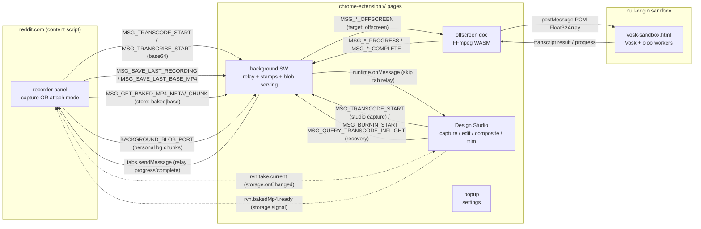
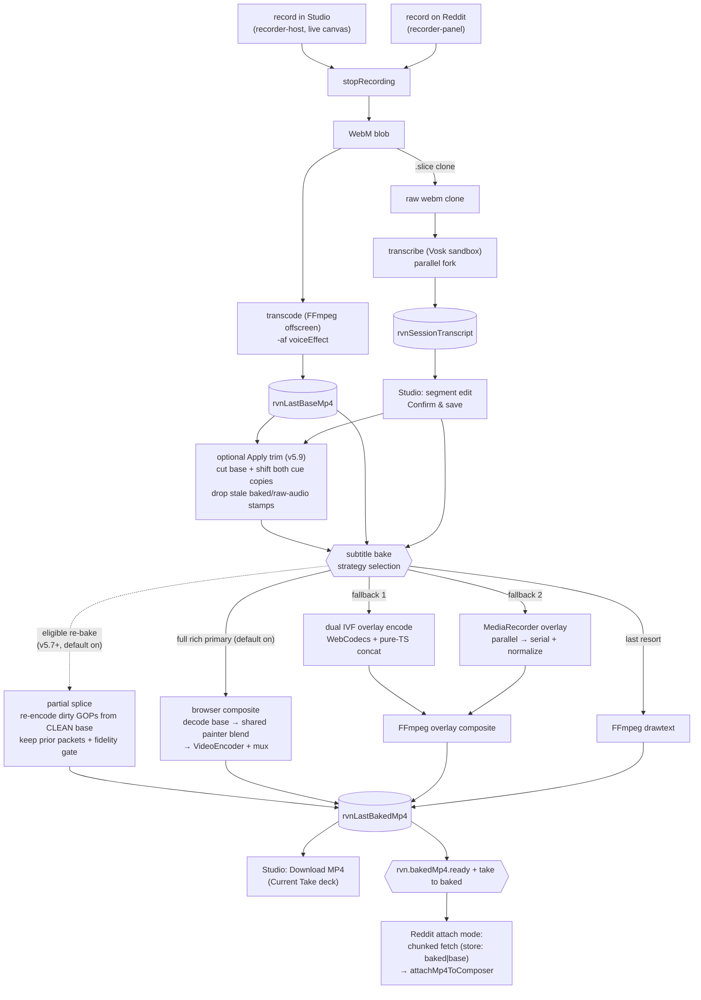
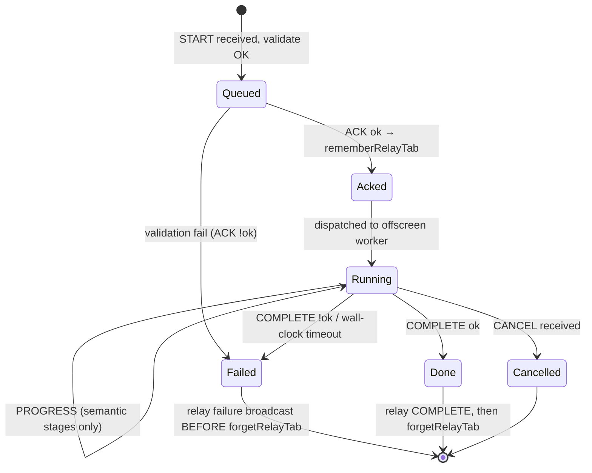

# Architecture Map — Reddit Voice Notes

**Version:** v2.6 · **Reflects branch/tag:** `main` @ `v5.9.0` · **Updated:** 2026-07-11
**Status:** Canonical cross-cutting architecture index. Wins for *how subsystems fit together*;
subsystem internals are owned by the canonical docs linked in §8.
**Re-run:** `/architecture-hardening` (full) or a named phase.

### Changelog
- `v2.6` (2026-07-11) — full four-phase hardening refresh on tagged `v5.9.0`: re-verified all six contexts, the `types.ts` wire, storage owners, the primary browser-composite bake, Studio-direct progress delivery, recovery, and atomic trim apply. Corrected the data-flow diagram (browser composite paints directly; it does **not** consume the dual-IVF overlay), take state machine, flagship money path, stale QA/confidence text, and canonical-doc pointers. Added I18 + Trace E for preview=APPLY trim semantics. Phase 3: H12 resolved by code inspection; H8 remains open because interrupted drafts have no completed `TakeVoiceStamp`; new H13 scopes fail-loud/acknowledged artifact-store writes; R16 records the residual cross-store trim-commit race. No new context, message family, storage class, writer, or ADR.
- `v2.5` (2026-07-11) — additive: **v5.9.0 atomic trim APPLY** closes the v2.4 "next feature" note. `edits.trim` intent is no longer inert: `src/editing/trim-apply.ts` (NEW module, structurally parallel to `voice-reapply.ts`; kept out of `trim.ts` so `test-timeline.mjs` bundles the pure logic without the storage graph) materializes a trim — H6-verified base → mediabunny container trim → pure `shiftCuesForTrim` (mirrors the ghost-preview math `projectCueThroughTrim`; **both** session-transcript copies shift so revert can't resurrect pre-trim times) → superseded guard → commit-last: new base stamp + `meta.durationSeconds` + intent clear + **`bakedMp4`/`baseRecording` stamp deletes** (baked: next bake is a forced full composite via `computePartialRebakePlan`'s duration guard; baseRecording: raw audio no longer matches the timeline — voice locked in, re-apply fails honestly through the clean-audio door) + status `baked → ready`, all one `updateCurrentTake` (`expectId`). Enabling take-manager evolution: `CurrentTakePatch.artifacts` accepts `null` = stamp delete (mirrors the edits patch; closes the explicit-`undefined`-clobber hazard). No new context/message/storage-key/writer. Design + as-built: `docs/v5.9.0-trim-apply-roadmap.md`.
- `v2.4` (2026-07-11) — additive refresh for the v5.7.0 + v5.8.0 editing-suite arc (now on `main`; picks up v5.5.0/v5.5.1 browser-composite default-on in passing). **v5.7.0 partial-rebake splice EXECUTION** shipped — supersedes the v2.3 "planner only, execution deferred" note: a re-bake whose dirty cues cover a small enough fraction re-encodes only keyframe-aligned dirty GOPs from the **CLEAN base** and copies clean packets bit-exact, gated by a self-verifying kept-region pixel-equality check (the avcC hazard) → honest full fallback on any miss. Pure `src/editing/splice-plan.ts`; browser `src/composite/composite-splice.ts` + `composite-fidelity.ts`; wired via `coordinateRebake` (injected `executePartialSplice`, AbortError propagates) + `bakeWithOptionalSplice` in `subtitle-bake.ts`; flag `experimental.partialRebakeSplice` **default ON**; ADR-0005 (Accepted). New I16. **v5.8.0 timeline visual subtitle editor** — the flat cue-list modal became a DOM+CSS-transform timeline surface (`subtitle-timeline-editor.ts` + pure leaves `timeline-geometry.ts` one-import / `waveform-peaks.ts` zero-import): added **no** new execution context, message family, storage key, or take writer (extension-points § Timeline cue editor). Cue-time edits frame-snap through `timeline.ts` `snapTimeToFrame` (I11 consumer → new I17); non-destructive ✂ trim writes the existing `edits.trim` intent via the `planTrim` gate (atomic apply still deferred). Surface internals stay owned by `docs/design-studio.md`. Also fixed pre-existing staleness (carry-forward block was still v2.1; §8 pointers were extension-points v1.3 / backlog v2.0 / ADR-0003 "stub").
- `v2.3` (2026-07-07) — v5.6.0 audio decoupling (branch `feature/5.6.0-audio-decoupling`, ADR-0004): additive `voice`/`edits` fields on the take snapshot (provenance: which voice the baked audio carries; non-destructive trim intent); new page-local audio suite `src/audio/*` (H6-gated clean-audio door over the raw `baseRecording` WebM, Dulcet II re-render, mediabunny stream-copy audio-replace remux — visuals bit-exact, NO new message family); editing/timeline primitives `src/editing/*` + `src/timeline/*` (dirty tracking, keyframe-grid partial-rebake PLANNER — execution deferred to Phase 2b, trim backend). Contract doc: `docs/v5.6.0-audio-decoupling.md`; seam: extension-points v1.5. (Header version also catches up: the v2.2 entry below shipped without bumping the v2.1 header.)
- `v2.2` (2026-07-07) — H9 decision: **browser-side full composite accepted via ADR-0003** (user directive: performance + extensibility prioritized over preview↔bake pixel fidelity; v5.3.10 segment/painter/IVF foundation leveraged). Diagram 2.2 + §3.1/§3.2/§3.3 notes updated for primary path (composite executor now browser canvas+VideoEncoder in Studio page; burn-in relay skipped for successful webcodecs bakes). New pointer to ADR-0003.
- `v2.1` (2026-07-06) — hardening triage applied: **H6 shipped** (`takeArtifactMatchesStore` + `clearArtifact`; I15 now enforced → High), **H11 closed by user QA** (concurrent Studio recordings work; transient length-display edge noted, no code), H10 deferred by user decision, open question 2 resolved. Confidence ledger + carry-forward updated.
- `v2.0` (2026-07-06) — MAJOR: three architectural shifts since v1.1. (1) **Subtitle bake re-architected**: FFmpeg `drawtext` is now the *last* fallback tier; the primary path is Canvas-2D overlay render (v5.3.4) → per-chunk encode (WebCodecs dual-IVF, v5.3.10; MediaRecorder parallel/serial, v5.3.9 fallback) → FFmpeg composite (`alphamerge`/`overlay`). Invariant I3 reworded. (2) **Take lifecycle** — new cross-context state class: `rvn.take.current` snapshot + `TakeArtifactStamp`s, synced by `storage.onChanged` (deliberately no message family — ADR-0002). (3) **Design Studio is now a capture surface** (`recorder-host.ts` headless mount, live WYSIWYG canvas handover, Reddit demoted to optional output target via attach mode). New diagrams 2.3 (take lifecycle) and updated 2.1/2.2; confidence ledger + self-critique fully refreshed.
- `v1.1` (2026-07-04) — additive: v5.3.9 parallel chunked bake (N concurrent MediaRecorder capture loops in the Studio page; workers/offscreen deliberately rejected — pacing-bound). Detail: `docs/transcription-architecture.md` § Parallel chunked bake; `docs/5.3.9-worker-and-chunked-parallelization-design.md` §0.
- `v1.0` (2026-06-24) — initial map; all four phases. Branch: `eloquent` at eloquent-5 hardening.

> Bump MINOR for additive refreshes; MAJOR when a context, pipeline, or storage class is added/removed.

---

## 1. Execution contexts

Verified against `wxt.config.ts` `manifest.content_security_policy` (2026-07-06 — unchanged since v1.0). The single most important architectural fact: **a fix in one context never transfers to another** — different CSP, origin, and API surface.

| Context | Origin / CSP | eval | chrome.* | Responsibility | Entry |
|---------|--------------|------|----------|----------------|-------|
| Content script | reddit.com, isolated world | n/a | limited | recorder panel (capture **or** attach mode), composer inject, canvas capture | `entrypoints/content.ts` |
| Background SW | ext, `wasm-unsafe-eval` | no | yes | relay registry, offscreen lifecycle, artifact stamping, orphan-transcode persistence, chunked blob serving | `entrypoints/background.ts` |
| Offscreen doc | ext, `wasm-unsafe-eval` | no | yes | FFmpeg transcode + subtitle burn-in/composite (WASM) | `entrypoints/offscreen/main.ts` |
| Manifest sandbox | opaque/null, `unsafe-eval` + `worker-src blob:` | **yes** | **no** | Vosk STT (Emscripten + blob workers) | `public/vosk-sandbox.html` |
| Design Studio | ext page | no | yes | **primary product surface**: styling, preview, transcript edit (**timeline cue editor + atomic trim apply**), **native capture (getUserMedia)**, browser composite / fallback overlay encode, partial-rebake splice, voice re-apply, take deck | `entrypoints/design-studio/` |
| Popup | ext page | no | yes | quick settings | `entrypoints/popup/` |

**Sandbox CSP detail (BUG-010/011/013):** `sandbox allow-scripts allow-forms allow-popups allow-modals; script-src 'self' 'unsafe-inline' 'unsafe-eval'; worker-src blob: 'self'; child-src blob: 'self'` — Vosk needs `unsafe-eval` for Emscripten and `worker-src blob:` for blob workers. Full CSP archaeology: `docs/transcription-architecture.md`.

**v5.9.0 full-pass note:** no execution context has been added since v5.4.0. Studio-native recording runs `VoiceRecorderSession` on the extension page; transcode/transcribe still cross the existing background→offscreen boundary, while browser composite, partial splice, voice re-apply orchestration, and trim apply stay in the Studio page. The WebCodecs encode loop remains worker-portable but page-local (ADR-0001).

---

## 2. Diagrams

### 2.1 Context map (who talks to whom)

Verified against `src/messaging/types.ts`, `src/messaging/baked-mp4-blob.ts`, `src/messaging/background-blob.ts` (message constants) and `src/session/take-manager.ts` (storage sync).



**Invariants encoded:**
- Design Studio receives burn-in messages via `runtime.onMessage` and is registered in `burnInSkipTabRelayByJobId` in `background.ts` — excluded from the `tabs.sendMessage` relay that targets Reddit tabs. A future pipeline whose consumer is an extension page must preserve this split.
- The take lifecycle crosses contexts as a **storage key**, never a message. `storage.onChanged` on `rvn.take.current` is the sync channel (ADR-0002); the Reddit panel's live-sync during Studio capture (`maybePromoteNewerTake` in `recorder-panel.ts`) rides this subscription.

### 2.2 Data flow (record → bake → attach), v5.4.0 shape

Verified against `src/recorder/voice-recorder.ts` (fork at stop), `src/recorder/recorder-host.ts`, `docs/transcription-architecture.md` § WebCodecs overlay encode, IDB store module names.



**Invariants encoded:** Transcribe always consumes the raw clone (STT timing independent of voice effect). Every capture surface funnels into the same stop path — blobs are written **only at stop**. Atomic trim consumes the H6-verified base and live cue draft, then drops stale baked/raw-audio stamps; it adds no context or wire. The full-bake fallback order is `browser composite → dual-IVF WebCodecs + FFmpeg composite → MediaRecorder parallel/serial + FFmpeg composite → drawtext`; the browser path paints directly from cues and never builds overlay IVF streams. Only constructed WebCodecs streams skip normalize (ADR-0001/0003). Partial-splice misses delegate to that full chain.

### 2.3 State machine — take lifecycle (NEW, the v5.4.0 spine)

Verified against `src/session/take-manager.ts` (types + `normalizeStaleTake`, `STALE_TRANSIENT_MS`), `src/ui/design-studio/studio-take-recovery.ts`, `claude-progress.md` v5.4.0 Phase 0.

```mermaid
stateDiagram-v2
  [*] --> recording: beginTake (prior snapshot stashed)
  recording --> processing: stop (blobs written NOW)
  recording --> restored: discard / error → prior take restored
  processing --> ready: transcode OK, baseMp4 stamped
  processing --> draft: cancel / error during processing
  ready --> baked: updateFromBake (Studio bake completes)
  baked --> baked: re-bake with new style
  ready --> ready: Apply trim (new base; clear raw-audio stamp)
  baked --> ready: Apply trim (new base; clear baked + raw-audio stamps)
  recording --> draft: reader finds stale transient (>2 min)
  processing --> draft: reader finds stale transient (>2 min)
  draft --> processing: recovery auto-resume (WebM in IDB, no baseMp4, no inflight job)
  ready --> [*]: attach / next beginTake replaces
  baked --> [*]: attach / next beginTake replaces
```

**Invariants encoded:**
- **Stop-time blob-write:** blobs land in IDB only at stop; a discarded recording restores the stashed prior take intact (this is what makes Reddit "Record new here" safe while a Studio take is attachable).
- **Stale-transient demotion is read-side:** `normalizeStaleTake` demotes `recording`/`processing` snapshots older than `STALE_TRANSIENT_MS` (2 min) to `draft` *when read* — no daemon required, correct under MV3 SW death.
- **Recovery is serialized and queue-aware:** `studio-take-recovery.ts` chains recovery ops and asks the background (`MSG_QUERY_TRANSCODE_INFLIGHT`) before resuming, so a still-running offscreen transcode is never doubled.
- **Trim apply is a capability demotion:** a baked take returns to `ready` because the baked bytes and raw capture no longer describe the shortened timeline; a ready take stays ready with a fresh base stamp and locked-in voice.

### 2.4 State machine — offscreen job lifecycle (carried from v1.1)

Applies to all three offscreen pipelines. Verified in v1.0 against `entrypoints/offscreen/main.ts` and `src/messaging/relay-registry.ts`; not re-read line-by-line this session (see §7).



**Invariants encoded:** failure broadcasts before relay-map cleanup (BUG-032); heartbeats never advance `Running→Running` — only semantic progress resets the stall timer (`isMeaningfulProgress()` in `src/ffmpeg/transcoder.ts`, BUG-006).

### 2.5 Pipeline sequence + relay hop (transcode, representative)

Burn-in differs: Design Studio initiates and `runtime.onMessage` replaces `tabs.sendMessage`. The same is true for Studio-initiated native-capture transcode: `transcoder.ts` listens to the offscreen broadcast on `runtime.onMessage`, while `registerTranscodeTab` marks extension-page senders in `transcodeSkipTabRelayByJobId` so background does not duplicate the event through a Reddit tab. H12 is resolved by this code path.

```mermaid
sequenceDiagram
  participant CS as content script
  participant BG as background SW
  participant OFF as offscreen (FFmpeg)
  CS->>BG: MSG_TRANSCODE_START (base64 WebM, jobId)
  BG->>BG: validate + rememberRelayTab(jobId→tabId)
  BG-->>CS: MSG_TRANSCODE_ACK (ok)
  BG->>OFF: ensureOffscreen + MSG_TRANSCODE_OFFSCREEN
  loop until done
    OFF-->>BG: MSG_TRANSCODE_PROGRESS (semantic stages)
    BG-->>CS: tabs.sendMessage relay
  end
  OFF-->>BG: MSG_TRANSCODE_COMPLETE (mp4Base64 | error)
  Note over BG: relay COMPLETE first, then forgetRelayTab (BUG-032)
  BG-->>CS: relay COMPLETE
  BG->>BG: forgetRelayTab(jobId) + stamp take artifact (v5.4.0)
```

**v5.4.0 addition:** after relayed IDB writes succeed, `background.ts` stamps `baseRecording`/`baseMp4` artifacts on the current take (`recordArtifact`) and adopts orphan artifacts into a draft; `persistOrphanStudioTranscodeResult` persists a transcode result whose initiating Studio tab died mid-job.

---

## 3. First-class concerns

### 3.1 Preview ↔ bake boundary

The single canvas in `waveform.ts` (`canvas.captureStream`) is the video-track source for `base.mp4`. Studio's Live preview uses the same draw pipeline (`renderThemePreview()`); **Studio-native recording strengthens this further** — `recorder-host.ts` hands the *actual* `WaveformRenderer` canvas element to the Studio preview surface (`onLiveCanvas`), the same element `captureStream()` feeds MediaRecorder: zero copies, zero preview-vs-output drift. Restyling during capture hot-swaps live via the existing prefs listener.

**Invariant:** *Anything visible in Live preview must be reproducible by the transcode or bake export path.* — `docs/design-studio.md` §3.3; `docs/engineering-principles.md` § Pipeline-native solutions.

**The subtitle preview↔bake story changed shape (v5.3.4 → v5.3.10 → ADR-0003):**
- Preview and bake continue to share **one painter**: `createOverlayFramePainter` (`subtitle-overlay-renderer.ts`) paints the overlay's global frame at `(startFrame + i) / fps` for *every* encoder strategy — the paint pixels are identical regardless of encoder; the encode/composite leg is the per-strategy QA surface (ADR-0001, ADR-0003, extension-points § Overlay encoding backbone).
- Rich effects (halo, dual border, gradients, Oklch rainbow) are canvas-native in both preview and bake — the old drawtext quantization gaps (0.25 s rainbow slices, static `fontcolor`) now apply **only** on the last-resort drawtext tier.
- v5.5+ (ADR-0003): primary WebCodecs path moves the *blend* itself into the browser (VideoDecoder + canvas composite using the painter + VideoEncoder). Per explicit user direction, preview↔bake *pixel* fidelity is relaxed in favor of performance and extensibility; the new fidelity surface (decode + canvas blend semantics + encoder) is gated by a global-frame-index harness (see ADR-0003 § Verification). Remaining accepted gaps include those from v5.3.10 plus possible small visual deltas vs prior alphamerge (documented, not a blocker).

**Animated GIF backgrounds — no gap (canvas-native case):** decoded once, advanced by elapsed time in the RAF, captured straight into `base.mp4`. See `docs/gif-animation-design-implementation.md`.

**Where it could silently drift:** a preview-only canvas effect with no bake path, or an encoder strategy that paints at chunk-local rather than global timestamps (breaks animation-phase invariance).

**ADR-0003 pointer:** See `docs/architecture/adr/0003-composite-stage-elimination.md` for the full decision (browser full composite accepted), consequences, new risks, phases, and the verification strategy (global-frame fidelity harness for the new blend surface). The map diagrams and invariants above reflect the post-decision shape for the primary path.

**Timeline cue editor (v5.8.0) is a new I11 consumer, not a new fidelity surface.** The visual editor edits cue *timing*; every drag / resize / nudge quantizes through `timeline.ts` `snapTimeToFrame` (the painter's own global-PTS expression) — `timeline-geometry.ts` is a one-import leaf that owns no frame math of its own (`timeline-geometry.ts:21`). An edited cue boundary therefore lands on the same frame grid the bake paints at, so preview timing == bake timing by construction (I17). The waveform lane reads the *same* decoded `AudioBuffer` the ▶ preview plays (`getDecodedBuffer()` on `segment-cue-player.ts` — zero extra decode) and is time-aligned to the ruler, so it can't imply a cue sits where the bake won't put it.

**Atomic trim apply (v5.9.0) extends preview=bake to preview=APPLY.** Ghost bars use `projectCueThroughTrim`; destructive apply uses `shiftCuesForTrim` with the same half-open overlap and epsilon, consumes the live modal draft, shifts both persisted transcript copies, and clears modal undo. The next bake uses the shorter H6-stamped base and is forced through the full-composite path because `computePartialRebakePlan` rejects a duration change (I18).

### 3.2 Effect composition

Compositing order (bottom → top) in the final MP4 — unchanged:

1. **Background** — theme gradient/SVG/bokeh + optional personal image or animated GIF (`rvnImageDb`).
2. **Bars** — waveform + glow/effects (canvas capture; 24 fps).
3. **Subtitles** — composited onto `base.mp4` in a post pass. **Never drawn into the capture canvas stream.** The pass is now: overlay video composite (`alphamerge`+`unpremultiply` for WebCodecs IVF, or WebM `overlay` for MediaRecorder paths) with `drawtext` as final fallback.

**Voice effect** applies to the audio track via `-af`/`-filter_complex` in the transcode pass (graph-native, `resolveVoiceGraph` → `buildStylizedGraph`) — not a visual layer.

**Invariant (reworded in v2.0, refined ADR-0003):** *Subtitles are always a post-`base.mp4` composite pass on the export; they never enter the live capture stream.* The primary browser-composite executor decodes the base and invokes the shared painter directly at each decoded frame PTS, then VideoEncoder+mux produces the MP4. It does **not** first render dual-IVF overlay streams. Those streams, MediaRecorder overlays, and drawtext are permanent FFmpeg-backed fallback tiers. The "no canvas subtitles" rule applies to the live capture RAF, not the offline painter. — `browser-composite.ts`; `subtitle-canvas-bake.ts`; ADR-0003.

**Re-bake splice sub-path (v5.7.0, default on).** A *re*-bake whose dirty cues cover a bounded fraction (`coordinateRebake` plan `partial`) re-encodes only the keyframe-aligned dirty GOPs from the **CLEAN base** MP4 (the baked frames there still carry the old burned-in subtitle) and copies the untouched packets bit-exact from the prior baked MP4 — the two inputs `renderCompositeSplice` requires (`composite-splice.ts:328/338-339`). Structural honesty is `validateSpliceOutput` (kept + reencoded == output == expected packet count, ≤1-frame drift); pixel honesty across the splice boundary is the **kept-region pixel-equality fidelity gate** `verifySpliceKeptFrames` (`composite-fidelity.ts:133`, called at `composite-splice.ts:533`) — the single defense against an avcC/sample-description mismatch corrupting the copied AVC packets (I16). Any miss (scan-gate reject, plan `full`, fidelity miss, no prior bake) → `runFullComposite` honestly; `executed:'partial'` is reported *only* on a verified splice; AbortError propagates (never a silent full re-render).

Adding a fourth visual layer still changes compositing order → explicit ADR required.

### 3.3 Message contracts

**Registry:** `src/messaging/types.ts` — single source of truth for pipeline constants and payloads. Chunked blob relays live beside it: `src/messaging/background-blob.ts` (personal backgrounds, port + message fallback), `src/messaging/baked-mp4-blob.ts` (baked/base MP4 fetch, `store: 'baked' | 'base'` param added in v5.4.0 Phase 3 — default `'baked'`, backward compatible).

**Pipelines** (all share `START→ACK→OFFSCREEN→PROGRESS*→COMPLETE|CANCEL`):

| Pipeline | START message | Worker | Initiator | Notes |
|----------|--------------|--------|-----------|-------|
| Transcode | `MSG_TRANSCODE_START` | FFmpeg (offscreen) | Content script **or Studio** (v5.4.0) | Optional voice graph; `voiceEffectFallback` on fail |
| Transcribe | `MSG_TRANSCRIBE_START` | Vosk (sandbox via offscreen) | Content script or Studio | Raw WebM clone; parallel fork |
| Burn-in | `MSG_BURNIN_START` | FFmpeg (offscreen) | Design Studio | Composite/drawtext; skip tab relay. **Primary browser-composite path (ADR-0003) bypasses this entirely**; fallbacks continue to use it. |

**Non-pipeline message kinds (v5.4.0):** `MSG_QUERY_TRANSCODE_INFLIGHT` is a simple query/response (no ACK/PROGRESS lifecycle) used by Studio recovery. This is a *second message shape* — keep queries idempotent and side-effect-free so they stay safe to call from recovery chains (extension-points § Message pipelines v2).

**Deliberate non-message:** the take lifecycle. `MSG_TAKE_*` placeholders were scaffolded and then **removed** — storage IS the sync channel (ADR-0002).

**Also deliberately non-message (the v5.6→v5.8 editing arc):** ~5 k lines of editing/splice/timeline code added **zero** new `MSG_` family (grep-verified in `types.ts` — no `MSG_SPLICE/TIMELINE/TRIM/WAVEFORM/CUE`). Partial-splice execution is in-page (`composite-splice.ts` — no relay hop, it runs where the bake already runs); the timeline editor is a Design Studio surface over the existing edit/dirty/trim seams; trim is the `edits.trim` **storage** intent (via `planTrim` → `mergeTakeEdits`). Reach for a pipeline only when there is cross-context work-with-progress to relay — none of these are.

**Studio progress delivery (H12 resolved):** extension-page clients install `runtime.onMessage` listeners in the same transcode/burn-in clients as content-script callers. Background identifies the extension-page sender URL and records `*SkipTabRelayByJobId`; the offscreen broadcast reaches Studio directly, while background relays to `tabs.sendMessage` only for Reddit content-script jobs. No late-bound Reddit-tab fallback participates in a normal Studio job (`background.ts` `registerTranscodeTab` / `relayTranscodeBroadcast`; `transcoder.ts` `onBroadcast`).

**Relay:** `src/messaging/relay-registry.ts` — `browser.storage.session` survives SW restarts; `clearAllRelayTabs()` on SW boot; connection-failure cleanup in all three relay broadcast functions (backlog v1 H4). Fragile ordering: broadcast COMPLETE/failure before deleting the tab entry (BUG-032).

### 3.4 State ownership

**Rule:** one writer per datum. Blobs and transcript text never in `rvnUserPrefs`. Blobs never in the take snapshot.

Authoritative storage map: `docs/design-studio.md` §3.2 (now includes `rvn.take.current`). Deltas this map adds context for:

| Datum | Where | Single writer / choke point |
|-------|-------|------------------------------|
| `rvn.take.current` | `chrome.storage.local` | **TakeManager** (`src/session/take-manager.ts`) — recorder session owns capture transitions, background merges artifact stamps, Studio bake promotes to `baked`. Same-context writes serialized; `sessionEpoch` guards sub-second races |
| `experimental.webCodecsBake` / `parallelBake` | `rvnUserPrefs` | `enqueuePrefsOp`; **default true since v5.4.0** (`resolveOverlayBakeEncoder`, one-time rollout migration — `user-preferences.ts:191,329`) |
| Encoded segment metadata | in-memory per bake | `src/encoding/encoded-segment.ts` (`EncodedOverlaySegmentMeta`) — telemetry + future editing primitive; not persisted |
| `experimental.partialRebakeSplice` | `rvnUserPrefs` | `enqueuePrefsOp`; **default ON** (opt-out `=== false`) — `resolvePartialRebakeSpliceEnabled` (`user-preferences.ts:183`) |
| `edits.trim` (non-destructive trim intent) | `rvn.take.current` snapshot | **`planTrim` gate only** (`src/editing/trim.ts`) → TakeManager `mergeTakeEdits`; view-state until an explicit Save. **Consumed by v5.9.0 atomic apply** (`src/editing/trim-apply.ts` — clears the intent in the same commit that mutates `baseMp4`, shifts cues, and drops the `bakedMp4`/`baseRecording` stamps). Not a new writer: reuses the v5.6.0 `edits` merge path |

**Invariants:** all `rvnUserPrefs` writes via `enqueuePrefsOp` (BUG-023). Content scripts can't read extension IDB — chunked relay only. The take snapshot references blobs through `TakeArtifactStamp` (`savedAt`/`byteLength`/`durationSeconds`); consumers verify stamps against store metas via `takeArtifactMatchesStore()` before adopting blobs, demoting mismatched stamps with an honest note (**H6, shipped 2026-07-06** — enforced at recovery resume, Reddit attach, and the Download CTA).

---

## 4. Invariants (Phase 2)

| # | Invariant | Concern | Enforced at | Confidence |
|---|-----------|---------|-------------|------------|
| I1 | Anything in Live preview is reproducible by the export path | preview↔bake | `docs/design-studio.md` §3.3; informal | High |
| I2 | Transcription always runs on the raw WebM clone, never the voice-modulated export | preview↔bake | `src/recorder/voice-recorder.ts` (fork at stop) | High |
| I3 | Subtitles are a post-`base.mp4` export pass; never in the live capture stream (overlay pixels are canvas-painted offline — that's the design, not a violation) | composition | `src/ffmpeg/subtitle-burnin.ts`; `subtitle-canvas-bake.ts` | High |
| I4 | Failure broadcasts before the relay-registry entry is deleted | messages | `src/messaging/relay-registry.ts`; BUG-032 | High |
| I5 | Stall timers reset only on semantic progress, never heartbeats | messages | `src/ffmpeg/transcoder.ts` `isMeaningfulProgress()` | High |
| I6 | All `rvnUserPrefs` writes go through `enqueuePrefsOp` | state | `src/settings/user-preferences.ts` | High |
| I7 | Content scripts receive blobs via chunked relay only (no extension-IDB reads) | state | `background-blob.ts`, `baked-mp4-blob.ts` | High |
| I8 | Vosk model loads into MEMFS per session (no IDB cache in sandbox) | state | BUG-011/013 accepted tradeoff | High |
| I9 | The take snapshot never contains blobs; blobs stay in single-slot IDB stores, referenced by artifact stamps | state | `take-manager.ts` header + `parseCurrentTake` | High |
| I10 | Blobs are written only at recording stop; discard/error-while-recording restores the stashed prior take untouched | state, preview↔bake | `voice-recorder.ts` v5.4.0 wiring (`beginTake` prior-snapshot stash) | High |
| I11 | Every overlay encoder strategy paints at global `(startFrame + i) / fps` — animation phase and cue-cache keys are chunk-invariant | preview↔bake | `createOverlayFramePainter` (`subtitle-overlay-renderer.ts`); ADR-0001 | High |
| I12 | Only *constructed* streams (WebCodecs IVF) may skip normalize; *captured* MediaRecorder output must always be normalized | composition | ADR-0001 "not the compositeReady mistake"; `scripts/test-overlay-alphamerge-args.mjs` regression guard | High |
| I13 | The alphamerge composite is gated by a measured luma-range calibration probe — codec metadata is never trusted for alpha range | composition | `src/encoding/webcodecs-support.ts`; ADR-0001 | High |
| I14 | Stale transient takes (`recording`/`processing` > 2 min) are demoted to `draft` on read | state | `normalizeStaleTake` (`take-manager.ts:220`) | High |
| I15 | Artifact stamps let consumers detect a snapshot whose blobs moved on (stamp `savedAt` ≈ store meta `savedAt`, `byteLength` equal when both present) | state | `takeArtifactMatchesStore()` (`take-manager.ts`) at all three consumption sites: `studio-take-recovery.ts` resume, `recorder-panel.ts` attach, `current-take-status.ts` Download — H6, Node-tested | High |
| I16 | A partial re-bake splice is adopted only if it *cannot* lie: `validateSpliceOutput` proves kept + reencoded == output == expected packet count (≤1-frame drift) AND `verifySpliceKeptFrames` proves the copied kept-region frames decode pixel-identical to the original (mean Δ ≤ 1.5, peak ≤ 24) — any miss throws → full composite; `executed:'partial'` only on a verified splice | composition | `splice-plan.ts` `validateSpliceOutput`, `composite-fidelity.ts` `verifySpliceKeptFrames`, `partial-rebake-coordinator.ts` `coordinateRebake` — Node-tested (`test-splice-plan` 36, `test-partial-rebake-plan` 13) | High (single machine) |
| I17 | Timeline cue-time edits quantize through `timeline.ts` `snapTimeToFrame`, so an edited cue boundary lands on the same frame grid the overlay paints at (I11) — edited preview timing == bake timing | preview↔bake | `timeline-geometry.ts:21` (sole import; every snap path delegates) — Node-tested (`test-timeline-geometry` 48) | High |
| I18 | Trim ghost preview and destructive apply use the same half-open cue projection; apply consumes the live draft, shifts both transcript copies, and clears undo so pre-trim cue times cannot return | preview↔bake, state | `timeline-geometry.ts` `projectCueThroughTrim`; `trim.ts` `shiftCuesForTrim`; `trim-apply.ts`; `subtitle-segment-editor.ts` — Node-tested (`test-timeline` 16) + real-browser QA | High (single machine) |

---

## 5. Money-path traces (Phase 2)

### Trace A — Studio-native take, browser-composite bake, Reddit attach (current flagship path)

1. Studio deck Record → `mountRecorder({hostContext:'studio'})` (`recorder-host.ts`) → `VoiceRecorderSession` with `takeSource:'studio'` → `beginTake` stashes prior snapshot, take → `recording`
2. `onLiveCanvas` hands the WaveformRenderer canvas into the hero monitor (`.studio__preview-canvas--live`); theme RAF paused (`auditionActive` guard); style edits hot-swap live
3. Stop ■ → take → `processing`; WebM written; fork: clone → `MSG_TRANSCRIBE_START`, main → `MSG_TRANSCODE_START` (both `runtime.sendMessage` — identical to Reddit capture)
4. Background: transcode completes → relays IDB writes → stamps `baseRecording`/`baseMp4` artifacts → take → `ready`
5. Transcript arrives (`rvn.sessionTranscript.ready`) → segment edit → Confirm & save
6. Bake: `subtitle-bake.ts` → optional splice gate misses on a first/full bake → `bakeWithCanvasOverlay` with `composite:'browser'` → `renderBrowserComposite`: mediabunny decodes the base, `createOverlayFramePainter` paints directly at each decoded frame PTS, Canvas2D blends, VideoEncoder+mux emits the MP4. No overlay-IVF or `MSG_BURNIN_*` hop occurs on this primary path. `saveLastBakedMp4` + `BAKED_MP4_READY_KEY` + `updateFromBake` promote the take to `baked`; any browser-path failure falls through to the permanent FFmpeg tiers.
7. Reddit composer opened → `RecorderPanel.open()` sees completed take → **attach mode** ("Current Studio Take" card) → `MSG_GET_BAKED_MP4_META/_CHUNK` (`store:'baked'`) → `attachMp4ToComposer` → workflow → `'design'`

**Code verified at:** `recorder-host.ts`, `voice-recorder.ts` stop fork, `background.ts` direct-runtime/relay split, `subtitle-bake.ts`, `subtitle-canvas-bake.ts`, `browser-composite.ts`, `take-manager.ts`, and `recorder-panel.ts` attach H6 gate (v2.6 session).

### Trace B — mid-processing Studio tab close → recovery (QA checklist #4)

1. Tab closes during `processing` → `pagehide` auto-draft; snapshot may persist as phantom `processing`
2. Reopen Studio → `studio-take-recovery.ts`: `reconcileInterruptedProcessing()` + `MSG_QUERY_TRANSCODE_INFLIGHT` → if inflight: wait (background will `persistOrphanStudioTranscodeResult`); if idle: demote to `draft`
3. Draft with `baseRecording` stamp but no `baseMp4` → `resumeDraftTranscodeInner`: load WebM from `rvnLastRecording` (≥256 bytes) → re-transcode with **current** `prefs.voiceEffect` → `relaySaveLastBaseMp4` → take → `ready`
4. Reddit attach mode available again (never-baked takes attach their base MP4)

**Code verified at:** `studio-take-recovery.ts:44-70`. Hardening applied here 2026-07-06 (H6): resume now cross-checks the draft's `baseRecording` stamp against `recording.meta` before adopting the WebM, demoting the stamp on mismatch. Remaining seam: resume re-applies *current* voice prefs rather than capture-time settings (H8, v5.4.x patch).

### Trace C — personal background WYSIWYG relay (carried from v1, unchanged)

Studio reads `rvnImageDb` directly; the Reddit recorder receives chunked base64 via `BACKGROUND_BLOB_PORT` → decode → `drawThemeBackground()`. Same bytes feed animated GIFs (WebCodecs `ImageDecoder`). Missing/undecodable → theme fallback, never blocks recording. — `docs/engineering-principles.md` § Personal backgrounds.

### Trace D — cue edit in the timeline → partial-splice re-bake → attach (v5.7.0 + v5.8.0)

1. Studio opens the transcript editor; the timeline view mounts (`subtitle-timeline-editor.ts`) over the same `modalDraft` the List view edits — the host keeps the two views lossless via `captureActiveDraft()` (reads the List DOM only when List is active; Timeline writes straight to the draft — the load-bearing two-view source-of-truth).
2. User drags a cue edge → `timeline-geometry.ts` `resolveSnapSticky` → `snapTimeToFrame` (frame-exact, I17) → new timing lands in `modalDraft`; the dirty cue chips amber.
3. Confirm & save persists the edited cues; a subsequent **re-bake** runs `subtitle-bake.ts` → `computePartialRebakePlan(segments, style, duration)` → `bakeWithOptionalSplice`.
4. Flag on + plan `partial` + a prior baked MP4 exists → `coordinateRebake(plan, runFullComposite, executePartialSplice)` → `renderCompositeSplice({ bakedMp4, baseMp4 })`: scan keyframes → map dirty spans to whole-GOP windows → re-encode those from the CLEAN base with the new cues → assemble (kept packets bit-exact) → `verifySpliceKeptFrames` (I16).
5. Fidelity OK → `executed:'partial'`, `rvnLastBakedMp4` updated, take → `baked`. Any miss (fidelity, plan `full`, no prior bake) → `runFullComposite` — identical output, just no speedup.
6. Reddit attach serves the spliced bytes exactly as a full bake (H6 stamps unchanged).

**Code verified at:** `subtitle-bake.ts:121/188/200/263/301/360`, `partial-rebake-coordinator.ts:174-196`, `composite-splice.ts:328/338-339/533`, `composite-fidelity.ts:133`, `timeline-geometry.ts:21/272-285` (this session).

### Trace E — trim preview → atomic apply → full re-bake (v5.9.0)

1. Timeline trim mode projects every cue through `projectCueThroughTrim`; `captureActiveDraft()` makes the active List/Timeline draft authoritative.
2. Two-click **Apply trim** calls `applyTrimToCurrentTake`: read current take → H6-verify `baseMp4` → validate the frame-snapped range with the same `planTrim` gate Save uses.
3. `applyTrimToMp4` produces a new in-memory MP4; `shiftCuesForTrim` applies the ghost-preview overlap math independently to stored original cues and the live edited draft.
4. Superseded-take guard passes → commit block writes the shorter base and both shifted transcript copies → one `updateCurrentTake(expectId)` publishes the new base stamp/duration, clears `edits.trim`, deletes `bakedMp4`/`baseRecording` stamps, and demotes `baked → ready`.
5. Host re-seeds every draft/baseline, clears undo, reloads the clip/waveform, and fits the shorter view. Voice re-apply is now honestly unavailable because no matching raw-audio stamp exists.
6. The next subtitle bake sees a duration change, so `computePartialRebakePlan` returns null and the full chain runs against the trimmed clean base. Download/attach resolve the trimmed base until that bake completes.

**Code verified at:** `trim-apply.ts`, `trim.ts`, `session-transcript-db.ts` `replaceSessionTranscriptResults`, `subtitle-segment-editor.ts` `onApplyTrim`, `subtitle-bake.ts` duration guard, and real-browser QA in `release-notes-v5.9.0.md`.

---

## 6. Confidence ledger (Phase 2)

| Subsystem | Confidence | Evidence / notes |
|-----------|-----------|------------------|
| Transcode / transcribe / drawtext pipelines (BUG-001–035) | **High** | Mature failure/cancel/semantic-progress contract; unchanged through v5.9.0 and release regression sweep |
| TakeManager pure core (parse/merge/stale/freshness/null-delete) | **High** | Node-tested (`test-take-manager.mjs` 33); pure helpers isolated from `browser.*` |
| Studio-native capture + live canvas | **High** | User QA checklist 1–11 PASS (2026-07-06); zero-copy contract structural |
| WebCodecs dual-IVF + FFmpeg composite fallback | **High (single machine)** | QA PASS 2026-07-05, 8–10× render speedup; session-cached alpha calibration (`codec+dimensions+fps`) gates this fallback tier |
| Recovery paths (tab-close, orphan transcode, inflight query) | **Med-High** | QA #4 PASS; stamp cross-check now guards the resume path (H6); remaining: async branch coverage, H8 voice provenance |
| Artifact stamp contract | **High** | I15 — `takeArtifactMatchesStore` enforced at all three consumers, 6 Node checks (H6, 2026-07-06) |
| Studio-initiated transcode progress delivery | **High** | H12 resolved: `transcoder.ts` listens on `runtime.onMessage`; `transcodeSkipTabRelayByJobId` suppresses only the content-tab duplicate for extension-page senders |
| Concurrent Studio recordings / dual-writer take races | **High** | User QA 2026-07-06: overlapping recordings capture correctly, processing serializes, first take downloadable (and downloads) while second processes; Reddit panel syncs as designed. Known accepted edge: transient window between the two completions where the status display shows the *second* take's length while the first is the downloadable one — display-only, self-corrects on second completion (backlog H11) |
| MediaRecorder fallback health (post-default-flip) | **Med (accepted)** | Fallback chain tested pre-flip; observability instrumentation deferred by user decision (H10) — watch-symptom: unexplained multi-minute bakes |
| Composite stage performance | **High (resolved)** | The ~43 s FFmpeg x264 composite wall is **eliminated** on the primary path — browser-side composite shipped v5.5.0, **default-on since v5.5.1** (ADR-0003 Accepted; two-machine QA PASS). Partial-splice re-bakes (v5.7.0) cut it further by re-encoding only dirty GOPs |
| Partial re-bake splice execution (v5.7.0) | **High (single machine)** | Real-browser QA PASS 2026-07-08 — AVC (C1) + VP9 (C2), happy path + honest fallbacks + a forced fidelity reject; the avcC hazard is self-verifying (I16). Residual: second-machine encoder variance → more *full* fallbacks only, never a wrong pixel |
| Timeline visual subtitle editor (v5.8.0) | **High** | Sprints 3–9 real-browser QA PASS (Windows/Chrome, 2026-07-09/10); pure geometry/waveform Node-tested (`test-timeline-geometry` 48, `test-waveform-peaks` 10); frame-snap delegates to `timeline.ts` (I17). Trim intent → **atomic apply shipped v5.9.0** (row below) |
| Atomic trim apply (v5.9.0) | **High (single machine)** | Node: timeline 16 + take-manager 33; real-browser QA PASS for duration/cue parity, full post-apply bake, voice lock, revert/undo, recovery, Download/attach, and regressions (2026-07-11) |
| Artifact-store write acknowledgment | **Low** | `saveLastBaseMp4`/`saveLastBakedMp4` can return without persisting on size rejection (base also swallows IDB errors), while callers may still stamp/signal success. H6 catches later mismatch only when a stamp-aware consumer runs; H13 scopes the fail-loud contract |
| Vosk model caching | **Low (accepted)** | ~40 MB re-download per session; BUG-013 tradeoff stands |
| Demo site (`demo/`) parity with v5.4.0 | **Low (out of scope)** | No capture pipeline there; explicitly deferred |

**Open questions:**
1. Should H13 make store saves return authoritative persisted metadata, or only throw on rejection/failure? Returning metadata best prevents callers from manufacturing `Date.now()` stamps, but touches more call sites.
2. Does the v5.9 trim commit need transcript ownership (`takeId` on the session record) before concurrency grows? Today the pre-commit guard + H6 protect the base, but a different take beginning during the final multi-store write window could still observe a shifted single-slot transcript (R16).

**Resolved this pass:** Studio-job progress is direct `runtime.onMessage` with tab-relay suppression (H12); overlay alpha calibration is cached once per session by codec+dimensions+fps, while the content-dependent browser-composite decode probe runs per bake/input.

---

## 7. Self-critique (Phase 2)

**Verified in the v2.6 full pass (2026-07-11, `main` @ `v5.9.0`):** CSP and six-context inventory (`wxt.config.ts`); every `MSG_*` family/query/signal in `types.ts`; `rvn.take.current` subscription/write contract; Studio capture fork; extension-page direct progress delivery and all three skip-tab-relay maps; current prefs defaults; primary browser composite vs dual-IVF/MediaRecorder/drawtext fallback ownership; partial-splice gate; H6 consumers; recovery; atomic trim source/transform/commit/host-refresh path; all single-slot store save contracts. Two money paths were re-walked from code (Trace A and E), not inferred from earlier docs.

**Verified in the v2.5 session (2026-07-11, v5.9.0 branch):** the entire trim-apply integration surface read directly during Phase 0/1 — `trim.ts` backend + `shiftCuesForTrim` vs `projectCueThroughTrim` (semantics mirrored, epsilon matched); `computePartialRebakePlan`'s `durationSeconds !== ` guard in `subtitle-bake.ts:129` (the post-apply full-composite safety); all four `loadLastBakedMp4` consumers H6-safe after a stamp drop (Download per-stamp check, voice-reapply skips absent baked leg + dies at cleared baseRecording, background relay gated panel-side, splice duration-guarded); `session-transcript-db.ts` dual-copy model (the §3H revert hazard); `mergeTakePatch` null-delete evolution Node-tested.

**Verified in the v2.4 session (2026-07-11):** the v5.7.0/v5.8.0 code delta directly — `resolvePartialRebakeSpliceEnabled` default-on (`user-preferences.ts:183/186/240`); `renderCompositeSplice` clean-base two-input signature (`composite-splice.ts:328/338-339`); the fidelity gate `verifySpliceKeptFrames` defined (`composite-fidelity.ts:133`) and wired as the final splice step (`composite-splice.ts:533`); `coordinateRebake` injected splice + AbortError passthrough (`partial-rebake-coordinator.ts:174-196`); `splice-plan.ts` export surface (`planSplice`/`validateSplicePlan`/`validateSpliceOutput`/`selectSpliceFidelityAnchors`); `bakeWithOptionalSplice`/`computePartialRebakePlan`/`runFullComposite` (`subtitle-bake.ts`); `timeline-geometry.ts` sole-import frame-snap delegation (line 21); `getDecodedBuffer` on the cue player; `edits.trim` written via `mergeTakeEdits` (no new writer); **zero new `MSG_` families** in `types.ts`. NOT re-read: the 2066-line `subtitle-timeline-editor.ts` UI internals (owned by `docs/design-studio.md` + the v5.8.0 design doc) and the assemble/re-encode internals of `composite-splice.ts` (trusted from ADR-0005 + the QA log).

**Verified in the v2.3 session:** CSP table vs `wxt.config.ts`; wire constants vs `types.ts` + `background-blob.ts` + `baked-mp4-blob.ts`; TakeManager types/constants/exports read directly; `studio-take-recovery.ts` read; `user-preferences.ts` default-flip confirmed at lines 148–191/329; `recorder-host.ts` contract read; storage map extended in `design-studio.md` §3.2; stale doc fixed in `transcription-architecture.md` §gating.

**Carried forward, NOT re-verified line-by-line this session:** Vosk sandbox inference internals after the parent/worker trust boundary; the full 2k-line timeline pointer/keyboard UI; codec packet assembly internals inside `composite-splice.ts`. Their boundary contracts and tests were checked; implementation detail remains owned by the canonical subsystem docs/ADRs.

**Doc-vs-code disagreements found (and fixed or filed):**
- `architecture-map.md` Trace A and its data-flow diagram routed the default rich bake through dual-IVF + `MSG_BURNIN_START`; code has defaulted to direct in-page browser composite since v5.5.1 → **fixed in v2.6**.
- `design-studio.md` and `transcription-architecture.md` still described Reddit-only capture, flat subtitle preview, and FFmpeg as the normal composite → **canonical owners refreshed in place**; no duplicate architecture doc created.
- `extension-points.md` said trim intent had no consumer immediately before its v5.9 preview=APPLY paragraph → **fixed in v1.8**.
- `hardening-backlog.md` still called v5.9 QA pending, H12 unverified, and H8 possibly subsumed → **corrected in v2.5**; H13/R16 record the newly verified persistence/commit gaps.
- `transcription-architecture.md` said `webCodecsBake` default false; code says true since `bd7d60a` → **fixed this session**.
- `take-manager.ts` header promises stamp cross-checking by consumers; no consumer does it → **filed as H6** (code change, not doc change — the contract is right, the implementation is missing).
- v1 map referenced ADR stub `adr/0001-voice-recorder-prefs-transcriptconfig.md` that was never created; the number was then used by the WebCodecs ADR → stub question absorbed into this refresh (the `transcriptConfig` optionality concern did not recur in 5.3.x; dropped without a stub).

**Coupling that surprised:** atomic trim is called “commit-last,” but the commit spans three independently transactional stores (`rvnLastBaseMp4`, `rvnSessionTranscript`, `rvn.take.current`). H6 makes a partially written base fail safe for stamp-aware consumers, but the transcript has no take ownership. This is a narrow race, not evidence of a shipped failure; it is explicit as R16 instead of hidden behind the word atomic.

**If I changed X, what breaks?**
- Write `rvn.take.current` outside TakeManager → dual-writer races, deck/panel desync (the exact class Phase-0 centralization removed).
- Paint a chunk at local `(i / fps)` instead of global → animation-phase seams at chunk boundaries; cue-cache poisoning (I11).
- Mark any captured stream composite-ready → v5.3.9.1 regression class (I12).
- Skip the calibration probe "because VP8 is always limited-range" → wrong alpha on hardware that encodes full-range (I13).
- Add a `MSG_TAKE_*` message family "for consistency" → two sync channels for one datum; ADR-0002 explains why storage won.
- Treat `saveLast*Mp4()` resolution as proof of persistence without an acknowledgment contract → a rejected/failed store write can still publish a success signal or stamp (H13).

---

## 8. Related docs

| Doc | Owns |
|-----|------|
| `docs/design-studio.md` | Studio semantics, preview=bake, dirty layers, storage map (§3.2 — incl. `rvn.take.current`), outbound index (§12) |
| `docs/transcription-architecture.md` | Vosk sandbox CSP stack, canvas overlay + WebCodecs bake paths, strategy/fallback table |
| `docs/engineering-principles.md` | Semantic health, save pathways, ImageDB, pipeline-native effects |
| `docs/bug-archive.md` | Full `BUG-###` write-ups (Phase-3 raw material) |
| `docs/5.4.0-design-studio-first-standalone-voice-notes-suite-roadmap.md` | v5.4.0 Phase 0 as-built (TakeManager decisions) |
| `docs/5.3.10-webcodecs-per-chunk-encoding.md` §0 | WebCodecs backbone as-built |
| `docs/v5.6.0-audio-decoupling.md` | Audio decoupling + editing/timeline backend + **partial-splice contract** (§4.2 as-built, §13 QA checklist) |
| `docs/v5.8.0-trim-ui-visual-subtitle-editor.md` | Timeline visual subtitle editor as-built (the v5.8.0 Studio surface — SHIPPED) |
| `docs/v5.9.0-trim-apply-roadmap.md` | Atomic trim apply as-built + QA gate/result |
| `docs/v5.10.0-raw-trim-apply-roadmap.md` | **Planning only / unshipped:** proposed raw-WebM trim extension to restore post-trim voice changes. Re-verify its storage API names, H13 acknowledgment rule, and R16 transcript ownership before implementation |
| `docs/architecture/adr/` | ADR-0001 WebCodecs backbone · ADR-0002 TakeManager storage sync · ADR-0003 composite-stage elimination (**Accepted**) · ADR-0004 audio decoupling / voice re-apply · ADR-0005 partial re-bake splice (**Accepted**, default-on) |
| `docs/architecture/extension-points.md` | Seam registry (v1.8) |
| `docs/architecture/hardening-backlog.md` | Ranked hardening items + risk register (v2.5) |
| `src/messaging/types.ts` | Wire registry — authoritative message constants |
| `src/session/take-manager.ts` | Take lifecycle contract (header doc is authoritative) |

---

## Resume in a new chat (carry-forward)

```
architecture-hardening resume.
Repo: Reddit Voice Notes (Chrome MV3/WXT), main @ tagged v5.9.0. Map v2.6 (2026-07-11).
Contexts (6): content / background SW / offscreen FFmpeg / Vosk sandbox / Design Studio / popup.
Spine:
  preview=bake: direct shared painter on browser composite; timeline frame-snap I17; trim preview=APPLY I18.
  composition: bg→bars in capture; subtitles post-base. Full default = browser decode→paint→encode; FFmpeg tiers persist.
  messages: types.ts has 3 pipelines + idempotent query + chunked relays; Studio progress is direct runtime broadcast (H12 resolved).
  state: TakeManager owns rvn.take.current; H6 validates single-slot blobs; trim clears baked/raw-audio stamps and forces full re-bake.
Editing arc: v5.6 audio/edits → v5.7 verified GOP splice → v5.8 timeline → v5.9 atomic trim (QA PASS).
Hardening v2.5: H13 OPEN (store writes must acknowledge persistence); H8 OPEN (recovery uses resume-time voice); H10 deferred.
Risks: R14 splice avcC mitigated by I16; R15 two-view draft; R16 narrow trim multi-store race.
Extension points v1.8. ADRs 0001–0005 Accepted; no new ADR/context/message/store in v5.9.
Read docs/architecture/architecture-map.md then run /architecture-hardening resume.
```
