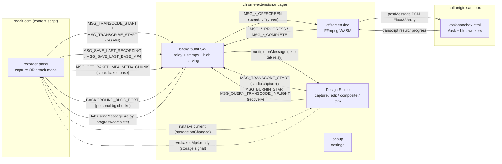
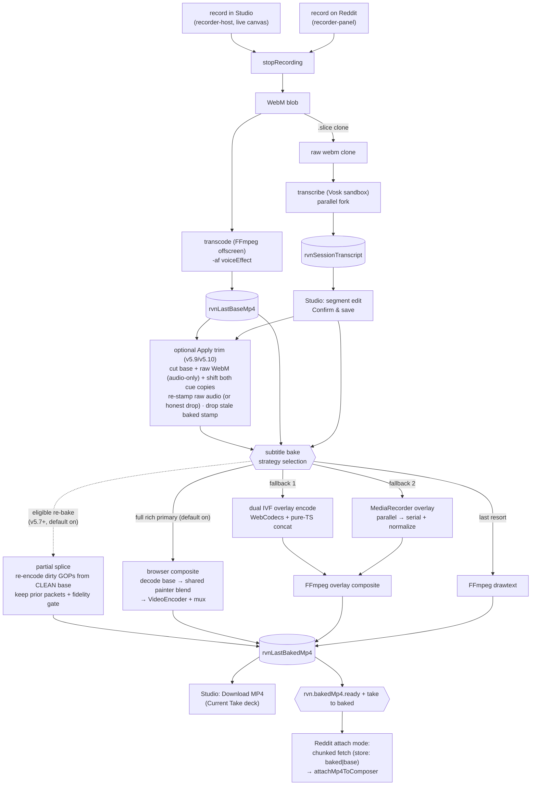
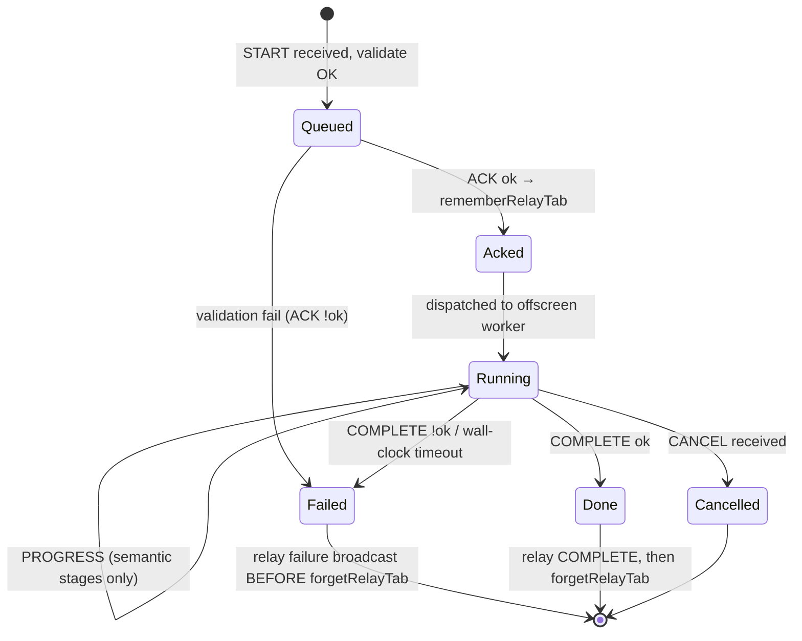
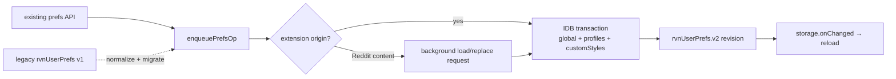

# Architecture Map — Reddit Voice Notes

**Version:** v3.22 · **Reflects branch/tag:** `main@7d1c649` @ package `5.11.0` · **v6 Tracks A/B/C merged; Track B full QA PASS** · **Updated:** 2026-07-20
**Status:** Canonical cross-cutting architecture index. Wins for *how subsystems fit together*;
subsystem internals are owned by the canonical docs linked in §8.
**Re-run:** `/architecture-hardening` (full) or a named phase.

### Changelog
- `v3.22` (2026-07-20) — **Background Layout v2 / Track B merge closeout:** normalized additive `UserBackgroundLayout` now carries continuous position/scale, dim/blur/blend/solid-plate/Holo/GIF/safe-text fields through one preference → Studio preview/direct-manipulation → recorder hot-swap/relay → record-time Canvas 2D draw seam. `computeImageDrawOffset` prefers normalized `customPosition` with discrete fallback; the personal slot paints plate → treated image → dim. Presets, DOM-only crop/thirds, transient Theme-only compare, and page-local A/B add no context/message/store/signal/layer. Added I23 and refreshed Trace C/confidence after full operator checklist PASS, focused 89/89, build PASS, and blur+GIF 23/29 MiB. Feature merged to `main@7d1c649`; package and `USER_PREFS_VERSION` intentionally unchanged. Extension points **v1.37**; ADR-0008 Accepted/final.
- `v3.21` (2026-07-14) — **v6 Phase 4 Style Control Center + shared performance governor:** replaced the live Bar Style panel/summary/guard IDs with `style`; added registry-driven 6-spectrum, 7-atmosphere (+Clean), and 7-accent discovery; shared tuning/palettes/band weights/contextual layout/readability; and reused existing `DesignOverrides` + debounced custom-style persistence. A pure `maxElements` estimate defines Comfortable ≤560, Elevated ≤980, and Guarded >980; Guarded suspends the costliest selected accent in the actual record-time renderer without rewriting the saved ordered list. Identity hot-swaps reset bounded per-canvas state; caption-safe dim paints after visual layers and below captions. New focused tests 6/6, v6 total 226/226, production build PASS, and responsive production-fixture browser QA PASS (desktop/mobile containment, max-three, ARIA/keyboard, governor transitions); QA found/fixed CSS Grid min-content overflow. I22 remains Medium until live capture/FPS and real heavy 120-second artifacts land. No new context/message/store/signal/dependency/compositing layer/preference version/ADR; ADR-0007 already owns the governor direction. Extension-points **v1.35**.
- `v3.20` (2026-07-14) — **v6 Phase 3 Particle Burst / curated visual catalog complete:** registered the final stackable ID as an onset-only field of 14–28 comet/diamond shards per bloom. The existing lifetime emitter caps three overlapping loads at 42–84 particles; three fixed effect-local shock shells add two rings and a core flash for ≤261 paint elements. Explicit transients and a consumer-local positive spectral-flux fallback trigger linear dominant-band fans, centered novas, or radial rim cones; steady/falling spectra stay quiet behind a bounded cooldown. Capture silence is empty, preview deterministic, High Contrast hard/no-blur, and reduced motion fixed. Node 15/15; focused v6 regressions 220/220; production build PASS and recorder + Studio bundles contain Particle Burst. ADR-0007 owns the unchanged ordered record-time seam; no shared onset/event/burst framework, preference/UI/context/message/store/signal/dependency/compositing layer/bake renderer/scene graph/governor/ADR. Extension-points **v1.34**; browser visual/FPS and real heavy three-stack artifact evidence remain Phase 4 gates.
- `v3.19` (2026-07-14) — **v6 Phase 3 bounded Neon Glow stackable:** registered a consumer-local field of 3–7 continuous 18-point neon tubes, with fixed smoothed levels and two charge phases per tube (≤126 typed-array geometry points / ≤49 paint passes). Linear light rails, centered rounded sign contours, and radial orbit rings consume weighted bands without importing or duplicating Classic's 32-bar renderer. Transients surge existing cores/knots without spawning state; capture silence is empty, preview deterministic, High Contrast hard/no-blur, and reduced motion fixed. Node 13/13; focused v6 regressions 205/205; production build PASS and recorder + Studio shared bundles contain Neon Glow. ADR-0007 owns the unchanged ordered record-time seam; no shared glow framework, preference/UI/context/message/store/signal/dependency/compositing layer/bake renderer/scene graph/governor/ADR. Extension-points **v1.33**; browser visual/FPS and real heavy three-stack artifact evidence remain Phase 4 gates.
- `v3.18` (2026-07-14) — **v6 Phase 3 Layered Smoke + consumed bounded plume history:** added `BoundedPlumeField<T>`, a fixed set of per-plume rings capped generically at 16×16 / 256 nodes. It exposes only a live plume ceiling, append/recycle, newest-first lookup, age/expiry, and clear; airflow, pressure, fluid cells, physics, rendering, and effect policy remain consumer-local or absent. Layered Smoke consumes 4–10 plumes × 9 nodes and ≤280 lobe/spine passes, with audio-weighted buoyancy/curl, immediate transient wisps, linear smoke-bank/centered-chimney/radial-wreath layouts, empty capture silence, deterministic preview, crisp High Contrast, and a fixed reduced-motion sculpture. Node 15/15; focused v6 regressions 192/192; build PASS; recorder + Studio shared bundles contain Layered Smoke. No preference field/version, UI, context/message/store/signal/dependency/compositing layer/bake renderer/scene graph/fluid solver/governor/ADR. Extension-points **v1.32**; browser visual/FPS and real heavy three-stack artifact evidence remain Phase 4 gates.
- `v3.17` (2026-07-14) — **v6 Phase 3 Conway Life + consumed binary lattice:** added a separate `BoundedLifeGrid` contract with two fixed typed-array buffers, generic capacity caps of 64×64 / 4,096 cells, dead edges, and B3/S23 stepping only. The `conway` stackable owns one 48×16 field, deterministic audio pattern stamps, a smoothing-controlled 80–220 ms cadence capped at two steps/render, immediate transient organisms, and linear/centered/radial projections. One cell paint plus one boundary caps work at ≤769 elements; capture silence is empty, preview deterministic, High Contrast hard/no-blur, reduced motion fixed. Digital Rain's directional float activation grid stays separate; no torus/arbitrary rule/multistate/general CA framework or new preference field/version, UI, context/message/store/signal/dependency/compositing layer/bake renderer/scene graph/governor/ADR. Node 15/15; focused v6 regressions 177/177; build PASS; recorder + Studio shared bundles contain Conway Life. Extension-points **v1.31**; browser visual/FPS and real heavy three-stack artifact evidence remain Phase 4 gates.
- `v3.16` (2026-07-14) — **v6 Phase 3 Electric Arc + sustained Lightning:** registered two distinct electricity stackables on the existing ordered seam. Electric Arc adds 6–18 maximum-preallocated corona streamers rooted on 3–6 conductors, with ≤8 forks and ≤300 logical passes; Lightning keeps one sustained 14–30-point channel connected between two contacts, with slow bounded rerouting, ≤5 branches, and ≤158 elements. Both consume the shared normalized carrier, three layouts, transient surges, deterministic preview, empty capture silence, no-blur High Contrast, and fixed reduced motion. All arc/contact/branch buffers and geometry remain consumer-local; no generalized path/graph solver or new preference field/version, message, store, signal, dependency, compositing layer, bake renderer, scene graph, auto-governor, or ADR. Node 13/13; focused v6 regressions 162/162; build PASS; recorder + Studio shared bundles contain both labels. Extension-points **v1.30**; browser visual/FPS and real heavy three-stack artifact evidence remain Phase 4 gates.
- `v3.15` (2026-07-14) — **v6 Phase 3 Rising Ember / first ordered stackable:** added the minimal per-canvas `StackableEffect` definition runtime anticipated by ADR-0007. Normalized saved IDs render after the primary overlay and before spectrum, deduplicate defensively, cap at three, and sum bounded instance cost. Rising Ember reuses the lifetime-only emitter for 16–44 cinders / ≤132 trail-halo-core passes across linear hearth, centered plume, and radial corona layouts. Capture silence is empty, preview deterministic, High Contrast no-glow/source-over, reduced motion fixed. Node 12/12; focused v6 regressions 149/149; build PASS; recorder + Studio shared bundles contain Ember. No scene graph, arbitrary chain, auto-governor, generalized particle/arc framework, context/message/store/signal/dependency/compositing layer/bake renderer/ADR. Extension-points **v1.29**; browser visual/FPS and heavy three-stack artifact evidence remain Phase 4 gates.
- `v3.14` (2026-07-14) — **v6 Phase 3 Glitch / primary overlays complete:** registered a preset-local signal-corruption renderer with 12–36 stable scanlines, two filtered RGB ghost passes, and a fixed 10-slot short-lived tear pool; four passes per tear plus three sync rails hard-cap work at ≤81 paint/copy elements. Explicit carrier hints or local positive spectral flux trigger clamped source-rectangle displacement. Linear mode tears horizontal strips, centered mode offsets opposing half-frame slabs, and radial mode scatters tangential blocks through concentric interference rings. Capture silence retains a low-entropy scan texture; preview has deterministic bounded bursts; band weights alter displacement. High Contrast removes filtered ghosts, while reduced motion performs no canvas self-copy and is time-independent (the focused gate fixed preview tide leaking into that mode). Node 12/12; focused v6 regressions 137/137; production build PASS; recorder + Studio bundles contain Glitch. ADR-0007 owns the unchanged seam; no shared onset service/glitch primitive, context/message/store/signal/dependency/compositing layer, bake renderer, or ADR. Extension-points **v1.28**; browser visual/FPS and real 120-second Glitch artifact evidence remain Phase 4 gates.
- `v3.13` (2026-07-14) — **v6 Phase 3 Aurora:** registered one 100–200-shard / ≤403-element flow-field curtain that reuses the lifetime emitter and caller-buffered curl sampler. Aurora keeps its immediately consumed ribbon state and tapered Bézier geometry local: linear emits from 32 band-shaped bar tops, centered from opposing side spectra, and radial from a circular spectrum rim. Bass shapes body/lift, mids steer folds, and treble/transients inject bright creases; band weights alter source geometry. Capture silence is empty, preview uses a deterministic tide, High Contrast is crisp cyan/green/white without blur, and reduced motion is a fixed audio-scaled curtain. Node 10/10; focused v6 regressions 125/125; production build PASS; recorder + Studio bundles contain Aurora. ADR-0007 owns the unchanged seam; no generalized ribbon API, context/message/store/signal/dependency/compositing layer, bake renderer, or ADR. Extension-points **v1.27**; browser visual/FPS and real 120-second Aurora artifact evidence remain Phase 4 gates.
- `v3.12` (2026-07-14) — **v6 Phase 3 Inferno / Void Inferno + consumed bounded emitter:** added one maximum-preallocated `BoundedParticleEmitter<T>` with a generic 256-particle hard cap, live slot ceiling, lifetime expiry, and deterministic slot reuse. It deliberately owns no physics/render/stackable/governor policy. Inferno consumes only 28–72 particles and ≤219 paint elements, reusing the caller-buffered curl field for floor-hearth, centered-bonfire, and radial-corona flame/smoke/spark motion. Bass/energy control heat/emission, mids shape smoke/convection, and treble/transients throw immediate bounded sparks. High Contrast is the named Void Inferno treatment (near-black negative-space bodies, hard violet/cyan/white edges, no glow); reduced motion is a fixed audio-scaled flame sculpture. Node 11/11; focused v6 regressions 115/115; production build PASS; recorder + Studio bundles contain Inferno. ADR-0007 already owns the seam; no new context/message/store/signal/dependency/compositing layer or ADR. Extension-points **v1.26**; browser visual/FPS and real 120-second Inferno artifact evidence remain Phase 4 gates.
- `v3.11` (2026-07-14) — **v6 Phase 3 Digital Rain + consumed activation grid:** added one fixed-allocation `BoundedActivationGrid` with two typed-array buffers, a generic 64×64 / 4,096-cell hard cap, and bounded direction/decay/transfer/spread/threshold rules. Digital Rain consumes only 14×9–32×18 cells and renders at most 576 deterministic numeral/Latin/Katakana/symbol glyphs plus one accent across vertical, horizontal, and radial layouts. Audio gates source activation; one-frame transients inject bounded interior forks; preview adds a deterministic synthetic tide; High Contrast removes glow; reduced motion freezes identity/geometry. Node 12/12; focused v6 regressions 104/104; production build PASS; recorder + Studio bundles contain the preset. Conway/stackable/emitter/general-CA APIs remain deferred. ADR-0007 already owns the seam; no new context/message/store/signal/dependency/compositing layer or ADR. Extension-points **v1.25**; browser visual/FPS and real 120-second Digital Rain artifact evidence remain Phase 4 gates.
- `v3.10` (2026-07-14) — **v6 Phase 3 simulation backbone + Forest Spirits:** activated the overlay simulation seam without changing contexts, composition, persistence, or messages. The only new primitives are those Forest consumes: exact-radius `SpatialPartition<T>` (48 px cells, reusable query buffer), maximum-preallocated `ReactiveAgentPool` (≤48), thin `AudioReactiveSimulation` pool/grid lifecycle, and caller-buffered normalized curl-vector flow. Forest renders three balanced 6–16-node will-o'-wisp chains with flow leaders, spring/lag followers, local separation, audio-weighted motion, transient fracture/reform, High Contrast, and frozen reduced motion, capped at 18–48 agents / 192 render elements. Overlay environments now identify capture vs synthetic preview and reduced motion; the Studio's reduced-motion redraw was corrected from GIF-only to all animated overlays. Node 11/11; focused v6 regressions 92/92; production build PASS; recorder + Studio bundles contain Forest. ADR-0007 already owns the seam; no new context/message/store/signal/dependency/compositing layer or ADR. Extension-points **v1.24**; browser visual/FPS and real long-artifact evidence remain Phase 4 gates.
- `v3.9` (2026-07-14) — **v6 Phase 2 Oscilloscope / core spectra complete:** activated the carrier's optional time-domain path without taxing other visuals. Input capabilities moved to static registry-definition metadata; only Oscilloscope requests waveform, so capture calls `getByteTimeDomainData` and preview synthesizes a representative signal only for that definition. Rising-zero-crossing triggering downsamples each snapshot to 96–160 points; a preallocated six-slot ring hard-caps afterimage at 960 path elements, clears after long render gaps, and retains no canvas pixels/full analyser buffers. Linear/circular layouts, a scope graticule, High Contrast, and a fixed-wave reduced-motion mode share the existing record-time spectrum slot. Node 10/10; focused v6 regressions 81/81; production build PASS; no new context/message/store/signal/dependency/compositing layer or ADR (ADR-0007 already owns the contract). Extension-points **v1.23**; browser visual QA remains Phase 4.
- `v3.8` (2026-07-14) — **v6 Phase 2 Central Pulse:** registered the fifth production spectrum and first centered/flow-field consumer. `layout.ts` now owns guarded centered-origin and contour-point mapping; `simulation/flow-field.ts` adds the deterministic, allocation-free layered 2D sampler Central actually consumes. The organic orb caps density at 36–72 contour points plus three bounded echo envelopes (≤288 contour elements), energy-gates live spectral detail, honors band weighting, maps the contextual smoothing control to Pulse Speed, and uses a palette radial body with a stable core. High Contrast removes gradients/glow/echoes and strengthens the outline; reduced motion fixes time/field complexity and ignores FFT order. Node 9/9; focused v6 regressions 71/71; production build PASS; no new context/message/store/signal/dependency/compositing layer or ADR. Extension-points **v1.22**; browser visual + real 120-second artifact evidence remain Phase 4 gates.
- `v3.7` (2026-07-14) — **v6 Phase 2 Radial Spectrum:** registered the fourth production spectrum and the first real consumer of non-linear layout helpers. `layout.ts` now owns guarded polar→Cartesian conversion and wrapped/even ring-segment mapping; Radial consumes both for a hard-capped 24–64 segment mirrored spectrum. The renderer adds palette-cycled spokes, a bounded outer contour, energy-gated live normalization, band weighting, frame-rate-aware smoothing, and a deterministic second-envelope afterimage rather than retained canvas pixels. High Contrast removes soft passes and thickens structure; reduced motion ignores FFT rearrangement and suppresses glow/trails. Node 8/8; focused v6 regressions 62/62; production build PASS; no new context/message/store/signal/dependency/compositing layer or ADR. Extension-points **v1.21**; browser visual + real 120-second artifact evidence remain Phase 4 gates.
- `v3.6` (2026-07-14) — **v6 Phase 2 Phosphor spectrum:** registered the third production spectrum on the existing record-time canvas slot. Phosphor maps the shared carrier into a hard-capped 12–24 × 6–10 segmented CRT matrix (≤240 cells), with an unlit physical grid, lit bevel blocks, bounded RGB-offset aberration, row scanlines, energy-gated live normalization, band weighting, and asymmetric attack/decay persistence. High Contrast removes haze and thickens bevels; reduced motion uses a fixed energy-scaled silhouette and no chromatic movement. Capture/preview share one definition. Node 7/7; focused v6 regressions 54/54; no new context/message/store/signal/dependency/compositing layer, ADR, or premature non-linear helper. Extension-points **v1.20**; browser visual + real 120-second artifact evidence remain Phase 4 gates.
- `v3.5` (2026-07-14) — **v6 Phase 2 Minimal spectrum:** registered the second production spectrum on the existing per-canvas draw slot. Minimal condenses the shared 32-band carrier into 8–16 broad meter marks, gates live peak normalization with the smoothed energy envelope so analyser noise settles, adds a quiet anchor rail and contrast-safe tip pair, applies frame-rate-aware slow easing, honors band weighting, and swaps FFT motion for a fixed energy-scaled silhouette under reduced motion. Capture and synthetic preview use the same definition; no glow/afterimage pass, new context/message/store/signal/dependency/compositing layer, or speculative non-linear helper was added. Node 7/7; related carrier/settings/Classic checks 22/22; extension-points **v1.19**. Browser visual QA remains a Phase 4 gate.
- `v3.4` (2026-07-14) — **v6 Phase 2 spectrum seam activated:** the direct 32-bar paint loops were removed from `waveform.ts`; both real capture and synthetic preview now dispatch the registry-native Classic (Neon Glow) definition, with neutral defaults reproducing prior capture, preview, and reduced-motion canvas operations (Node 5/5). Unknown additive spectrum IDs fail safe to Classic instead of blank video. Added a real-MP4 120-second size harness (Node 5/5) synchronized to the enforced 25/30 MiB stores. User reports Phase 1 browser QA PASS. Per ADR-0010 the public orb effect is Bubbles while serialized ID `bokeh` remains for stability. No context/message/store/signal/dependency/compositing layer added; extension-points **v1.18**.
- `v3.3` (2026-07-14) — **v6 audio-reactive Phase 1:** overlay dispatch now runs through a WeakMap-backed per-canvas registry runtime with clamped frame deltas. User direction superseded ADR-0007's legacy-adapter clause via ADR-0009: placeholder Sparkle/Bokeh files and math were deleted, stable IDs were retained, and both were rebuilt as deterministic `AudioVizFrame` families capped at 64 particles / 14 lenses. `DesignOverrides` now fully normalizes catalog IDs, bounded params/palettes, and ≤3 stackables in existing prefs truth. No context/message/store/signal/dependency/layer added. Node 9 + 8 + 6 + token sync 7; build PASS; browser visual/long-capture QA pending; extension-points **v1.17**.
- `v3.2` (2026-07-14) — **v6 audio-reactive Phase 0 foundation:** one normalized `AudioVizFrame` now carries smoothed energy, exactly 32 FFT bands, optional waveform data, and the shared clock through both record-time capture and Studio synthetic preview. The `AudioVisual` factory registry contract creates stateful presets per canvas; legacy bokeh/sparkle read the new carrier with their paint formulas unchanged. Added shared seven-stop Cividis TS/CSS tokens, I22, and a Medium-confidence subsystem row pending browser visual parity. No new context, message, store, signal, or compositing layer. Node 8 + token sync 7; production build PASS; ADR-0007 Accepted; extension-points **v1.16**.
- `v3.1` (2026-07-13) — **v5.11.0 real-browser QA PASS** (Chrome, `ebca7cb` dev build). I21 + confidence ledger raised to **High (single machine)**. Matrix: fresh install, real+planted v1 upgrade, profile/style CRUD, hot-swap, Reddit cold-load relay + capture, Export/Import, DevTools rows, size telemetry, product smoke all PASS. §3 force-fail PARTIAL accepted (fallback verified; Node inject covers hard fail). No post-QA code fixes. Extension-points **v1.15** · backlog **v2.13**. Merge-ready.
- `v3.0` (2026-07-12) — **new structured storage class:** full `UserPreferencesV1` truth moved from the large `rvnUserPrefs` local blob into extension-origin `rvnUserPrefs` IDB (`global`, `profiles`, `customStyles`) behind the preserved `user-preferences.ts` API and BUG-023 queue. `rvnUserPrefs.v2` is marker/revision signal only and publishes after the atomic IDB transaction. Reddit content scripts use bounded background load/replace requests because host-origin code cannot open extension IDB. One-time v1 migration is delete-after-success/retry-on-failure; versioned Export/Import + size telemetry ship in Studio. ADR-0006; focused tests 12/12; build PASS; browser matrix pending. Extension-points **v1.14**.
- `v2.12` (2026-07-12) — **H8 recovery voice provenance resolved in code** (no product version bump). The take snapshot gains optional, JSON-safe `captureVoiceIntent`; recorder writes it at begin and refreshes it in the awaited pre-transcode stop patch, then recovery prefers it over mutable prefs and promotes the successful/fallback render to `TakeVoiceStamp`. Legacy drafts retain current-prefs behavior with a visible deck note. Updated state ownership, Trace B, confidence, and carry-forward. TakeManager 37/37; deck 13/13; build PASS. Extension-points **v1.13** · backlog **v2.10**. No new context, message family, storage key/store, writer, or ADR.
- `v2.11` (2026-07-12) — **H13 + H14/BUG-038 browser QA PASS** and merge to `main` (no product version bump). I20 + Trace F confidence raised to High (single machine); confidence ledger rows for transcribe/recovery/H13 updated; backlog **v2.9**. No code change in this map revision.
- `v2.10` (2026-07-12) — H13 QA item 7 / **BUG-038**: fixed the tab-close transcript loss exposed after artifact recovery passed. Vosk/offscreen was successful; the initiating page owned the second-step transcript save and its timeout, so both disappeared on teardown. Background now owns accepted-job terminal context (`durationSeconds`/language), a 125 s completion watchdog, success/failure normalization, IDB commit, and ready publication. Cancelled/superseded/late jobs are excluded. Added I20 + Trace F; message/state sections and confidence ledger corrected. No new execution context, store, storage key, or message family; `TranscribeStartRequest` gained one optional duration field. Retry UI rejected as symptom-masking because the supplied audio and Vosk result were healthy. Extension-points **v1.12** · backlog **v2.8**.
- `v2.9` (2026-07-12) — hardening triage applied: **H13 shipped** (`feature/h13-persist-before-stamp`). All three single-slot artifact saves (`saveLastBaseMp4` / `saveLastBakedMp4` / `saveLastRecording`) throw on unpersistable size + IDB failure and return the authoritative persisted meta; the four mutation choke points (background relay ×3 sites, subtitle bake via new optional `TakeBakeResult.savedAt`, voice re-apply, trim apply) stamp/signal only from that meta. Trim raw leg's IDB-failure half of I19 closed (save failure → honest stamp drop). H6 reads untouched; no new context/message/storage-key/writer. New Node suite `test-artifact-store-writes.mjs` (28). Confidence ledger + open question 1 updated; backlog **v2.7**.
- `v2.8` (2026-07-12) — **incremental four-phase refresh** of the v5.9.0 → v5.10.0 delta on `main` after real-browser QA PASS. No new context, message family, storage class, writer, or ADR. Spot-checked `planRawTrimLeg` / `applyTrimToWebM` / `trim-apply.ts` raw-leg commit + exported `LAST_RECORDING_MIN/MAX_BYTES` against code; re-confirmed zero `MSG_TRIM*` / `MSG_SPLICE*` in `types.ts`. Upgraded **Raw-WebM trim** confidence from "QA gate open" → **High (single machine)** with the 2026-07-12 checklist (incl. honest raw-leg fallback + accepted IDB-nuke/reload observation). Trace E cites living release notes; I18/I19 notes dual QA legs; R16 extended to the optional `rvnLastRecording` write; H13 remains open with a **partial** trim-raw-leg bounds pre-check. Extension-points **v1.10** · hardening backlog **v2.6**.
- `v2.7` (2026-07-11) — additive: **v5.10.0 raw-WebM trim** closes the v5.9 §3I voice-lock follow-up. The trim apply now runs a raw-recording leg: pure `planRawTrimLeg(stamp, storeMeta)` (`'skip' | 'drop-stamp' | 'trim'`, H6 vocabulary) gates `applyTrimToWebM` (mediabunny `WebMOutputFormat`, **audio-only** — the VP8 canvas track is discarded because every post-trim `baseRecording` consumer is an audio consumer and a trim start > 0 forces a whole-clip video re-encode in mediabunny), and the fresh `baseRecording` stamp rides the SAME `updateCurrentTake` write as the base stamp — post-trim voice re-apply / Change Voice work again (`voice-reapply.ts` unchanged; the Voice panel re-enables emergently off the surviving stamp + `savedAt` poll). Raw-leg failure of any kind (no stamp, H6 mismatch, conversion error, result outside `last-recording-db.ts`'s now-exported persistability bounds — H13 pre-check) demotes to the v5.9 stamp-drop outcome and never fails the trim. Trim outcome flag `voiceLocked` → tri-state `rawAudio`. No new context/message/storage-key/writer. Design + as-built: `docs/v5.10.0-raw-trim-apply-roadmap.md`.
- `v2.6` (2026-07-11) — full four-phase hardening refresh on tagged `v5.9.0`: re-verified all six contexts, the `types.ts` wire, storage owners, the primary browser-composite bake, Studio-direct progress delivery, recovery, and atomic trim apply. Corrected the data-flow diagram (browser composite paints directly; it does **not** consume the dual-IVF overlay), take state machine, flagship money path, stale QA/confidence text, and canonical-doc pointers. Added I18 + Trace E for preview=APPLY trim semantics. Phase 3: H12 resolved by code inspection; H8 remains open because interrupted drafts have no completed `TakeVoiceStamp`; new H13 scopes fail-loud/acknowledged artifact-store writes; R16 records the residual cross-store trim-commit race. No new context, message family, storage class, writer, or ADR.
- `v2.5` (2026-07-11) — additive: **v5.9.0 atomic trim APPLY** closes the v2.4 "next feature" note. `edits.trim` intent is no longer inert: `src/editing/trim-apply.ts` (NEW module, structurally parallel to `voice-reapply.ts`; kept out of `trim.ts` so `test-timeline.mjs` bundles the pure logic without the storage graph) materializes a trim — H6-verified base → mediabunny container trim → pure `shiftCuesForTrim` (mirrors the ghost-preview math `projectCueThroughTrim`; **both** session-transcript copies shift so revert can't resurrect pre-trim times) → superseded guard → commit-last: new base stamp + `meta.durationSeconds` + intent clear + **`bakedMp4`/`baseRecording` stamp deletes** (baked: next bake is a forced full composite via `computePartialRebakePlan`'s duration guard; baseRecording: raw audio no longer matches the timeline — voice locked in, re-apply fails honestly through the clean-audio door) + status `baked → ready`, all one `updateCurrentTake` (`expectId`). Enabling take-manager evolution: `CurrentTakePatch.artifacts` accepts `null` = stamp delete (mirrors the edits patch; closes the explicit-`undefined`-clobber hazard). No new context/message/storage-key/writer. Design + as-built: `docs/v5.9.0-trim-apply-roadmap.md`.
- `v2.4` (2026-07-11) — additive refresh for the v5.7.0 + v5.8.0 editing-suite arc (now on `main`; picks up v5.5.0/v5.5.1 browser-composite default-on in passing). **v5.7.0 partial-rebake splice EXECUTION** shipped — supersedes the v2.3 "planner only, execution deferred" note: a re-bake whose dirty cues cover a small enough fraction re-encodes only keyframe-aligned dirty GOPs from the **CLEAN base** and copies clean packets bit-exact, gated by a self-verifying kept-region pixel-equality check (the avcC hazard) → honest full fallback on any miss. Pure `src/editing/splice-plan.ts`; browser `src/composite/composite-splice.ts` + `composite-fidelity.ts`; wired via `coordinateRebake` (injected `executePartialSplice`, AbortError propagates) + `bakeWithOptionalSplice` in `subtitle-bake.ts`; flag `experimental.partialRebakeSplice` **default ON**; ADR-0005 (Accepted). New I16. **v5.8.0 timeline visual subtitle editor** — the flat cue-list modal became a DOM+CSS-transform timeline surface (`subtitle-timeline-editor.ts` + pure leaves `timeline-geometry.ts` one-import / `waveform-peaks.ts` zero-import): added **no** new execution context, message family, storage key, or take writer (extension-points § Timeline cue editor). Cue-time edits frame-snap through `timeline.ts` `snapTimeToFrame` (I11 consumer → new I17); non-destructive ✂ trim writes the existing `edits.trim` intent via the `planTrim` gate (atomic apply still deferred). Surface internals stay owned by `docs/design-studio.md`. Also fixed pre-existing staleness (carry-forward block was still v2.1; §8 pointers were extension-points v1.3 / backlog v2.0 / ADR-0003 "stub").
- `v2.3` (2026-07-07) — v5.6.0 audio decoupling (branch `feature/5.6.0-audio-decoupling`, ADR-0004): additive `voice`/`edits` fields on the take snapshot (provenance: which voice the baked audio carries; non-destructive trim intent); new page-local audio suite `src/audio/*` (H6-gated clean-audio door over the raw `baseRecording` WebM, Dulcet II re-render, mediabunny stream-copy audio-replace remux — visuals bit-exact, NO new message family); editing/timeline primitives `src/editing/*` + `src/timeline/*` (dirty tracking, keyframe-grid partial-rebake PLANNER — execution deferred to Phase 2b, trim backend). Contract doc: `docs/v5.6.0-audio-decoupling.md`; seam: extension-points v1.5. (Header version also catches up: the v2.2 entry below shipped without bumping the v2.1 header.)
- `v2.2` (2026-07-07) — H9 decision: **browser-side full composite accepted via ADR-0003** (user directive: performance + extensibility prioritized over preview↔bake pixel fidelity; v5.3.10 segment/painter/IVF foundation leveraged). Diagram 2.2 + §3.1/§3.2/§3.3 notes updated for primary path (composite executor now browser canvas+VideoEncoder in Studio page; burn-in relay skipped for successful webcodecs bakes). New pointer to ADR-0003.
- `v2.1` (2026-07-06) — hardening triage applied: **H6 shipped** (`takeArtifactMatchesStore` + `clearArtifact`; I15 now enforced → High), **H11 closed by user QA** (concurrent Studio recordings work; transient length-display edge noted, no code), H10 deferred by user decision, open question 2 resolved. Confidence ledger + carry-forward updated.
- `v2.0` (2026-07-06) — MAJOR: three architectural shifts since v1.1. (1) **Subtitle bake re-architected**: FFmpeg `drawtext` is now the *last* fallback tier; the primary path is Canvas-2D overlay render (v5.3.4) → per-chunk encode (WebCodecs dual-IVF, v5.3.10; MediaRecorder parallel/serial, v5.3.9 fallback) → FFmpeg composite (`alphamerge`/`overlay`). Invariant I3 reworded. (2) **Take lifecycle** — new cross-context state class: `rvn.take.current` snapshot + `TakeArtifactStamp`s, synced by `storage.onChanged` (deliberately no message family — ADR-0002). (3) **Design Studio is now a capture surface** (`recorder-host.ts` headless mount, live WYSIWYG canvas handover, Reddit demoted to optional output target via attach mode). New diagrams 2.3 (take lifecycle) and updated 2.1/2.2; confidence ledger + self-critique fully refreshed.
- `v1.1` (2026-07-04) — additive: v5.3.9 parallel chunked bake (N concurrent MediaRecorder capture loops in the Studio page; workers/offscreen deliberately rejected — pacing-bound). Detail: `docs/transcription-architecture.md` § Parallel chunked bake; `docs/5.3.9-worker-and-chunked-parallelization-design.md` §0.
- `v1.0` (2026-06-24) — initial map; all four phases. Branch: `eloquent` at eloquent-5 hardening.

> Bump MINOR for additive refreshes; MAJOR when a context, pipeline, or storage class is added/removed.

---

## 1. Execution contexts

Verified against `wxt.config.ts` `manifest.content_security_policy` (2026-07-06 — unchanged since v1.0). The single most important architectural fact: **a fix in one context never transfers to another** — different CSP, origin, and API surface.

| Context | Origin / CSP | eval | chrome.* | Responsibility | Entry |
|---------|--------------|------|----------|----------------|-------|
| Content script | reddit.com, isolated world | n/a | limited | recorder panel (capture **or** attach mode), composer inject, canvas capture | `entrypoints/content.ts` |
| Background SW | ext, `wasm-unsafe-eval` | no | yes | relay registry, offscreen lifecycle, artifact stamping, orphan-transcode persistence, chunked blob serving | `entrypoints/background.ts` |
| Offscreen doc | ext, `wasm-unsafe-eval` | no | yes | FFmpeg transcode + subtitle burn-in/composite (WASM) | `entrypoints/offscreen/main.ts` |
| Manifest sandbox | opaque/null, `unsafe-eval` + `worker-src blob:` | **yes** | **no** | Vosk STT (Emscripten + blob workers) | `public/vosk-sandbox.html` |
| Design Studio | ext page | no | yes | **primary product surface**: styling, preview, transcript edit (**timeline cue editor + atomic trim apply**), **native capture (getUserMedia)**, browser composite / fallback overlay encode, partial-rebake splice, voice re-apply, take deck | `entrypoints/design-studio/` |
| Popup | ext page | no | yes | quick settings | `entrypoints/popup/` |

**Sandbox CSP detail (BUG-010/011/013):** `sandbox allow-scripts allow-forms allow-popups allow-modals; script-src 'self' 'unsafe-inline' 'unsafe-eval'; worker-src blob: 'self'; child-src blob: 'self'` — Vosk needs `unsafe-eval` for Emscripten and `worker-src blob:` for blob workers. Full CSP archaeology: `docs/transcription-architecture.md`.

**v5.9–v5.10 note:** no execution context has been added since v5.4.0. Studio-native recording runs `VoiceRecorderSession` on the extension page; transcode/transcribe still cross the existing background→offscreen boundary, while browser composite, partial splice, voice re-apply orchestration, and trim apply (MP4 + raw WebM legs) stay in the Studio page. The WebCodecs encode loop remains worker-portable but page-local (ADR-0001).

---

## 2. Diagrams

### 2.1 Context map (who talks to whom)

Verified against `src/messaging/types.ts`, `src/messaging/baked-mp4-blob.ts`, `src/messaging/background-blob.ts` (message constants) and `src/session/take-manager.ts` (storage sync).



**Invariants encoded:**
- Design Studio receives burn-in messages via `runtime.onMessage` and is registered in `burnInSkipTabRelayByJobId` in `background.ts` — excluded from the `tabs.sendMessage` relay that targets Reddit tabs. A future pipeline whose consumer is an extension page must preserve this split.
- The take lifecycle crosses contexts as a **storage key**, never a message. `storage.onChanged` on `rvn.take.current` is the sync channel (ADR-0002); the Reddit panel's live-sync during Studio capture (`maybePromoteNewerTake` in `recorder-panel.ts`) rides this subscription.

### 2.2 Data flow (record → bake → attach), v5.4.0 shape

Verified against `src/recorder/voice-recorder.ts` (fork at stop), `src/recorder/recorder-host.ts`, `docs/transcription-architecture.md` § WebCodecs overlay encode, IDB store module names.



**Invariants encoded:** Transcribe always consumes the raw clone (STT timing independent of voice effect). Every capture surface funnels into the same stop path — blobs are written **only at stop**. Atomic trim consumes the H6-verified base and live cue draft, cuts the raw capture WebM alongside the MP4 (v5.10 — audio-only, `baseRecording` re-stamped so voice re-apply survives; any raw-leg failure demotes to an honest stamp drop), and drops the stale baked stamp; it adds no context or wire. The full-bake fallback order is `browser composite → dual-IVF WebCodecs + FFmpeg composite → MediaRecorder parallel/serial + FFmpeg composite → drawtext`; the browser path paints directly from cues and never builds overlay IVF streams. Only constructed WebCodecs streams skip normalize (ADR-0001/0003). Partial-splice misses delegate to that full chain.

### 2.3 State machine — take lifecycle (NEW, the v5.4.0 spine)

Verified against `src/session/take-manager.ts` (types + `normalizeStaleTake`, `STALE_TRANSIENT_MS`), `src/ui/design-studio/studio-take-recovery.ts`, `claude-progress.md` v5.4.0 Phase 0.

```mermaid
stateDiagram-v2
  [*] --> recording: beginTake (prior snapshot stashed)
  recording --> processing: stop (blobs written NOW)
  recording --> restored: discard / error → prior take restored
  processing --> ready: transcode OK, baseMp4 stamped
  processing --> draft: cancel / error during processing
  ready --> baked: updateFromBake (Studio bake completes)
  baked --> baked: re-bake with new style
  ready --> ready: Apply trim (new base; raw audio re-stamped or dropped)
  baked --> ready: Apply trim (new base; clear baked; raw audio re-stamped or dropped)
  recording --> draft: reader finds stale transient (>2 min)
  processing --> draft: reader finds stale transient (>2 min)
  draft --> processing: recovery auto-resume (WebM in IDB, no baseMp4, no inflight job)
  ready --> [*]: attach / next beginTake replaces
  baked --> [*]: attach / next beginTake replaces
```

**Invariants encoded:**
- **Stop-time blob-write:** blobs land in IDB only at stop; a discarded recording restores the stashed prior take intact (this is what makes Reddit "Record new here" safe while a Studio take is attachable).
- **Stale-transient demotion is read-side:** `normalizeStaleTake` demotes `recording`/`processing` snapshots older than `STALE_TRANSIENT_MS` (2 min) to `draft` *when read* — no daemon required, correct under MV3 SW death.
- **Recovery is serialized and queue-aware:** `studio-take-recovery.ts` chains recovery ops and asks the background (`MSG_QUERY_TRANSCODE_INFLIGHT`) before resuming, so a still-running offscreen transcode is never doubled.
- **Trim apply is a capability demotion only for the bake:** a baked take returns to `ready` because the baked bytes no longer describe the shortened timeline. Since v5.10 the raw capture is trimmed WITH the base (fresh `baseRecording` stamp, matching duration), so voice re-apply / Change Voice remain available; only a failed raw leg falls back to the v5.9 locked-in-voice outcome (honest stamp drop).

### 2.4 State machine — offscreen job lifecycle (carried from v1.1)

Applies to all three offscreen pipelines. Verified in v1.0 against `entrypoints/offscreen/main.ts` and `src/messaging/relay-registry.ts`; not re-read line-by-line this session (see §7).



**Invariants encoded:** failure broadcasts before relay-map cleanup (BUG-032); heartbeats never advance `Running→Running` — only semantic progress resets the stall timer (`isMeaningfulProgress()` in `src/ffmpeg/transcoder.ts`, BUG-006).

### 2.5 Pipeline sequence + relay hop (transcode, representative)

Burn-in differs: Design Studio initiates and `runtime.onMessage` replaces `tabs.sendMessage`. The same is true for Studio-initiated native-capture transcode: `transcoder.ts` listens to the offscreen broadcast on `runtime.onMessage`, while `registerTranscodeTab` marks extension-page senders in `transcodeSkipTabRelayByJobId` so background does not duplicate the event through a Reddit tab. H12 is resolved by this code path.

```mermaid
sequenceDiagram
  participant CS as content script
  participant BG as background SW
  participant OFF as offscreen (FFmpeg)
  CS->>BG: MSG_TRANSCODE_START (base64 WebM, jobId)
  BG->>BG: validate + rememberRelayTab(jobId→tabId)
  BG-->>CS: MSG_TRANSCODE_ACK (ok)
  BG->>OFF: ensureOffscreen + MSG_TRANSCODE_OFFSCREEN
  loop until done
    OFF-->>BG: MSG_TRANSCODE_PROGRESS (semantic stages)
    BG-->>CS: tabs.sendMessage relay
  end
  OFF-->>BG: MSG_TRANSCODE_COMPLETE (mp4Base64 | error)
  Note over BG: relay COMPLETE first, then forgetRelayTab (BUG-032)
  BG-->>CS: relay COMPLETE
  BG->>BG: forgetRelayTab(jobId) + stamp take artifact (v5.4.0)
```

**v5.4.0 addition:** after relayed IDB writes succeed, `background.ts` stamps `baseRecording`/`baseMp4` artifacts on the current take (`recordArtifact`) and adopts orphan artifacts into a draft; `persistOrphanStudioTranscodeResult` persists a transcode result whose initiating Studio tab died mid-job.

---

## 3. First-class concerns

### 3.1 Preview ↔ bake boundary

The single canvas in `waveform.ts` (`canvas.captureStream`) is the video-track source for `base.mp4`. Studio's Live preview uses the same draw pipeline (`renderThemePreview()`); **Studio-native recording strengthens this further** — `recorder-host.ts` hands the *actual* `WaveformRenderer` canvas element to the Studio preview surface (`onLiveCanvas`), the same element `captureStream()` feeds MediaRecorder: zero copies, zero preview-vs-output drift. Restyling during capture hot-swaps live via the existing prefs listener.

**Invariant:** *Anything visible in Live preview must be reproducible by the transcode or bake export path.* — `docs/design-studio.md` §3.3; `docs/engineering-principles.md` § Pipeline-native solutions.

**The subtitle preview↔bake story changed shape (v5.3.4 → v5.3.10 → ADR-0003):**
- Preview and bake continue to share **one painter**: `createOverlayFramePainter` (`subtitle-overlay-renderer.ts`) paints the overlay's global frame at `(startFrame + i) / fps` for *every* encoder strategy — the paint pixels are identical regardless of encoder; the encode/composite leg is the per-strategy QA surface (ADR-0001, ADR-0003, extension-points § Overlay encoding backbone).
- Rich effects (halo, dual border, gradients, Oklch rainbow) are canvas-native in both preview and bake — the old drawtext quantization gaps (0.25 s rainbow slices, static `fontcolor`) now apply **only** on the last-resort drawtext tier.
- v5.5+ (ADR-0003): primary WebCodecs path moves the *blend* itself into the browser (VideoDecoder + canvas composite using the painter + VideoEncoder). Per explicit user direction, preview↔bake *pixel* fidelity is relaxed in favor of performance and extensibility; the new fidelity surface (decode + canvas blend semantics + encoder) is gated by a global-frame-index harness (see ADR-0003 § Verification). Remaining accepted gaps include those from v5.3.10 plus possible small visual deltas vs prior alphamerge (documented, not a blocker).

**Animated GIF backgrounds — no gap (canvas-native case):** decoded once, advanced by elapsed time in the RAF, captured straight into `base.mp4`. See `docs/gif-animation-design-implementation.md`.

**Background Layout v2 — Design-phase WYSIWYG:** `normalizeUserBackgroundLayout` supplies one guarded layout to Studio preview and the recorder. Direct hero/precision manipulation hot-swaps the next record-time draw; `computeImageDrawOffset` uses normalized `customPosition`/`manualScale` and falls back to legacy discrete anchors when nested fields are absent. During recording, synchronous session media/layout defeats delayed same-ID preference reloads; transient preset/Theme-only views restore and decode-gate before the first frame. Once captured, subtitle bake preserves those background pixels and offers no reposition path (I23). — `background-layout.ts`; `background-direct-manipulation.ts`; `recorder-background-state.ts`; `voice-recorder.ts`; ADR-0008.

**Audio-reactive visuals (v6 complete catalog):** `WaveformRenderer.drawFrame()` builds a normalized `AudioVizFrame` from live analyser energy + 32 bands; `renderThemePreview()` builds the same shape from representative synthetic data. Both dispatch one of six spectra after one of seven primary overlays and up to three of seven ordered stackables, with shared bounded per-canvas state and governor policy. Static `wants` metadata keeps waveform acquisition genuinely lazy—Oscilloscope alone requests it. The honest gap stays explicit: preview audio is synthetic; capture reacts to the microphone. — `src/theme/audio-reactive/`; `performance-governor.ts`; `src/recorder/waveform.ts`; ADR-0007/0009/0010.

**Where it could silently drift:** a preview-only canvas effect with no bake path, or an encoder strategy that paints at chunk-local rather than global timestamps (breaks animation-phase invariance).

**ADR-0003 pointer:** See `docs/architecture/adr/0003-composite-stage-elimination.md` for the full decision (browser full composite accepted), consequences, new risks, phases, and the verification strategy (global-frame fidelity harness for the new blend surface). The map diagrams and invariants above reflect the post-decision shape for the primary path.

**Timeline cue editor (v5.8.0) is a new I11 consumer, not a new fidelity surface.** The visual editor edits cue *timing*; every drag / resize / nudge quantizes through `timeline.ts` `snapTimeToFrame` (the painter's own global-PTS expression) — `timeline-geometry.ts` is a one-import leaf that owns no frame math of its own (`timeline-geometry.ts:21`). An edited cue boundary therefore lands on the same frame grid the bake paints at, so preview timing == bake timing by construction (I17). The waveform lane reads the *same* decoded `AudioBuffer` the ▶ preview plays (`getDecodedBuffer()` on `segment-cue-player.ts` — zero extra decode) and is time-aligned to the ruler, so it can't imply a cue sits where the bake won't put it.

**Atomic trim apply (v5.9.0) extends preview=bake to preview=APPLY.** Ghost bars use `projectCueThroughTrim`; destructive apply uses `shiftCuesForTrim` with the same half-open overlap and epsilon, consumes the live modal draft, shifts both persisted transcript copies, and clears modal undo. The next bake uses the shorter H6-stamped base and is forced through the full-composite path because `computePartialRebakePlan` rejects a duration change (I18).

**Raw-WebM trim (v5.10.0) restores post-trim voice freedom without a new fidelity surface.** The raw capture is cut with the same trim range (audio-only Opus WebM); a successful save re-stamps `baseRecording` so the clean-audio door and Voice panel re-enable emergently. Failure demotes to the v5.9 honest lock. Persistability bounds are pre-checked before any stamp is published (I19); since H13 (2026-07-12) the store itself also throws on size/IDB failure and returns the persisted meta the stamp is built from.

### 3.2 Effect composition

Compositing order (bottom → top) in the final MP4 — unchanged:

1. **Background** — theme gradient/SVG/Bubbles (`bokeh` serialized type) + optional personal image or animated GIF (`rvnImageDb`). Inside the personal-image slot: optional solid plate → blended/blurred image (+ optional Holo passes) → per-layout dim.
2. **Bars** — waveform + glow/effects (canvas capture; 24 fps).
3. **Subtitles** — composited onto `base.mp4` in a post pass. **Never drawn into the capture canvas stream.** The pass is now: overlay video composite (`alphamerge`+`unpremultiply` for WebCodecs IVF, or WebM `overlay` for MediaRecorder paths) with `drawtext` as final fallback.

**Voice effect** applies to the audio track via `-af`/`-filter_complex` in the transcode pass (graph-native, `resolveVoiceGraph` → `buildStylizedGraph`) — not a visual layer.

**v6 activates its registry slots without adding a layer.** `backgrounds.ts` resolves Sparkle, Bubbles, Forest Spirits, Digital Rain, Inferno, Aurora, and Glitch through the primary overlay runtime, then renders up to three normalized ordered stackables through isolated per-canvas instances; Rising Ember, Electric Arc, Lightning, Conway Life, Layered Smoke, Neon Glow, and Particle Burst are active definitions. `waveform.ts` resolves spectrum last through the same capture-canvas lifecycle. Effective live order is background → primary overlay → ordered stackables → spectrum → post-base subtitles. All visual state remains per-canvas and record-time only; the stackable seam owns ordering/cost but no scene graph or drawing policy. ADR-0007 owns spectrum, simulation, and ordered stackable seams. Legacy state is kept only where it prevents a missing visual, not to preserve old formulas or feature constraints.

**Invariant (reworded in v2.0, refined ADR-0003):** *Subtitles are always a post-`base.mp4` composite pass on the export; they never enter the live capture stream.* The primary browser-composite executor decodes the base and invokes the shared painter directly at each decoded frame PTS, then VideoEncoder+mux produces the MP4. It does **not** first render dual-IVF overlay streams. Those streams, MediaRecorder overlays, and drawtext are permanent FFmpeg-backed fallback tiers. The "no canvas subtitles" rule applies to the live capture RAF, not the offline painter. — `browser-composite.ts`; `subtitle-canvas-bake.ts`; ADR-0003.

**Re-bake splice sub-path (v5.7.0, default on).** A *re*-bake whose dirty cues cover a bounded fraction (`coordinateRebake` plan `partial`) re-encodes only the keyframe-aligned dirty GOPs from the **CLEAN base** MP4 (the baked frames there still carry the old burned-in subtitle) and copies the untouched packets bit-exact from the prior baked MP4 — the two inputs `renderCompositeSplice` requires (`composite-splice.ts:328/338-339`). Structural honesty is `validateSpliceOutput` (kept + reencoded == output == expected packet count, ≤1-frame drift); pixel honesty across the splice boundary is the **kept-region pixel-equality fidelity gate** `verifySpliceKeptFrames` (`composite-fidelity.ts:133`, called at `composite-splice.ts:533`) — the single defense against an avcC/sample-description mismatch corrupting the copied AVC packets (I16). Any miss (scan-gate reject, plan `full`, fidelity miss, no prior bake) → `runFullComposite` honestly; `executed:'partial'` is reported *only* on a verified splice; AbortError propagates (never a silent full re-render).

Adding a fourth visual layer still changes compositing order → explicit ADR required.

### 3.3 Message contracts

**Registry:** `src/messaging/types.ts` — single source of truth for pipeline constants and payloads. Chunked blob relays live beside it: `src/messaging/background-blob.ts` (personal backgrounds, port + message fallback), `src/messaging/baked-mp4-blob.ts` (baked/base MP4 fetch, `store: 'baked' | 'base'` param added in v5.4.0 Phase 3 — default `'baked'`, backward compatible).

**Pipelines** (all share `START→ACK→OFFSCREEN→PROGRESS*→COMPLETE|CANCEL`):

| Pipeline | START message | Worker | Initiator | Notes |
|----------|--------------|--------|-----------|-------|
| Transcode | `MSG_TRANSCODE_START` | FFmpeg (offscreen) | Content script **or Studio** (v5.4.0) | Optional voice graph; `voiceEffectFallback` on fail |
| Transcribe | `MSG_TRANSCRIBE_START` | Vosk (sandbox via offscreen) | Content script or Studio | Raw WebM clone; parallel fork |
| Burn-in | `MSG_BURNIN_START` | FFmpeg (offscreen) | Design Studio | Composite/drawtext; skip tab relay. **Primary browser-composite path (ADR-0003) bypasses this entirely**; fallbacks continue to use it. |

**Non-pipeline message kinds (v5.4.0):** `MSG_QUERY_TRANSCODE_INFLIGHT` is a simple query/response (no ACK/PROGRESS lifecycle) used by Studio recovery. This is a *second message shape* — keep queries idempotent and side-effect-free so they stay safe to call from recovery chains (extension-points § Message pipelines v2).

**Deliberate non-message:** the take lifecycle. `MSG_TAKE_*` placeholders were scaffolded and then **removed** — storage IS the sync channel (ADR-0002).

**Also deliberately non-message (the v5.6→v5.10 editing arc):** the full editing suite (dirty tracking, partial splice, timeline UI, atomic MP4 trim, raw-WebM trim) added **zero** new `MSG_` family (grep-verified in `types.ts` — no `MSG_SPLICE/TIMELINE/TRIM/WAVEFORM/CUE`). Partial-splice and both trim legs are in-page Studio work; trim intent remains `edits.trim` storage (via `planTrim` → `mergeTakeEdits`). Reach for a pipeline only when there is cross-context work-with-progress to relay — none of these are.

**Studio progress delivery (H12 resolved):** extension-page clients install `runtime.onMessage` listeners in the same transcode/burn-in clients as content-script callers. Background identifies the extension-page sender URL and records `*SkipTabRelayByJobId`; the offscreen broadcast reaches Studio directly, while background relays to `tabs.sendMessage` only for Reddit content-script jobs. No late-bound Reddit-tab fallback participates in a normal Studio job (`background.ts` `registerTranscodeTab` / `relayTranscodeBroadcast`; `transcoder.ts` `onBroadcast`).

**Relay:** `src/messaging/relay-registry.ts` — `browser.storage.session` survives SW restarts; `clearAllRelayTabs()` on SW boot; connection-failure cleanup in all three relay broadcast functions (backlog v1 H4). Fragile ordering: broadcast COMPLETE/failure before deleting the tab entry (BUG-032).

**Transcribe terminal ownership (BUG-038):** the page still initiates and observes progress, but it is no longer the persistence authority. `TranscribeStartRequest.durationSeconds` seeds a background job context. On COMPLETE, background runs `prepareTranscribeCompletionForPersistence`, commits success or a graceful-failure scaffold to `rvnSessionTranscript`, then publishes `SESSION_TRANSCRIPT_READY_KEY`; a 125 s background watchdog covers a missing COMPLETE after the offscreen 120 s ceiling. The page-local listener is optional after ACK. Cancellation/supersession retires the context, and taking the context deduplicates late terminal events.

### 3.4 State ownership

**Rule:** one writer per datum. Blobs and transcript text never enter preference storage. Blobs never enter the take snapshot.

Preference publication order, verified against `user-preferences.ts`, `user-prefs-db.ts`, and the background relay:



**Invariant encoded:** the coordinator is notification, never preference truth; it is written only after the complete IDB snapshot commits. A failed first migration retains and returns the legacy v1 blob for retry.

Authoritative storage map: `docs/design-studio.md` §3.2 (now includes `rvn.take.current`). Deltas this map adds context for:

| Datum | Where | Single writer / choke point |
|-------|-------|------------------------------|
| `rvn.take.current` | `chrome.storage.local` | **TakeManager** (`src/session/take-manager.ts`) — recorder session owns capture transitions, background merges artifact stamps, Studio bake promotes to `baked`. Same-context writes serialized; `sessionEpoch` guards sub-second races |
| Capture-time voice intent | Optional `captureVoiceIntent` inside `rvn.take.current` | **Recorder session** writes normalized config + id-free key at `beginTake`, then refreshes the exact stop-time config in the awaited pre-transcode patch. Recovery reads it; TakeManager remains dependency-free and parses it as an opaque JSON object (H8) |
| Current Vosk transcript / failure scaffold | `rvnSessionTranscript` IDB + `rvn.sessionTranscript.ready` signal | **Background terminal transcribe owner** (`entrypoints/background.ts` → `saveSessionTranscript`) after offscreen COMPLETE/watchdog. The initiating page is not required after ACK (BUG-038) |
| Complete user preferences (`global`, profiles, custom styles) | `rvnUserPrefs` IDB + `rvnUserPrefs.v2` signal | `src/settings/user-preferences.ts` under `enqueuePrefsOp`; extension pages direct, Reddit content via background DB relay; three stores replaced atomically |
| Personal background layout | additive `AppearancePreferences.backgroundLayout` inside the prefs global/profile rows | `saveAppearancePreferences` / profile save through the same serialized preference API; `normalizeUserBackgroundLayout` is the read/write guard. Session A/B, crop guides, and Theme-only compare are deliberately not stored |
| `experimental.webCodecsBake` / `parallelBake` | `rvnUserPrefs` IDB `global` row | `enqueuePrefsOp`; **default true since v5.4.0** (`resolveOverlayBakeEncoder`, one-time rollout migration) |
| Encoded segment metadata | in-memory per bake | `src/encoding/encoded-segment.ts` (`EncodedOverlaySegmentMeta`) — telemetry + future editing primitive; not persisted |
| `experimental.partialRebakeSplice` | `rvnUserPrefs` IDB `global` row | `enqueuePrefsOp`; **default ON** (opt-out `=== false`) — `resolvePartialRebakeSpliceEnabled` |
| `edits.trim` (non-destructive trim intent) | `rvn.take.current` snapshot | **`planTrim` gate only** (`src/editing/trim.ts`) → TakeManager `mergeTakeEdits`; view-state until an explicit Save. **Consumed by v5.9.0 atomic apply** (`src/editing/trim-apply.ts` — clears the intent in the same commit that mutates `baseMp4`, shifts cues, drops the `bakedMp4` stamp, and — v5.10.0 — mutates `baseRecording` too: the raw WebM is trimmed audio-only and re-stamped, or honestly dropped when the raw leg cannot run). Not a new writer: reuses the v5.6.0 `edits` merge path |

**Invariants:** all preference writes go through `enqueuePrefsOp` (BUG-023); IDB commit precedes coordinator publication (ADR-0006). Content scripts cannot read extension IDB directly—preference JSON uses the bounded background requests, while binary stores retain their chunked relays. The take snapshot references blobs through `TakeArtifactStamp` (`savedAt`/`byteLength`/`durationSeconds`); consumers verify stamps against store metas via `takeArtifactMatchesStore()` before adopting blobs, demoting mismatched stamps with an honest note (**H6, shipped 2026-07-06** — enforced at recovery resume, Reddit attach, and the Download CTA).

---

## 4. Invariants (Phase 2)

| # | Invariant | Concern | Enforced at | Confidence |
|---|-----------|---------|-------------|------------|
| I1 | Anything in Live preview is reproducible by the export path | preview↔bake | `docs/design-studio.md` §3.3; informal | High |
| I2 | Transcription always runs on the raw WebM clone, never the voice-modulated export | preview↔bake | `src/recorder/voice-recorder.ts` (fork at stop) | High |
| I3 | Subtitles are a post-`base.mp4` export pass; never in the live capture stream (overlay pixels are canvas-painted offline — that's the design, not a violation) | composition | `src/ffmpeg/subtitle-burnin.ts`; `subtitle-canvas-bake.ts` | High |
| I4 | Failure broadcasts before the relay-registry entry is deleted | messages | `src/messaging/relay-registry.ts`; BUG-032 | High |
| I5 | Stall timers reset only on semantic progress, never heartbeats | messages | `src/ffmpeg/transcoder.ts` `isMeaningfulProgress()` | High |
| I6 | All user-preference read-modify-writes go through `enqueuePrefsOp`; callers never write IDB rows | state | `src/settings/user-preferences.ts` | High |
| I7 | Content scripts receive blobs via chunked relay only (no extension-IDB reads) | state | `background-blob.ts`, `baked-mp4-blob.ts` | High |
| I8 | Vosk model loads into MEMFS per session (no IDB cache in sandbox) | state | BUG-011/013 accepted tradeoff | High |
| I9 | The take snapshot never contains blobs; blobs stay in single-slot IDB stores, referenced by artifact stamps | state | `take-manager.ts` header + `parseCurrentTake` | High |
| I10 | Blobs are written only at recording stop; discard/error-while-recording restores the stashed prior take untouched | state, preview↔bake | `voice-recorder.ts` v5.4.0 wiring (`beginTake` prior-snapshot stash) | High |
| I11 | Every overlay encoder strategy paints at global `(startFrame + i) / fps` — animation phase and cue-cache keys are chunk-invariant | preview↔bake | `createOverlayFramePainter` (`subtitle-overlay-renderer.ts`); ADR-0001 | High |
| I12 | Only *constructed* streams (WebCodecs IVF) may skip normalize; *captured* MediaRecorder output must always be normalized | composition | ADR-0001 "not the compositeReady mistake"; `scripts/test-overlay-alphamerge-args.mjs` regression guard | High |
| I13 | The alphamerge composite is gated by a measured luma-range calibration probe — codec metadata is never trusted for alpha range | composition | `src/encoding/webcodecs-support.ts`; ADR-0001 | High |
| I14 | Stale transient takes (`recording`/`processing` > 2 min) are demoted to `draft` on read | state | `normalizeStaleTake` (`take-manager.ts:220`) | High |
| I15 | Artifact stamps let consumers detect a snapshot whose blobs moved on (stamp `savedAt` ≈ store meta `savedAt`, `byteLength` equal when both present) | state | `takeArtifactMatchesStore()` (`take-manager.ts`) at all three consumption sites: `studio-take-recovery.ts` resume, `recorder-panel.ts` attach, `current-take-status.ts` Download — H6, Node-tested | High |
| I16 | A partial re-bake splice is adopted only if it *cannot* lie: `validateSpliceOutput` proves kept + reencoded == output == expected packet count (≤1-frame drift) AND `verifySpliceKeptFrames` proves the copied kept-region frames decode pixel-identical to the original (mean Δ ≤ 1.5, peak ≤ 24) — any miss throws → full composite; `executed:'partial'` only on a verified splice | composition | `splice-plan.ts` `validateSpliceOutput`, `composite-fidelity.ts` `verifySpliceKeptFrames`, `partial-rebake-coordinator.ts` `coordinateRebake` — Node-tested (`test-splice-plan` 36, `test-partial-rebake-plan` 13) | High (single machine) |
| I17 | Timeline cue-time edits quantize through `timeline.ts` `snapTimeToFrame`, so an edited cue boundary lands on the same frame grid the overlay paints at (I11) — edited preview timing == bake timing | preview↔bake | `timeline-geometry.ts:21` (sole import; every snap path delegates) — Node-tested (`test-timeline-geometry` 48) | High |
| I18 | Trim ghost preview and destructive apply use the same half-open cue projection; apply consumes the live draft, shifts both transcript copies, and clears undo so pre-trim cue times cannot return | preview↔bake, state | `timeline-geometry.ts` `projectCueThroughTrim`; `trim.ts` `shiftCuesForTrim`; `trim-apply.ts`; `subtitle-segment-editor.ts` — Node-tested (`test-timeline` 22) + real-browser QA (v5.9 + v5.10) | High (single machine) |
| I19 | A `baseRecording` stamp published by trim apply always describes bytes the store can hold: the raw leg pre-checks the trimmed blob against `last-recording-db.ts`'s exported persistability bounds and demotes to an honest stamp drop otherwise (never a lying stamp). Post-trim voice re-apply is available only when that stamp survives | state | `trim-apply.ts` raw-leg guard + `planRawTrimLeg` (`trim.ts`) — Node-tested (`test-timeline` 22: leg truth table) + real-browser QA PASS 2026-07-12 (happy path + store-mismatch fallback) | High (single machine) |
| I20 | Once a transcribe START is accepted, a non-cancelled terminal outcome is persisted by background before its ready signal; the initiating tab may disappear without dropping success/failure/timeout, and a superseded job cannot publish | messages, state | `background.ts` transcribe context/watchdog + `transcribe-completion.ts`; BUG-038 — Node-tested (`test-transcribe-failure` 12) + real-browser QA item 7 PASS 2026-07-12 | High (single machine) |
| I21 | A `rvnUserPrefs.v2` revision never advertises uncommitted preference data: the atomic `global`/`profiles`/`customStyles` transaction (direct or background-relayed) resolves first; failed first migration retains v1 | state, messages | `user-prefs-db.ts`; `user-preferences.ts`; `background.ts`; ADR-0006 — Node-tested 12 checks + **real-browser QA PASS 2026-07-13** (fresh/upgrade/relay/Export-Import; §3 force-fail PARTIAL accepted) | High (single machine) |
| I22 | Preview and capture deliver visual effects one normalized carrier: clamped energy + exactly 32 normalized bands + one animation clock; optional waveform data is acquired only when static registry metadata requests it. Visual state is registry-created/reused per canvas; primary overlay → normalized ordered ≤3 stackables → spectrum → optional caption-safe dim is fixed below post-base captions. Histories/density/agent/directional-grid/binary-life-grid/emitter/plume-ring/tear/cinder/electrical-path/neon-tube/one-shot-burst work are hard-capped without retained canvas pixels or per-frame particle/agent/cell/path/plume-node/tube allocation. Registry `maxElements` drives one shared governor; Guarded suspends the costliest selected accent in both preview/capture while saved order remains intact. Identity changes reset per-canvas runtime state. Every visual remains record-time capture rather than a bake-time renderer | preview↔bake, composition | `audio-frame.ts`; `layout.ts`; `performance-governor.ts`; `subtitle-safe-dim.ts`; `simulation/{flow-field,spatial-partition,agent,simulation,activation-grid,bounded-life-grid,bounded-emitter,bounded-plume,stackable}.ts`; `stackables/{electricity,conway,smoke,neon-glow,particle-burst}.ts`; `style-controls.ts`; `backgrounds.ts`; `waveform.ts`; all six spectra + seven overlays + seven stackables — Node-tested (carrier 9, prefs 8, overlays 6, Classic 5, Minimal 7, Phosphor 7, Radial 8, Central 9, Oscilloscope 10, Forest 11, Digital Rain 12, Inferno 11, Aurora 10, Glitch 12, Ember/stackable 12, electricity 13, Conway 15, Smoke/plume 15, Neon 13, Particle Burst 15, size 5, Style/governor 6; focused total 226) + production build PASS + focused desktop/mobile production-fixture QA PASS; live capture/FPS and heavy artifacts remain to be logged | Medium |
| I23 | Personal-background layout is Design-phase state for the next recording: one normalized layout drives Studio preview and recorder draw; the capture canvas bakes those pixels into the base video, and post-base subtitle/trim/voice operations never re-render or reposition the background | preview↔bake, composition, state | `background-layout.ts`; `backgrounds.ts`; `background-direct-manipulation.ts`; `recorder-background-state.ts`; `voice-recorder.ts`; ADR-0008 — focused Track B 89/89 + full operator checklist/parity PASS + blur/GIF 23/29 MiB | High (single machine) |

---

## 5. Money-path traces (Phase 2)

### Trace A — Studio-native take, browser-composite bake, Reddit attach (current flagship path)

1. Studio deck Record → `mountRecorder({hostContext:'studio'})` (`recorder-host.ts`) → `VoiceRecorderSession` with `takeSource:'studio'` → `beginTake` stashes prior snapshot, take → `recording`
2. `onLiveCanvas` hands the WaveformRenderer canvas into the hero monitor (`.studio__preview-canvas--live`); theme RAF paused (`auditionActive` guard); style edits hot-swap live
3. Stop ■ → take → `processing`; WebM written; fork: clone → `MSG_TRANSCRIBE_START`, main → `MSG_TRANSCODE_START` (both `runtime.sendMessage` — identical to Reddit capture)
4. Background: transcode completes → relays IDB writes → stamps `baseRecording`/`baseMp4` artifacts → take → `ready`
5. Transcript arrives (`rvn.sessionTranscript.ready`) → segment edit → Confirm & save
6. Bake: `subtitle-bake.ts` → optional splice gate misses on a first/full bake → `bakeWithCanvasOverlay` with `composite:'browser'` → `renderBrowserComposite`: mediabunny decodes the base, `createOverlayFramePainter` paints directly at each decoded frame PTS, Canvas2D blends, VideoEncoder+mux emits the MP4. No overlay-IVF or `MSG_BURNIN_*` hop occurs on this primary path. `saveLastBakedMp4` + `BAKED_MP4_READY_KEY` + `updateFromBake` promote the take to `baked`; any browser-path failure falls through to the permanent FFmpeg tiers.
7. Reddit composer opened → `RecorderPanel.open()` sees completed take → **attach mode** ("Current Studio Take" card) → `MSG_GET_BAKED_MP4_META/_CHUNK` (`store:'baked'`) → `attachMp4ToComposer` → workflow → `'design'`

**Code verified at:** `recorder-host.ts`, `voice-recorder.ts` stop fork, `background.ts` direct-runtime/relay split, `subtitle-bake.ts`, `subtitle-canvas-bake.ts`, `browser-composite.ts`, `take-manager.ts`, and `recorder-panel.ts` attach H6 gate (v2.6 session).

### Trace B — mid-processing Studio tab close → recovery (QA checklist #4)

1. Tab closes during `processing` → `pagehide` auto-draft; snapshot may persist as phantom `processing`
2. Reopen Studio → `studio-take-recovery.ts`: `reconcileInterruptedProcessing()` + `MSG_QUERY_TRANSCODE_INFLIGHT` → if inflight: wait (background will `persistOrphanStudioTranscodeResult`); if idle: demote to `draft`
3. Draft with `baseRecording` stamp but no `baseMp4` → `resumeDraftTranscodeInner`: H6-verify and load WebM from `rvnLastRecording` (≥256 bytes) → re-transcode with `take.captureVoiceIntent.config` → `relaySaveLastBaseMp4` → atomically promote `ready` + capture-origin `TakeVoiceStamp` (including fallback)
4. Legacy draft without `captureVoiceIntent` → retain current-prefs transcode, but persist a visible ready-deck note disclosing that fallback
5. Reddit attach mode available again (never-baked takes attach their base MP4)

**Code verified at:** `voice-recorder.ts` `beginTakeTracking` / stop pre-transcode patch / `transcodeToMp4`, `take-manager.ts` additive parser/merge, and `studio-take-recovery.ts` `resumeDraftTranscodeInner`. H6 still rejects superseded WebM bytes before adoption; H8 now makes a restarted job voice-stable across mutable prefs. Automated: TakeManager 37/37, deck 13/13; **browser QA PASS** (user A→B hard-reload + mutate/nuke resume-time prefs → capture-time voice).

### Trace C — personal background layout → record-time pixels → subtitle bake (Background Layout v2)

1. Studio reads `rvnImageDb` directly and normalizes `appearance.backgroundLayout`; existing flat/discrete profiles migrate to equivalent anchors without a preference-version bump.
2. Hero/precision drag, wheel, keyboard, presets, and treatment controls update one layout. `mount-clip-studio.ts` redraws immediately and persists through the serialized preference API; page-local crop/thirds/compare/A-B state stays outside prefs.
3. Reddit-origin capture fetches the image through `BACKGROUND_BLOB_PORT` (chunked base64) while Studio-native capture already has extension-origin bytes. Both call the same `drawUserBackgroundLayer` / `drawImageBackground`; animated GIFs use the same decoded frame clock.
4. The personal slot fills the selected solid plate, paints the positioned/scaled image with blur/blend/Holo, then dims. Live session layout authority prevents one stale same-ID frame during preference reload. Preset/Theme-only audition restores and decode-gates before capture begins.
5. `canvas.captureStream()` writes the composed background into `baseRecording` / base MP4. Subtitle bake decodes that base and paints subtitles only; no API offers post-capture background repositioning.
6. Missing/undecodable bytes still fall back to theme and never block recording.

**Code verified at:** `background-layout.ts`, `backgrounds.ts`, `background-layout-controls.ts`, `background-direct-manipulation.ts`, `recorder-background-state.ts`, `voice-recorder.ts`, `background-loader.ts`; focused 89/89, production build, full operator parity/product checklist, and 23/29 MiB blur+GIF gate PASS.

### Trace D — cue edit in the timeline → partial-splice re-bake → attach (v5.7.0 + v5.8.0)

1. Studio opens the transcript editor; the timeline view mounts (`subtitle-timeline-editor.ts`) over the same `modalDraft` the List view edits — the host keeps the two views lossless via `captureActiveDraft()` (reads the List DOM only when List is active; Timeline writes straight to the draft — the load-bearing two-view source-of-truth).
2. User drags a cue edge → `timeline-geometry.ts` `resolveSnapSticky` → `snapTimeToFrame` (frame-exact, I17) → new timing lands in `modalDraft`; the dirty cue chips amber.
3. Confirm & save persists the edited cues; a subsequent **re-bake** runs `subtitle-bake.ts` → `computePartialRebakePlan(segments, style, duration)` → `bakeWithOptionalSplice`.
4. Flag on + plan `partial` + a prior baked MP4 exists → `coordinateRebake(plan, runFullComposite, executePartialSplice)` → `renderCompositeSplice({ bakedMp4, baseMp4 })`: scan keyframes → map dirty spans to whole-GOP windows → re-encode those from the CLEAN base with the new cues → assemble (kept packets bit-exact) → `verifySpliceKeptFrames` (I16).
5. Fidelity OK → `executed:'partial'`, `rvnLastBakedMp4` updated, take → `baked`. Any miss (fidelity, plan `full`, no prior bake) → `runFullComposite` — identical output, just no speedup.
6. Reddit attach serves the spliced bytes exactly as a full bake (H6 stamps unchanged).

**Code verified at:** `subtitle-bake.ts:121/188/200/263/301/360`, `partial-rebake-coordinator.ts:174-196`, `composite-splice.ts:328/338-339/533`, `composite-fidelity.ts:133`, `timeline-geometry.ts:21/272-285` (this session).

### Trace E — trim preview → atomic apply (MP4 + raw WebM) → post-trim voice change → full re-bake (v5.9.0 + v5.10.0)

1. Timeline trim mode projects every cue through `projectCueThroughTrim`; `captureActiveDraft()` makes the active List/Timeline draft authoritative.
2. Two-click **Apply trim** calls `applyTrimToCurrentTake`: read current take → H6-verify `baseMp4` → resolve the raw leg (`loadLastRecording` + pure `planRawTrimLeg` over the `baseRecording` stamp: `skip`/`drop-stamp`/`trim`) → validate the frame-snapped range with the same `planTrim` gate Save uses.
3. `applyTrimToMp4` produces a new in-memory MP4; on a `'trim'` leg, `applyTrimToWebM` produces an in-memory **audio-only** WebM for the same range (sample-accurate Opus; VP8 canvas track discarded by design). Any raw-leg failure — conversion error or a result outside `LAST_RECORDING_MIN/MAX_BYTES` — demotes the leg to `'drop-stamp'` and never fails the trim (I19). `shiftCuesForTrim` applies the ghost-preview overlap math independently to stored original cues and the live edited draft.
4. Superseded-take guard passes → commit block writes the shorter base, both shifted transcript copies, and (leg `'trim'`) the trimmed WebM via `saveLastRecording` → one `updateCurrentTake(expectId)` publishes the new base stamp/duration, the fresh `baseRecording` stamp (or its honest delete), clears `edits.trim`, deletes the `bakedMp4` stamp, and demotes `baked → ready`.
5. Host re-seeds every draft/baseline, clears undo, reloads the clip/waveform, and fits the shorter view. The Voice panel's `savedAt`-keyed poll picks up the trimmed recording and **"Apply voice to current take" re-enables** — Change Voice / re-apply run unchanged (`voice-reapply.ts` resolves the trimmed WebM through the same clean-audio H6 door; rendered audio matches the trimmed video duration, no desync).
6. The next subtitle bake sees a duration change, so `computePartialRebakePlan` returns null and the full chain runs against the trimmed clean base (with whatever voice the user last applied). Download/attach resolve the trimmed base until that bake completes.

**Code verified at:** `trim-apply.ts`, `trim.ts` (`applyTrimToWebM`, `planRawTrimLeg`), `last-recording-db.ts` bounds, `clean-audio-source.ts`, `voice-controls.ts` `refreshApplyAvailability`/`loadRecordingSource`, `session-transcript-db.ts` `replaceSessionTranscriptResults`, `subtitle-segment-editor.ts` `onApplyTrim`, `subtitle-bake.ts` duration guard. **Real-browser QA:** v5.9 leg in [`archive/docs/release-notes-v5.9.0.md`](../archive/docs/release-notes-v5.9.0.md); **v5.10 raw leg all PASS 2026-07-12** in [`docs/release-notes-v5.10.0.md`](../release-notes-v5.10.0.md) (gate = roadmap §7).

### Trace F — close initiating tab after transcribe ACK → terminal transcript recovery (BUG-038)

1. Stop recording with subtitles enabled → raw WebM save begins; transcribe START carries `jobId` + recorder duration. Background registers the relay and terminal context, starts keep-alive + 125 s watchdog, then ACKs.
2. User closes Reddit/Studio. Studio pagehide detaches when either transcode or post-transcode STT is still pending (no accidental CANCEL); the page listener/timers disappear and raw WebM/base MP4 recovery remains unchanged.
3. Offscreen drains the FFmpeg queue, runs Vosk, and emits COMPLETE. The supplied QA log proves this leg completed with 2 segments / 59 chars.
4. Background atomically takes the job context (late duplicates now stale), normalizes success/failure, commits `rvnSessionTranscript`, then publishes `rvn.sessionTranscript.ready`. A cancelled/superseded context persists nothing.
5. Reopened Studio loads the row via the existing 2 s poll/storage listener and resolves `ready` / `timeout` / failure-scaffold instead of indefinite Pending. If no COMPLETE crosses by 125 s, the background watchdog emits/persists a timeout scaffold and cancels offscreen.

**Code verified at:** `transcribe-client.ts`, `background.ts`, `offscreen/main.ts`, `transcribe-completion.ts`, `session-transcript-db.ts`, `subtitle-controls.ts`; Node 12/12 + production build PASS. **Real-browser item 7 re-run PASS 2026-07-12** (transcript/scaffold survives tab close).

---

## 6. Confidence ledger (Phase 2)

| Subsystem | Confidence | Evidence / notes |
|-----------|-----------|------------------|
| Transcode / transcribe / drawtext pipelines (BUG-001–038) | **High (single machine)** | BUG-038 corrected terminal ownership + 125 s background watchdog. Node 12/12 + build PASS; **real-browser H13 item 7 PASS 2026-07-12** (transcript survives initiating-tab close) |
| TakeManager pure core (parse/merge/stale/freshness/null-delete) | **High** | Node-tested (`test-take-manager.mjs` 34); pure helpers isolated from `browser.*` |
| Studio-native capture + live canvas | **High** | User QA checklist 1–11 PASS (2026-07-06); zero-copy contract structural |
| WebCodecs dual-IVF + FFmpeg composite fallback | **High (single machine)** | QA PASS 2026-07-05, 8–10× render speedup; session-cached alpha calibration (`codec+dimensions+fps`) gates this fallback tier |
| Recovery paths (tab-close, orphan transcode/transcript, inflight query) | **High (single machine)** | MP4/raw recovery QA passed; BUG-038 background transcript terminal recovery **browser QA PASS**; H8 capture voice intent + resumed `TakeVoiceStamp` Node/build verified **and browser QA PASS** (user A→B hard-reload + mutate/nuke prefs → capture-time voice retained) |
| Artifact stamp contract | **High** | I15 — `takeArtifactMatchesStore` enforced at all three consumers, 6 Node checks (H6, 2026-07-06) |
| Studio-initiated transcode progress delivery | **High** | H12 resolved: `transcoder.ts` listens on `runtime.onMessage`; `transcodeSkipTabRelayByJobId` suppresses only the content-tab duplicate for extension-page senders |
| Concurrent Studio recordings / dual-writer take races | **High** | User QA 2026-07-06: overlapping recordings capture correctly, processing serializes, first take downloadable (and downloads) while second processes; Reddit panel syncs as designed. Known accepted edge: transient window between the two completions where the status display shows the *second* take's length while the first is the downloadable one — display-only, self-corrects on second completion (backlog H11) |
| MediaRecorder fallback health (post-default-flip) | **Med (accepted)** | Fallback chain tested pre-flip; observability instrumentation deferred by user decision (H10) — watch-symptom: unexplained multi-minute bakes |
| Composite stage performance | **High (resolved)** | The ~43 s FFmpeg x264 composite wall is **eliminated** on the primary path — browser-side composite shipped v5.5.0, **default-on since v5.5.1** (ADR-0003 Accepted; two-machine QA PASS). Partial-splice re-bakes (v5.7.0) cut it further by re-encoding only dirty GOPs |
| Partial re-bake splice execution (v5.7.0) | **High (single machine)** | Real-browser QA PASS 2026-07-08 — AVC (C1) + VP9 (C2), happy path + honest fallbacks + a forced fidelity reject; the avcC hazard is self-verifying (I16). Residual: second-machine encoder variance → more *full* fallbacks only, never a wrong pixel |
| Timeline visual subtitle editor (v5.8.0) | **High** | Sprints 3–9 real-browser QA PASS (Windows/Chrome, 2026-07-09/10); pure geometry/waveform Node-tested (`test-timeline-geometry` 48, `test-waveform-peaks` 10); frame-snap delegates to `timeline.ts` (I17). Trim intent → **atomic apply shipped v5.9.0** (row below) |
| Atomic trim apply (v5.9.0) | **High (single machine)** | Node: timeline 16→22 + take-manager 33→34; real-browser QA PASS for duration/cue parity, full post-apply bake, voice lock (now fallback-only), revert/undo, recovery, Download/attach, and regressions (2026-07-11); reconfirmed under v5.10 suite |
| Raw-WebM trim + post-trim voice re-apply (v5.10.0) | **High (single machine)** | Node: timeline 22 (`planRawTrimLeg` truth table) + take-manager 34 (dual-stamp one-write). **Real-browser QA PASS 2026-07-12:** post-trim Change Voice / re-apply / bake, edges, recovery, deck/Download/attach, raw-leg store-mismatch → honest lock, regressions. Accepted non-defect: manual DevTools IDB nuke of `rvnLastRecording` needs extension reload to recreate open path. No post-QA code fixes. As-built: `docs/v5.10.0-raw-trim-apply-roadmap.md` §10 |
| Artifact-store write acknowledgment | **High** | **H13 shipped 2026-07-12 (merged):** all three saves throw on size/IDB failure and return persisted meta; callers stamp/signal only from it — Node-tested (`test-artifact-store-writes.mjs` 28). Real-browser regression covered with H13 checklist + item 7 PASS |
| User-preferences full-IDB migration (v5.11.0) | **High (single machine)** | Node: `test-user-prefs-storage.mjs` **12/12** + build PASS. **Real-browser QA PASS 2026-07-13** (checklist `.ignore/QA-5.11.0/`): fresh IDB layout, real+planted v1 upgrade (legacy removed), profile/style CRUD, hot-swap, Reddit cold-load relay + capture, Export/Import, DevTools per-entity rows, size telemetry, product smoke. §3 force-fail PARTIAL accepted (fallback surface + Node inject). No post-QA code fixes. As-built: `docs/v5.11.0-prefs-storage-refactor.md` §9/§12 |
| Audio-reactive carrier + complete registry + Phase 4 Style/governor integration | **Medium** | User Phase 1 browser appearance/FPS QA PASS. Carrier/runtime 9/9, guarded prefs 8/8, capped Sparkle/Bubbles 6/6, all six spectra, all overlays/stackables, Style/governor/dim 6/6, size contract 5/5, Cividis 7/7, focused total 226/226, production build PASS. Focused desktop/mobile fixture QA passes responsive containment, max-three, keyboard/ARIA, and governor suspension/restoration. Confidence remains Medium until live Phase 2/3 visual/FPS QA and real 120-second heavy/three-stack artifacts are logged; overlay legacy pixel parity remains intentionally out of scope (ADR-0009) |
| Background Layout v2 / personal-image record-time seam | **High (single machine)** | Full Track B operator checklist PASS: migration/profile load, identity hot-swap, direct manipulation, presets/treatments/GIF/eye-dropper, Theme-only restore, preview→record→bake parity, keyboard/contrast/reduced-motion, Classic/default/popup. Focused 89/89 + build; blur/GIF 23/29 MiB. ADR-0008; no new context/message/store/signal/layer/version |
| Vosk model caching | **Low (accepted)** | ~40 MB re-download per session; BUG-013 tradeoff stands |
| Demo site (`demo/`) parity with v5.4.0 | **Low (out of scope)** | No capture pipeline there; explicitly deferred |

**Open questions:**
1. ~~Should H13 make store saves return authoritative persisted metadata, or only throw?~~ **Resolved 2026-07-12:** both — saves throw on any failure AND return the persisted meta, so callers cannot manufacture `Date.now()` stamps (stamp `savedAt` now equals store `savedAt` exactly).
2. Does the trim commit need transcript ownership (`takeId` on the session record) before concurrency grows? Today the pre-commit guard + H6 protect the base (and re-stamped recording when the raw leg runs), but a different take beginning during the final multi-store write window could still observe a shifted single-slot transcript (R16).

**Resolved this pass (v2.8):** raw-WebM trim real-browser QA gate closed (PASS); confidence ledger and Trace E citations updated. Prior: Studio-job progress is direct `runtime.onMessage` with tab-relay suppression (H12); overlay alpha calibration is cached once per session by codec+dimensions+fps.

---

## 7. Self-critique (Phase 2)

**Verified in the v3.0 preference-storage pass (2026-07-12):** complete `user-preferences.ts` API and normalize/profile embedding paths; H13 native-IDB wrappers; every recorder/content caller; background request-response conventions; Studio profile cluster. The first direct-IDB draft incorrectly assumed all preference consumers shared extension origin. Canonical docs plus live recorder imports exposed the contradiction before close-out; the implementation now relays content-script load/replace through explicit background direct helpers, covered by a Reddit-origin wrapper test.

**Closed in v3.1 (2026-07-13):** real Chrome origin behavior, DevTools per-entity row ergonomics, Export/Import download/upload, cold Reddit relay, and migration delete-after-success were proven in browser QA PASS. Residual accepted: browser §3 force-fail remains PARTIAL (IDB auto-recreates; Node covers inject); optional Import merge/union is a future idea, not a defect.

**Verified in the v2.11 close-out (2026-07-12):** user real-browser re-run of H13 item 7 **PASS** — transcript survives tab close mid-processing after the BUG-038 background-owner fix. H13 + H14 merged to `main` without a product version bump. I20 / Trace F / recovery confidence raised to High (single machine).

**Verified in the v2.10 BUG-038 pass (2026-07-12):** the supplied three-console logs, current transcribe wire, offscreen timeout, client generation/abort behavior, session transcript writer, Studio delivery timer, and prior BUG-026/032/034 history. Confirmed the result was dropped after successful Vosk (not an inference/audio failure). Implemented background terminal context/persistence/watchdog; targeted test 12/12 and production build pass. **Rejected expansion:** no retry UI/message family—would duplicate healthy Vosk work and leave the owner bug intact.

**Verified in the v2.8 incremental pass (2026-07-12, `main` @ tagged `v5.10.0` QA PASS):** the v5.9→v5.10 delta only — `planRawTrimLeg` H6 vocabulary (`skip`/`drop-stamp`/`trim`); `applyTrimToWebM` audio-only contract; `trim-apply.ts` raw-leg order (plan → convert → bounds check → demote-on-fail never fails MP4 trim) and same-write stamp patch; exported `LAST_RECORDING_MIN/MAX_BYTES` (256 B–18 MB); zero new `MSG_` families in `types.ts`; Trace E steps match the shipped release notes + roadmap §7/§10. **Not re-walked line-by-line:** Vosk internals, full timeline pointer UI, composite-splice packet assembly (boundary contracts unchanged since v2.6). **Doc-vs-code:** map confidence still said "QA gate open" after PASS → fixed this version. **Coupling note (updated):** trim "commit-last" now may touch **four** stores when the raw leg succeeds (`rvnLastBaseMp4`, `rvnLastRecording`, `rvnSessionTranscript`, `rvn.take.current`) — still independently transactional; H6 + honest stamp drop cover the audio/base artifacts; transcript ownership remains R16.

**Verified in the v2.6 full pass (2026-07-11, `main` @ `v5.9.0`):** CSP and six-context inventory (`wxt.config.ts`); every `MSG_*` family/query/signal in `types.ts`; `rvn.take.current` subscription/write contract; Studio capture fork; extension-page direct progress delivery and all three skip-tab-relay maps; current prefs defaults; primary browser composite vs dual-IVF/MediaRecorder/drawtext fallback ownership; partial-splice gate; H6 consumers; recovery; atomic trim source/transform/commit/host-refresh path; all single-slot store save contracts. Two money paths were re-walked from code (Trace A and E), not inferred from earlier docs.

**Verified in the v2.5 session (2026-07-11, v5.9.0 branch):** the entire trim-apply integration surface read directly during Phase 0/1 — `trim.ts` backend + `shiftCuesForTrim` vs `projectCueThroughTrim` (semantics mirrored, epsilon matched); `computePartialRebakePlan`'s `durationSeconds !== ` guard in `subtitle-bake.ts:129` (the post-apply full-composite safety); all four `loadLastBakedMp4` consumers H6-safe after a stamp drop (Download per-stamp check, voice-reapply skips absent baked leg + dies at cleared baseRecording, background relay gated panel-side, splice duration-guarded); `session-transcript-db.ts` dual-copy model (the §3H revert hazard); `mergeTakePatch` null-delete evolution Node-tested.

**Verified in the v2.4 session (2026-07-11):** the v5.7.0/v5.8.0 code delta directly — `resolvePartialRebakeSpliceEnabled` default-on (`user-preferences.ts:183/186/240`); `renderCompositeSplice` clean-base two-input signature (`composite-splice.ts:328/338-339`); the fidelity gate `verifySpliceKeptFrames` defined (`composite-fidelity.ts:133`) and wired as the final splice step (`composite-splice.ts:533`); `coordinateRebake` injected splice + AbortError passthrough (`partial-rebake-coordinator.ts:174-196`); `splice-plan.ts` export surface (`planSplice`/`validateSplicePlan`/`validateSpliceOutput`/`selectSpliceFidelityAnchors`); `bakeWithOptionalSplice`/`computePartialRebakePlan`/`runFullComposite` (`subtitle-bake.ts`); `timeline-geometry.ts` sole-import frame-snap delegation (line 21); `getDecodedBuffer` on the cue player; `edits.trim` written via `mergeTakeEdits` (no new writer); **zero new `MSG_` families** in `types.ts`. NOT re-read: the 2066-line `subtitle-timeline-editor.ts` UI internals (owned by `docs/design-studio.md` + the v5.8.0 design doc) and the assemble/re-encode internals of `composite-splice.ts` (trusted from ADR-0005 + the QA log).

**Verified in the v2.3 session:** CSP table vs `wxt.config.ts`; wire constants vs `types.ts` + `background-blob.ts` + `baked-mp4-blob.ts`; TakeManager types/constants/exports read directly; `studio-take-recovery.ts` read; `user-preferences.ts` default-flip confirmed at lines 148–191/329; `recorder-host.ts` contract read; storage map extended in `design-studio.md` §3.2; stale doc fixed in `transcription-architecture.md` §gating.

**Carried forward, NOT re-verified line-by-line this session:** Vosk sandbox inference internals after the parent/worker trust boundary; the full 2k-line timeline pointer/keyboard UI; codec packet assembly internals inside `composite-splice.ts`. Their boundary contracts and tests were checked; implementation detail remains owned by the canonical subsystem docs/ADRs.

**Doc-vs-code disagreements found (and fixed or filed):**
- `architecture-map.md` Trace A and its data-flow diagram routed the default rich bake through dual-IVF + `MSG_BURNIN_START`; code has defaulted to direct in-page browser composite since v5.5.1 → **fixed in v2.6**.
- `design-studio.md` and `transcription-architecture.md` still described Reddit-only capture, flat subtitle preview, and FFmpeg as the normal composite → **canonical owners refreshed in place**; no duplicate architecture doc created.
- `extension-points.md` said trim intent had no consumer immediately before its v5.9 preview=APPLY paragraph → **fixed in v1.8**.
- `hardening-backlog.md` still called v5.9 QA pending, H12 unverified, and H8 possibly subsumed → **corrected in v2.5**; H13/R16 record the newly verified persistence/commit gaps.
- `transcription-architecture.md` said `webCodecsBake` default false; code says true since `bd7d60a` → **fixed this session**.
- `take-manager.ts` header promises stamp cross-checking by consumers; no consumer does it → **filed as H6** (code change, not doc change — the contract is right, the implementation is missing).
- v1 map referenced ADR stub `adr/0001-voice-recorder-prefs-transcriptconfig.md` that was never created; the number was then used by the WebCodecs ADR → stub question absorbed into this refresh (the `transcriptConfig` optionality concern did not recur in 5.3.x; dropped without a stub).

**Coupling that surprised:** atomic trim is called “commit-last,” but the commit spans three (or four, when the raw leg trims `rvnLastRecording`) independently transactional stores. H6 makes a partially written base/recording fail safe for stamp-aware consumers, but the transcript has no take ownership. This is a narrow race, not evidence of a shipped failure; it is explicit as R16 instead of hidden behind the word atomic.

**If I changed X, what breaks?**
- Write `rvn.take.current` outside TakeManager → dual-writer races, deck/panel desync (the exact class Phase-0 centralization removed).
- Paint a chunk at local `(i / fps)` instead of global → animation-phase seams at chunk boundaries; cue-cache poisoning (I11).
- Mark any captured stream composite-ready → v5.3.9.1 regression class (I12).
- Skip the calibration probe "because VP8 is always limited-range" → wrong alpha on hardware that encodes full-range (I13).
- Add a `MSG_TAKE_*` message family "for consistency" → two sync channels for one datum; ADR-0002 explains why storage won.
- Bypass the returned meta from `saveLast*()` and manufacture a `Date.now()` stamp → recreates the H13 class (resolved 2026-07-12: saves throw on failure and return the persisted meta — stamp/signal only from it).

---

## 8. Related docs

| Doc | Owns |
|-----|------|
| `docs/design-studio.md` | Studio semantics, preview=bake, dirty layers, storage map (§3.2 — incl. `rvn.take.current`), outbound index (§12) |
| `docs/transcription-architecture.md` | Vosk sandbox CSP stack, canvas overlay + WebCodecs bake paths, strategy/fallback table |
| `docs/engineering-principles.md` | Semantic health, save pathways, ImageDB, pipeline-native effects |
| `docs/bug-archive.md` | Full `BUG-###` write-ups (Phase-3 raw material) |
| `docs/5.4.0-design-studio-first-standalone-voice-notes-suite-roadmap.md` | v5.4.0 Phase 0 as-built (TakeManager decisions) |
| `docs/5.3.10-webcodecs-per-chunk-encoding.md` §0 | WebCodecs backbone as-built |
| `docs/v5.6.0-audio-decoupling.md` | Audio decoupling + editing/timeline backend + **partial-splice contract** (§4.2 as-built, §13 QA checklist) |
| `docs/v5.8.0-trim-ui-visual-subtitle-editor.md` | Timeline visual subtitle editor as-built (the v5.8.0 Studio surface — SHIPPED) |
| `docs/v5.9.0-trim-apply-roadmap.md` | Atomic trim apply as-built + QA gate/result |
| `docs/v5.10.0-raw-trim-apply-roadmap.md` | **Raw-WebM trim as-built (v5.10.0):** Phase 0 closed the storage-API-name gap (`saveLastRecording`, not the planning draft's `saveLastBaseRecording`) and the H13 posture (exported bounds pre-check); §10 is the as-built log, §7 the real-browser QA gate |
| `docs/v5.11.0-prefs-storage-refactor.md` | **Full-IDB preferences implementation:** migration, relay, Export/Import, size telemetry, risk and browser QA matrix |
| `docs/v6.0.0-background-panel-refactor.md` | Background Layout v2 as-built roadmap + full QA/merge closeout |
| `docs/architecture/adr/` | ADR-0001–0010 Accepted; ADR-0008 owns Background Layout v2 |
| `docs/architecture/extension-points.md` | Seam registry (v1.37) |
| `docs/architecture/hardening-backlog.md` | Ranked hardening items + risk register (v2.13) |
| `src/messaging/types.ts` | Wire registry — authoritative message constants |
| `src/session/take-manager.ts` | Take lifecycle contract (header doc is authoritative) |

---

## Resume in a new chat (carry-forward)

```
architecture-hardening resume.
Repo: Reddit Voice Notes (Chrome MV3/WXT), main@7d1c649 @ package 5.11.0; v6 Tracks A/B/C merged, explicit release/tag pending.
Map v3.22 · Style/governor + Background Layout v2 integrated; Track B full operator checklist PASS, focused 89/89, blur/GIF 23/29 MiB.
Contexts (6): content / background SW / offscreen FFmpeg / Vosk sandbox / Design Studio / popup.
Spine:
  preview=bake: AudioVizFrame feeds capture + synthetic preview (I22); background layout is captured at record time (I23); timeline frame-snap I17; trim preview=APPLY I18.
  composition: bg→overlay→bars in record-time canvas; subtitles post-base. No v6 bake layer/message/store.
  messages: types.ts has 3 pipelines + idempotent query + chunked relays; Studio progress is direct runtime broadcast (H12).
  state: TakeManager owns rvn.take.current; H6 validates single-slot blobs; prefs truth is rvnUserPrefs IDB
  (global/profiles/customStyles), with signal-only rvnUserPrefs.v2 and Reddit→background DB requests (I21 High);
  H8/H13/H14 remain closed; trim raw WebM is re-stamped or honestly dropped (I19).
Audio visual seam: src/theme/audio-reactive; six core spectra plus seven overlays. Ordered stackables are Rising Ember (16–44 cinders / ≤132), Electric Arc (6–18 corona streamers / ≤300), sustained Lightning (14–30-point channel + ≤5 branches / ≤158), Conway Life (dead-edge 48×16 B3/S23 / ≤769), Layered Smoke (4–10 plumes × 9 fixed-ring nodes / ≤280), Neon Glow (3–7 continuous 18-point tubes + two charge knots / ≤49), and Particle Burst (14–28 onset shards × ≤3 blooms / ≤261). Static definition wants gates optional waveform; Oscilloscope alone uses a ≤6-frame/960-element trace ring. `bokeh` is only the stable serialized key (ADR-0009/0010).
Shared Cividis: src/ui/tokens.ts ↔ studio-palette.css; sync test 7/7.
Background Layout v2: normalized prefs → Studio hero/precision/presets/treatments → recorder hot-swap/relay → drawUserBackgroundLayer; crop/compare/A-B transient; no post-capture reposition (ADR-0008).
Extension points v1.37 · backlog v2.13 · ADR-0007/0008/0009/0010 Accepted. Track B 89/89 + full operator QA; shared size contract 5/5.
Run real artifact gate with npm run qa:visual-size -- --preset <id> --base <base.mp4> --baked <baked.mp4>.
Next: explicit v6.0.0 package/release-notes/tag sprint; push remains user-owned.
```
