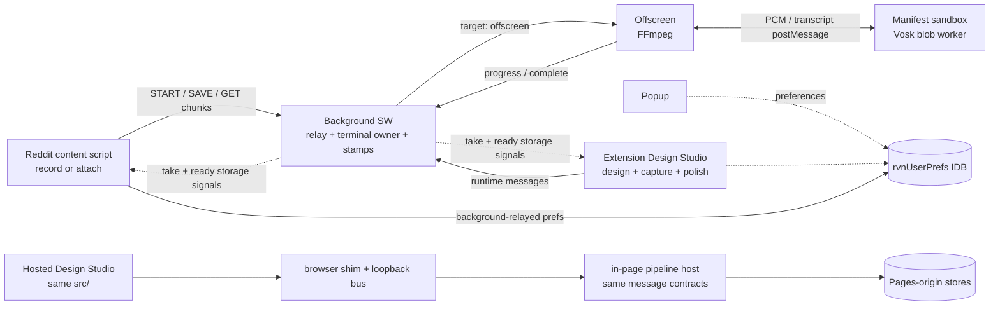
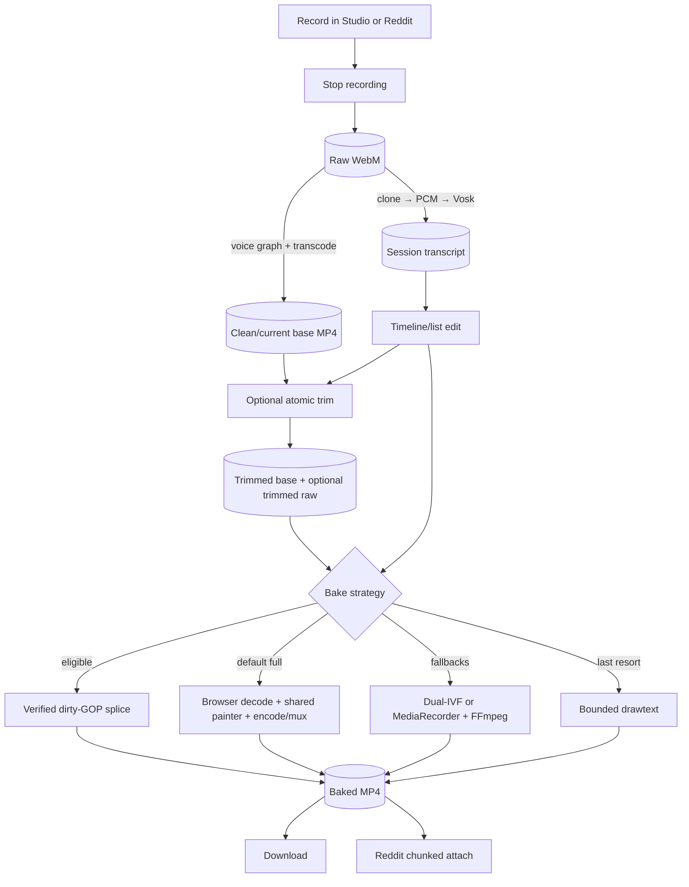
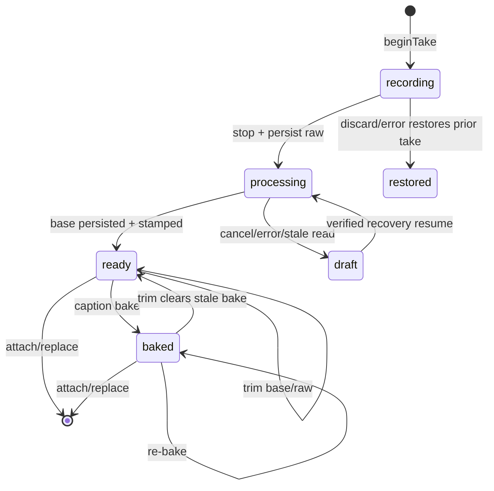
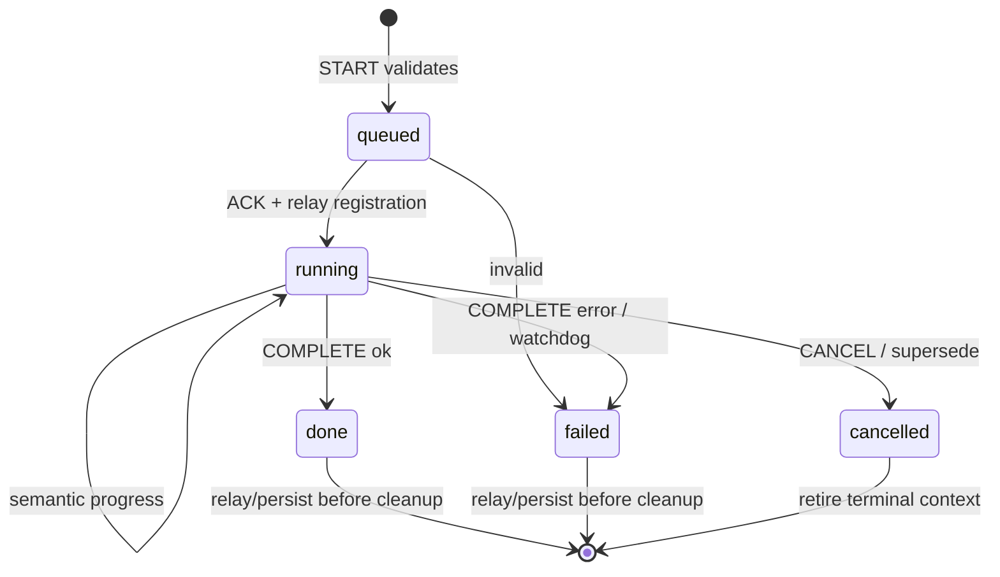

# Architecture Map — Reddit Voice Notes

<!--
CHANGED: Rebuilt the map as a dense post-v6 topology, ownership, invariant, and money-path reference.
WHY: The prior 26-version changelog and verification diary are preserved in the archive snapshot and obscured current architecture.
-->

**Version:** v3.27 · **Baseline:** `main@e3cd4b687e9854ae1fd4cd4ffc05eb487bf82179` / `v6.0.0` · **Updated:** 2026-07-23

## Archive Notice (Living Document)

The full v3.26 map—including its changelog, verification diary, detailed confidence evidence, and old carry-forward block—is preserved at [`archive/docs/v6.0.0-checkpoint/living-snapshots/architecture/architecture-map.md`](../../archive/docs/v6.0.0-checkpoint/living-snapshots/architecture/architecture-map.md). Completed source designs are indexed by [`archive/docs/MANIFEST.md`](../../archive/docs/MANIFEST.md); milestones live in [`docs/HISTORY.md`](../HISTORY.md).

This file owns current cross-cutting topology. Subsystem internals belong to the linked canonical docs.

## 1. Execution contexts and hosts

| Context | Origin / capability | Responsibility | Entry |
|---------|---------------------|----------------|-------|
| Content script | reddit.com isolated world; limited extension APIs | Recorder/attach panel, composer integration, record-time canvas | `entrypoints/content.ts` |
| Background service worker | Extension origin; no DOM | Relay registry, offscreen lifecycle, terminal persistence, artifact stamps, chunked blob service | `entrypoints/background.ts` |
| Offscreen document | Extension origin; FFmpeg WASM | Transcode and FFmpeg fallback work | `entrypoints/offscreen/main.ts` |
| Manifest sandbox | Opaque/null; `unsafe-eval`, blob workers; no extension APIs | Vosk inference | `public/vosk-sandbox.html` |
| Design Studio | Extension page | Design, capture, timeline/trim, browser composite, re-apply, take deck | `entrypoints/design-studio/` |
| Popup | Extension page | Quick settings and restart/reload affordances | `entrypoints/popup/` |

GitHub Pages is a second **host** for the Design Studio context, not a seventh extension context. It runs the same Studio source under a `browser` shim and in-page loopback pipeline host; its IndexedDB/local-storage equivalents are isolated by HTTPS origin.

## 2. Context and host topology

The hosted loopback collapse changes transport placement, not the message contract or subsystem ownership.

## 3. Data and media flow

Raw audio feeds transcription and voice re-apply. Captured background/audio-reactive pixels stay in the base; captions are post-base.

## 4. Durable state ownership

| Truth | Owner / location | Publication |
|-------|------------------|-------------|
| Preferences, profiles, styles | `rvnUserPrefs` IDB (`global`, `profiles`, `customStyles`) | `rvnUserPrefs.v2` only after commit |
| Personal backgrounds | `rvnImageDb` | ID in normalized prefs; blob relayed to content script |
| Current take state/stamps | `TakeManager` / `rvn.take.current` | `storage.onChanged` |
| Raw recording | `rvnLastRecording` | Artifact stamp + ready signal after persist |
| Base MP4 | `rvnLastBaseMp4` | Artifact stamp + ready signal after persist |
| Session transcript | `rvnSessionTranscript` | Background-owned ready signal after persist |
| Baked MP4 | `rvnLastBakedMp4` | Artifact stamp + `rvn.bakedMp4.ready` |
| Message schema | `src/messaging/types.ts` | Three pipeline families plus narrow query/blob relays |

The take snapshot contains metadata and stamps, never blobs. Content scripts do not read extension IDB directly.

## 5. Current state machines

### Take lifecycle

### Pipeline job lifecycle

Heartbeats do not reset stall timers. An initiating tab may disappear after ACK without owning the terminal result.

## 6. Invariants

| # | Invariant | Primary enforcement |
|---|-----------|---------------------|
| I1 | Anything in Live preview is reproducible in output | Shared Studio/capture renderers |
| I2 | Transcription uses the raw WebM clone, never voice-modulated export | Stop-time fork |
| I3 | Captions are post-base; never part of the live capture stream | Subtitle bake orchestration |
| I4 | Failure/terminal publication precedes relay cleanup | Relay registry + terminal owners |
| I5 | Only semantic progress resets a stall timer | Transcoder progress classifier |
| I6 | Preference RMW serializes through `enqueuePrefsOp` | Preference coordinator |
| I7 | Content scripts receive blobs through chunked relay, not IDB | Background blob services |
| I8 | Vosk uses per-session MEMFS in the sandbox | Accepted sandbox constraint |
| I9 | Take snapshots contain stamps, not blobs | TakeManager parser/types |
| I10 | Recording blobs persist at stop; discard restores the prior take | Recorder session |
| I11 | Overlay strategies paint at global frame timestamps | Shared frame painter |
| I12 | Only constructed WebCodecs streams skip normalize | Encoder strategy gates |
| I13 | Alphamerge alpha range is measured, not inferred from metadata | Calibration probe |
| I14 | Stale transient takes demote on read | `normalizeStaleTake` |
| I15 | Artifact stamps are verified against persisted metadata at consumption | H6 checks |
| I16 | Partial splice is adopted only after packet and kept-pixel fidelity gates | Splice validators |
| I17 | Cue edits snap through the painter’s frame grid | Timeline geometry |
| I18 | Trim preview and Apply share cue projection and shift both transcript copies | Trim modules |
| I19 | Trim publishes a raw-recording stamp only for persistable matching bytes | Raw trim plan + bounds |
| I20 | Background persists every non-cancelled transcription terminal before signaling | BUG-038 owner/watchdog |
| I21 | Preference revision never advertises uncommitted IDB state | ADR-0006 commit/publish order |
| I22 | Preview/capture share one normalized audio carrier, bounded registries, render order, and governor | Audio-reactive registry |
| I23 | Personal-background layout is Design-phase and never repositions after capture | ADR-0008 draw seam |

## 7. Money-path review traces

### A. Capture → ready take

1. `beginTake` stashes the prior snapshot.
2. Recorder captures one shared canvas and raw audio.
3. Stop persists raw bytes, then publishes the raw stamp.
4. Transcode and transcription fork; background accepts relay/terminal ownership.
5. Base MP4 persistence completes before the base stamp.
6. Take becomes `ready`; transcript may arrive independently and persists before its signal.

### B. Tab closes during transcription

1. Background ACKs and owns job context/watchdog.
2. Initiating page detaches without issuing accidental cancel.
3. Offscreen/sandbox completes or watchdog times out.
4. Background normalizes and persists transcript/scaffold.
5. Background publishes the ready signal; reopen hydrates the result.
6. Cancelled/superseded jobs cannot publish late.

### C. Timeline edit → trim → bake

1. Timeline edits one draft and snaps boundaries to the frame grid.
2. Trim ghost and Apply share cue projection.
3. Apply verifies the base, cuts MP4 and optional raw WebM, shifts both transcript copies, and publishes one take patch.
4. Stale baked stamp is deleted; raw stamp is refreshed or honestly dropped.
5. Next full bake uses the shared painter/fallback ladder; later edits may use verified partial splice.

### D. Hosted Studio record/export

1. Pages installs the shim before shared modules evaluate.
2. Shared Studio dispatches the normal message contract over the loopback bus.
3. In-page pipeline host loads the offscreen module once and does not duplicate broadcasts.
4. Shared artifact commit persists before stamps/signals.
5. Pages-origin take survives reload and downloads; extension-origin data remains isolated.

### E. Background layout → captured pixels

1. Normalized layout drives hero/precision controls.
2. Preview and recorder call the same personal-image draw seam.
3. Session-local media/layout wins over delayed same-ID reload during capture.
4. Base video owns the pixels; caption bake, trim, and voice re-apply preserve them.

## 8. Current confidence and residual risk

| Area | Confidence | Residual |
|------|------------|----------|
| Take lifecycle, artifact stamps, tab-close recovery | High (single-machine browser QA) | Re-test when writers/terminal owners change |
| Browser composite, trim, partial splice | High (single-machine browser QA) | Hardware variance should cause fallback, not wrong output |
| Preferences full-IDB | High (single-machine browser QA) | Force-fail browser coverage remains partial |
| Audio-reactive catalog/governor | Medium–High | Keep live heavy-artifact/FPS gates for future visual changes |
| Background Layout v2 | High (single-machine browser QA) | Conway residual is unrelated product polish |
| MediaRecorder fallback | Medium / accepted | H10 observability deferred |
| Vosk model caching | Low / accepted | Per-session download tradeoff |

The live risk register is [`hardening-backlog.md`](hardening-backlog.md).

## 9. Canonical references

| Topic | Owner |
|-------|-------|
| Integration seams | [`extension-points.md`](extension-points.md) |
| Accepted structural decisions | [`adr/`](adr/) |
| Studio semantics | [`../design-studio.md`](../design-studio.md) |
| Vosk and subtitle bake | [`../transcription-architecture.md`](../transcription-architecture.md) |
| Voice DSP | [`../dsp-foundation-design.md`](../dsp-foundation-design.md) |
| Hosted surfaces | [`../static-voice-studio-design.md`](../static-voice-studio-design.md) |
| Engineering rules | [`../engineering-principles.md`](../engineering-principles.md) |
| Historical designs/evidence | [`archive/docs/MANIFEST.md`](../../archive/docs/MANIFEST.md) |
