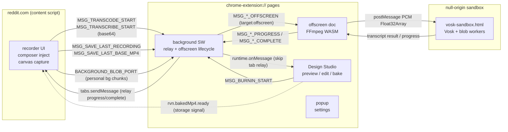
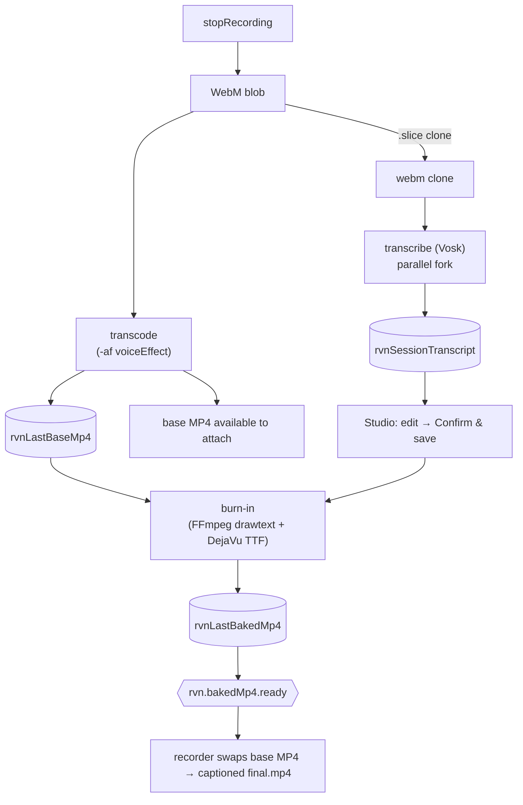
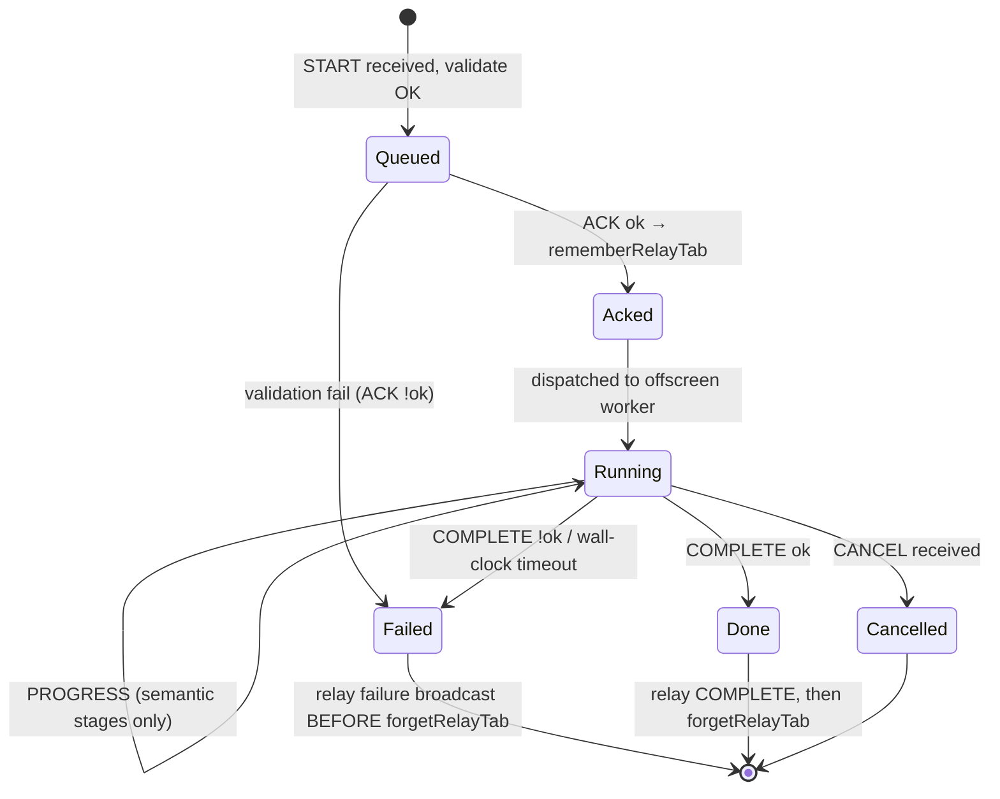

# Architecture Map — Reddit Voice Notes

**Version:** v1.0 · **Reflects branch/tag:** `eloquent` (eloquent-5 hardening) · **Updated:** 2026-06-24  
**Status:** Canonical cross-cutting architecture index. Wins for *how subsystems fit together*;  
subsystem internals are owned by the canonical docs linked in §8.  
**Re-run:** `/architecture-hardening` (full) or a named phase.

### Changelog
- `v1.1` (2026-07-04) — additive: v5.3.9 parallel chunked bake. The Design Studio context now runs N concurrent MediaRecorder capture loops for the subtitle overlay bake (no new execution context — workers/offscreen deliberately rejected; the bake is pacing-bound, not paint-bound). New modules: `overlay-chunk-planner.ts`, `subtitle-overlay-parallel.ts`, `overlay-concat-args.ts`, `overlay-chunk-concat.ts`. Canonical detail: `docs/transcription-architecture.md` § Parallel chunked bake; decision record: `docs/5.3.9-worker-and-chunked-parallelization-design.md` §0.
- `v1.0` (2026-06-24) — initial map; all four phases. Branch: `eloquent` at eloquent-5 hardening.

> Bump MINOR for additive refreshes; MAJOR when a context, pipeline, or storage class is added/removed.

---

## 1. Execution contexts

Verified against `wxt.config.ts` `manifest.content_security_policy`. The single most important architectural
fact: **a fix in one context never transfers to another** — different CSP, origin, and API surface.

| Context | Origin / CSP | eval | chrome.* | Responsibility | Entry |
|---------|--------------|------|----------|----------------|-------|
| Content script | reddit.com, isolated world | n/a | limited | recorder UI, composer inject, canvas capture | `entrypoints/content.ts` |
| Background SW | ext, `wasm-unsafe-eval` | no | yes | relay registry, offscreen lifecycle, keep-alive | `entrypoints/background.ts` |
| Offscreen doc | ext, `wasm-unsafe-eval` | no | yes | FFmpeg transcode + subtitle burn-in (WASM) | `entrypoints/offscreen/main.ts` |
| Manifest sandbox | opaque/null, `unsafe-eval` + `worker-src blob:` | **yes** | **no** | Vosk STT (Emscripten + blob workers) | `public/vosk-sandbox.html` |
| Design Studio | ext page | no | yes | styling, preview, transcript edit, bake trigger | `entrypoints/design-studio/` |
| Popup | ext page | no | yes | quick settings | `entrypoints/popup/` |

**Sandbox CSP detail (BUG-010/011/013):** `sandbox allow-scripts allow-forms allow-popups allow-modals; script-src 'self' 'unsafe-inline' 'unsafe-eval'; worker-src blob: 'self'; child-src blob: 'self'` — Vosk needs `unsafe-eval` for Emscripten and `worker-src blob:` for `WorkerFactory()`. The sandbox is a manifest iframe (opaque/null origin), which is why it cannot access extension IDB or construct `chrome-extension://` workers directly. See `docs/transcription-architecture.md` for full CSP archaeology.

---

## 2. Diagrams

### 2.1 Context map (who talks to whom)

Verified against `src/messaging/types.ts` (message constants) and `entrypoints/background.ts` (relay).



**Invariant encoded:** Design Studio receives burn-in messages via `runtime.onMessage` and is
registered in `burnInSkipTabRelayByJobId` in `background.ts` — it is *excluded* from the `tabs.sendMessage` relay that targets the Reddit content script. A future burn-in pipeline must preserve this split.

### 2.2 Data flow (record → attach)

Verified against `src/recorder/voice-recorder.ts` (fork at stop), IDB store module names.



**Invariant encoded:** Transcribe runs on the raw clone — not the voice-modulated export — so STT word timing stays aligned with unprocessed audio regardless of voice effect selection. Fork is parallel: `forkTranscribe` is `void`-dispatched; `transcodeToMp4` is `await`ed for the recorder's `setPhase('stopped')` gate.

### 2.3 State machine (offscreen job lifecycle)

Applies to all three pipelines (transcode / transcribe / burn-in). Verified against `entrypoints/offscreen/main.ts` (job queue), `src/messaging/relay-registry.ts` (BUG-032 fix).



**Invariant encoded:** On failure the relay entry is deleted *after* the failure broadcast
(BUG-032 ordering rule — `relay*Failure` before `forgetRelayTab`). Heartbeats `*-heartbeat` do
not advance `Running→Running`; only semantic progress (ratio increase, stage label change) resets the stall timer (`isMeaningfulProgress()` in `src/ffmpeg/transcoder.ts`).

### 2.4 Pipeline sequence + relay hop (transcode, representative)

Burn-in differs: Design Studio is the initiator and `runtime.onMessage` replaces `tabs.sendMessage`.

```mermaid
sequenceDiagram
  participant CS as content script
  participant BG as background SW
  participant OFF as offscreen (FFmpeg)
  CS->>BG: MSG_TRANSCODE_START (base64 WebM, jobId)
  BG->>BG: validate + rememberRelayTab(jobId→tabId)
  BG-->>CS: MSG_TRANSCODE_ACK (ok)
  BG->>OFF: ensureOffscreen + MSG_TRANSCODE_OFFSCREEN
  loop until done
    OFF-->>BG: MSG_TRANSCODE_PROGRESS (semantic stages)
    BG-->>CS: tabs.sendMessage relay
  end
  OFF-->>BG: MSG_TRANSCODE_COMPLETE (mp4Base64 | error)
  Note over BG: relay COMPLETE first, then forgetRelayTab (BUG-032)
  BG-->>CS: relay COMPLETE
  BG->>BG: forgetRelayTab(jobId)
```

---

## 3. First-class concerns

### 3.1 Preview ↔ bake boundary

The single canvas in `waveform.ts` (`canvas.captureStream`) is the video track source for `base.mp4`. Design Studio's Live preview uses the same draw pipeline (`renderThemePreview()`) so what the user sees is what gets exported. Subtitles are a second pass — `drawtext` burn-in on `base.mp4` → `final.mp4`.

**Invariant:** *Anything visible in Live preview must be reproducible by the transcode or burn-in export path.* — `docs/design-studio.md §3.3`; `docs/engineering-principles.md § Pipeline-native solutions`.

**Known fidelity gaps (documented, not silent):**
- Rainbow hue: canvas interpolates continuously; bake uses 0.25 s static slices (`RAINBOW_BAKE_SLICE_SECONDS`, `temporalizeDrawtextColor()` in `subtitle-effects.ts`). Faster rotation looks choppier in the export.
- Font preview (WYSIWYG): canvas uses `FontFace` API loading DejaVu TTFs under `RVN-*` names (`preview-font-loader.ts`); bake uses the same TTFs via FreeType in WASM FS. The two paths agree on glyphs because they load the same TTF assets, but rely on different renderers — minor kerning/hinting differences are accepted.
- Static `fontcolor` per drawtext filter — animated rainbow requires time-sliced duplicates at bake; canvas RAF is fully expressive.

**Animated GIF backgrounds — no gap (the canvas-native case):** GIF frames are decoded once (`AnimatedBackground` / WebCodecs `ImageDecoder`) and advanced by elapsed time in the canvas RAF (`frameAt`), so they are captured straight into `base.mp4`. Preview, live recorder, and export loop identically with **no** FFmpeg/bake path — the inverse of subtitles/rainbow. Reduced motion freezes to frame 0 everywhere. See `docs/gif-animation-design-implementation.md`.

**Where it could silently drift:** Adding a new visual effect to the canvas without a bake path is a violation. `extension-points.md` enforces this contract at the seam level.

### 3.2 Effect composition

Compositing order (bottom → top) in the final MP4:

1. **Background** — theme gradient/SVG/bokeh + optional personal image or **animated GIF loop** (`rvnImageDb`; GIF frames advanced in the canvas RAF and captured into `base.mp4`, no FFmpeg layer).
2. **Bars** — waveform + glow/effects (canvas capture at 24 fps on Reddit).
3. **Subtitles** — FFmpeg `drawtext` burn-in on `base.mp4`. **Never drawn into the canvas RAF.**

**Voice effect** applies to the **audio track** via `-af` in the transcode pass — it is not a visual layer and does not change compositing order.

**Invariant:** *Subtitles are always a post-`base.mp4` FFmpeg burn-in pass; they never appear in the canvas capture stream.* — `docs/v4-development-principles.md §2`; `src/ffmpeg/subtitle-burnin.ts`.

Adding a fourth visual layer changes compositing order. This must be an explicit architectural decision (ADR).

### 3.3 Message contracts

**Registry:** `src/messaging/types.ts` — single source of truth for all message constants, payload interfaces, and parse helpers. Read this to enumerate every pipeline.

**Pipelines** (all share the `START→ACK→OFFSCREEN→PROGRESS*→COMPLETE|CANCEL` shape):

| Pipeline | START message | Worker | Initiator | Notes |
|----------|--------------|--------|-----------|-------|
| Transcode | `MSG_TRANSCODE_START` | FFmpeg (offscreen) | Content script | Optional `voiceEffect` `-af`; `voiceEffectFallback` on fail |
| Transcribe | `MSG_TRANSCRIBE_START` | Vosk (sandbox via offscreen) | Content script | Raw WebM clone; parallel fork; relay to Studio via `MSG_SAVE_SESSION_TRANSCRIPT` |
| Burn-in | `MSG_BURNIN_START` | FFmpeg (offscreen) | Design Studio | `segmentsJson` + `styleJson`; skip tab relay (Studio uses `runtime.onMessage`) |

**Relay:** `src/messaging/relay-registry.ts` — `browser.storage.session` survives MV3 SW restarts. Late-bind fallback to active Reddit tab. The fragile ordering: *broadcast COMPLETE before deleting the tab entry* (BUG-032).

**Invariant:** *No pipeline sends COMPLETE before its relay-registry entry is cleaned up; failure broadcasts before map cleanup.* — `src/messaging/relay-registry.ts`; BUG-032.

### 3.4 State ownership

**Rule:** One writer per datum. Blobs and transcript text never in `rvnUserPrefs`.

| Store | Key / DB | Holds | Single writer |
|-------|----------|-------|---------------|
| `chrome.storage.local` | `rvnUserPrefs` | Profiles, styles, appearance, voice, `transcriptConfig` (style/toggle only) | Studio (`enqueuePrefsOp`) |
| `chrome.storage.local` | `rvn.subtitles.enabled` | Atomic subtitle on/off | Studio (`setSubtitlesEnabled`) |
| `chrome.storage.local` | `rvn.lastRecording.ready` | Signal: new WebM for voice preview | Recorder |
| `chrome.storage.local` | `rvn.sessionTranscript.ready` | Signal: new transcript IDB row | Background |
| `chrome.storage.local` | `rvn.bakedMp4.ready` | Signal: baked MP4 ready for recorder | Studio (bake completion) |
| `chrome.storage.local` | `rvn.workflow.phase` | `'design' | 'capture' | 'polish'` | Banner CTA, recorder stop |
| IndexedDB | `rvnImageDb` | Personal background blobs | Studio upload UI |
| IndexedDB | `rvnLastRecording` | Last WebM for voice preview | Background (recorder relay) |
| IndexedDB | `rvnSessionTranscript` | Vosk + edited transcript | Background (save), Studio (edit Confirm & save) |
| IndexedDB | `rvnLastBaseMp4` | Transcoded base for bake | Background (recorder relay) |
| IndexedDB | `rvnLastBakedMp4` | Burned-in MP4 output | Studio (bake) |

**Invariant:** *All `rvnUserPrefs` reads and writes go through `enqueuePrefsOp` in `src/settings/user-preferences.ts`.* — `docs/v4-development-principles.md §4`; BUG-023. Content scripts cannot read extension IDB — they receive blobs via chunked background relay (`BACKGROUND_BLOB_PORT`).

---

## 4. Invariants (Phase 2)

| # | Invariant | First-class concern | Enforced at | Confidence |
|---|-----------|---------------------|-------------|------------|
| I1 | Anything in Live preview is reproducible by transcode or burn-in export | preview↔bake | `docs/design-studio.md §3.3`; `engineering-principles.md § Pipeline-native` | High |
| I2 | Transcription always runs on the raw WebM clone, not the voice-modulated export | preview↔bake, effect composition | `src/recorder/voice-recorder.ts` (fork at stop) | High |
| I3 | Subtitles are post-`base.mp4` burn-in; never drawn into canvas capture | effect composition | `src/ffmpeg/subtitle-burnin.ts`; `docs/v4-development-principles.md §2` | High |
| I4 | Failure is broadcast before the relay-registry entry is deleted | message contracts | `src/messaging/relay-registry.ts`; BUG-032 | High |
| I5 | Stall timers reset only on semantic progress (ratio increase, stage change) — not heartbeats | message contracts | `src/ffmpeg/transcoder.ts isMeaningfulProgress()` | High |
| I6 | All `rvnUserPrefs` writes go through `enqueuePrefsOp` | state ownership | `src/settings/user-preferences.ts` | High |
| I7 | Content script can't read extension IDB — receives blobs via chunked relay only | state ownership | `entrypoints/background.ts`; `BACKGROUND_BLOB_PORT` | High |
| I8 | Vosk model loads from `downloadAndExtract` into MEMFS per session (no IDB cache in sandbox) | state ownership | BUG-011/013 accepted tradeoff; `scripts/build-vosk-sandbox.mjs` | High |

---

## 5. Money-path traces (Phase 2)

### Subtitle round-trip (full pipeline)

1. `stopRecording()` → `webmBlob.slice()` clone → `void forkTranscribe(clone)` (parallel)
2. Content: `MSG_TRANSCRIBE_START` (base64 clone) → background validates → `MSG_TRANSCRIBE_OFFSCREEN`
3. Offscreen: decode WebM PCM → assert usable → `postMessage` Float32Array to `vosk-sandbox.html`
4. Sandbox: Vosk inference → `postMessage` transcript result → offscreen
5. Offscreen: `MSG_TRANSCRIBE_COMPLETE` (transcriptJson) → background
6. Background: `MSG_SAVE_SESSION_TRANSCRIPT` → writes `rvnSessionTranscript` IDB → writes `rvn.sessionTranscript.ready`
7. Studio: storage listener fires → polls `getSessionTranscript()` → segment editor hydrated
8. User edits cues → clicks Confirm & Save → `saveSessionTranscriptEdits()` → `rvnSessionTranscript` IDB updated
9. User clicks Bake → `MSG_BURNIN_START` (mp4Base64 + segmentsJson + styleJson)
10. Background: ACK → `MSG_BURNIN_OFFSCREEN` → offscreen: FFmpeg drawtext + DejaVu TTF → `MSG_BURNIN_COMPLETE`
11. Background: writes `rvnLastBakedMp4` + `rvn.bakedMp4.ready` → content script listener → `applyBakedMp4()`

**Code verified at:** `src/recorder/voice-recorder.ts:392–396` (fork), `src/messaging/types.ts` (all constants), `entrypoints/offscreen/main.ts` (job queue).

### Personal background WYSIWYG relay

1. Studio reads `rvnImageDb` directly (extension origin — synchronous, no relay).
2. Recorder (reddit.com) cannot read extension IDB — on canvas init: opens `BACKGROUND_BLOB_PORT` to background → background reads `rvnImageDb` → streams chunked base64 → content script → decode → `canvas.drawImage`. The same relayed bytes feed animated GIFs, decoded into looping frames via WebCodecs `ImageDecoder` (`src/storage/animated-background.ts`).
3. Missing blob / undecodable GIF → static first frame or theme fallback. Never blocks recording.

**Code verified at:** `docs/engineering-principles.md § Personal backgrounds`; `docs/design-studio.md §5.3`.

---

## 6. Confidence ledger (Phase 2)

| Subsystem | Confidence | Evidence / notes |
|-----------|-----------|-----------------|
| Transcode pipeline (BUG-001–009) | **High** | Extensively documented + fixed; 2:00 cap stable |
| Transcription pipeline (BUG-010–018) | **High** | CSP archaeology complete; Vosk queue/PCM hardened |
| Burn-in pipeline (BUG-025–032) | **High** | drawtext + TTF proven; `burnInLogIndicatesFailure` narrowed |
| Studio state / prefs (BUG-016–027) | **High** | `enqueuePrefsOp` + hydration gate + `buildDraftConfig` closure |
| Relay registry session persistence | **Med** | BUG-032 fixed with `browser.storage.session`; not smoke-tested under true production SW restart (only dev HMR) |
| Font preview WYSIWYG (`preview-font-loader.ts`) | **Med** | FontFace API + per-font try/catch added; no cross-browser test (Safari/Edge) |
| `vosk-sandbox-host.ts` discriminated union access | **Med** | TS errors at lines 49+56: `.result`/`.error` on `ModelMessage` without narrowing — could crash on error path at runtime |
| `subtitle-effects.ts` undefined argument | **Med** | TS errors at lines 92+114: `normalizeHexColor(specialHue)` where `specialHue?: string` — undefined passes type boundary |
| `voice-recorder.ts:400` dead branch | **Med** | `this.phase === 'error'` comparison can never be true at that point (phase is `'processing'` and `transcodeToMp4` throws on error) — dead error guard |
| Binary transport (BUG-001 deferred) | **Low** | Base64 cap at 2:00 = acceptable; 3:00 cap requires chunked transport + lower video BPS — not started |
| Vosk model caching (BUG-013 accepted) | **Low** | ~40 MB re-download per session accepted until extension-origin Vosk migration |

**Open questions:**
- Does `browser.storage.session` relay persist across a production MV3 SW restart (not just HMR)?
- Is there a FontFace API fallback if `browser.runtime.getURL` returns a path that 404s in the installed extension? → `preview-font-loader.ts` try/catch now handles this gracefully.
- `voice-recorder.ts:388` `prefs.transcriptConfig` possibly undefined — is there a path where `loadVoiceRecorderPrefs` resolves without `transcriptConfig`? → ADR stub `adr/0001-voice-recorder-prefs-transcriptconfig.md`.

---

## 7. Self-critique (Phase 2)

**Assumptions verified this session:** CSP table confirmed against `wxt.config.ts`; message constants enumerated from `src/messaging/types.ts`; storage map confirmed against `docs/design-studio.md §3.2`; bug patterns drawn from `docs/bug-archive.md`.

**Assumptions NOT verified (require more reading):**
- `src/ffmpeg/transcoder.ts isMeaningfulProgress()` implementation — assumed correct from BUG-006 description; not read line-by-line this session.
- `burnInSkipTabRelayByJobId` mechanism — cited in docs, not re-read this session. Assumed structure correct from cookbook notes.
- `OFFSCREEN_WORKER_STAMP` check in PING/PONG — referenced in types, not verified that background actually closes stale docs on mismatch in production builds.

**Coupling that surprised:** Burn-in must wait for the transcribe queue to fully idle — `enqueueTranscribeJob` and `enqueueTranscodeJob` are separate queues, but burn-in reads `rvnLastBaseMp4` which is written after transcode completes. The coupling is through IDB state, not queue coordination. If transcode fails, there is no base MP4 and bake would fail. This dependency is implicit, not structurally enforced.

**If I changed X, what would break?**
- `rvnUserPrefs` write outside `enqueuePrefsOp` → BUG-023 class race returns (boot state stale, profile dirty false).
- Removing `worker-src blob:` from sandbox CSP → BUG-010 class: Vosk blob workers blocked.
- Using `chrome.*` instead of `browser.*` in `src/` files → WXT polyfill breaks; TS errors in content script / offscreen contexts.
- Adding a visual effect to canvas RAF without a drawtext path → preview≠bake violation; no test fails, silently diverges.
- Deleting relay map entry before `relay*Failure` → BUG-032 class: content script never hears failure.

---

## 8. Related docs

| Doc | Owns |
|-----|------|
| `docs/design-studio.md` | Studio semantics, preview=bake, dirty layers, storage map (§3), outbound index (§12) |
| `docs/transcription-architecture.md` | Vosk sandbox CSP stack, postMessage trust model |
| `docs/engineering-principles.md` | Semantic health, save pathways, ImageDB, pipeline-native effects |
| `docs/bug-archive.md` | Full `BUG-###` write-ups (Phase-3 raw material) |
| `docs/v4-development-principles.md` | Branch model, compositing, WASM queues, sprint hygiene |
| `docs/architecture/extension-points.md` | Where new features plug in (seam contracts) |
| `docs/architecture/hardening-backlog.md` | Ranked hardening items with ROI scores |
| `src/messaging/types.ts` | Wire registry — the authoritative message constant list |

---

## Resume in a new chat (carry-forward)

```
architecture-hardening resume.
Repo: Reddit Voice Notes (Chrome MV3 / WXT). Branch: eloquent (eloquent-5 hardening). Map: v1.0 (2026-06-24).
Contexts: content(reddit.com) / background(SW) / offscreen(FFmpeg) / sandbox(Vosk) / Design-Studio / popup.
Spine:
  preview=bake: canvas+drawtext agree; rainbow→slices; font WYSIWYG via FontFace API + same DejaVu TTFs
  effect composition: bg→bars→subs(drawtext); voice is -af audio only
  message contracts: src/messaging/types.ts; 3 pipelines; relay-registry session storage (BUG-032)
  state ownership: rvnUserPrefs via enqueuePrefsOp; 5 IDB stores; rvn.*.ready signals
Top open question: browser.storage.session relay under production SW restart not smoke-tested.
Medium-confidence items: relay prod smoke, font cross-browser, vosk-sandbox-host union access, subtitle-effects undefined arg.
Hardening backlog: docs/architecture/hardening-backlog.md (5 items; 2 resolved this session).
Read docs/architecture/architecture-map.md then run /architecture-hardening resume.
```
